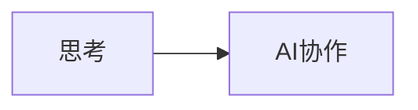

# 内容传递机制深度分析

## 当前问题

### Shell管道传递的脆弱性
```bash
# 当前的问题方式
echo "$AI_RESPONSE" | bash script.sh add-content "$content"
```

**问题根源**：
1. **特殊字符冲突**：Mermaid代码块中的 ```` ```mermaid` `` 被shell解释
2. **引号转义地狱**：多层引号嵌套导致解析错误
3. **命令注入风险**：恶意内容可能被执行为shell命令

### 具体失败场景

#### 场景1：Mermaid图表丢失
```bash
# AI原始输出


# Shell解析错误
$ ```mermaid
bash: mermaid: command not found
$ graph LR
bash: syntax error near unexpected token `('
```

#### 场景2：多行内容截断
```bash
# 预期保存完整内容
"第一行内容\n第二行内容\n第三行内容"

# 实际只保存了第一行
"第一行内容"
```

## 根本原因

1. **缺乏内容安全封装**：直接传递原始文本到shell环境
2. **没有内容类型识别**：无法区分普通文本和代码块
3. **错误处理机制缺失**：失败时无法准确定位问题
4. **用户反馈不及时**：问题发生后用户难以理解原因

## 改进方向

1. **文件中转机制**：避免通过shell参数传递复杂内容
2. **内容类型标记**：识别和保护特殊格式内容
3. **完整性验证**：确保内容传递前后一致
4. **智能错误恢复**：自动修复常见的传递问题