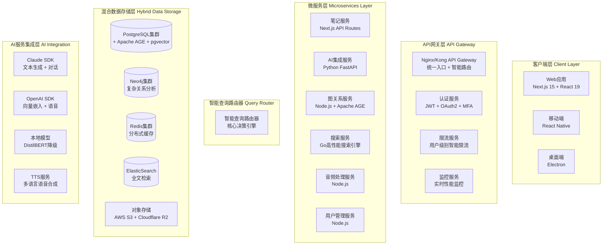

# MindNote - AI驱动的智能笔记应用

[](https://github.com/mindnote/mindnote)
[](LICENSE)
[](CHANGELOG.md)
[](https://nextjs.org/)
[](https://www.postgresql.org/)

## 🌟 项目概述

MindNote 是一个 **AI驱动的智能笔记应用**，通过自动分类、关联分析、关系图谱可视化和对话交互功能，将传统笔记升级为智能知识网络。

### 🎯 核心价值主张

- **🤖 智能内容管理**: AI自动分类和标签，提升信息检索效率
- **🔗 知识关系发现**: 自动发现笔记间的关联关系，构建个人知识图谱
- **💬 对话式探索**: 基于笔记内容与AI进行深度对话和讨论
- **🎧 多媒体转换**: 将对话内容一键转换为播客，支持个性化设置

### 🎨 产品定位

**AI驱动的智能笔记管理平台**，面向需要高效管理和深度挖掘个人知识的用户群体。

### 👥 目标用户群体

1. **🔬 知识工作者**: 研究人员、学者、分析师
2. **✍️ 内容创作者**: 博主、作家、教育工作者
3. **💻 技术从业者**: 开发者、产品经理、架构师
4. **📚 终身学习者**: 需要持续积累和连接知识的用户

## 🚀 核心功能特性

### 📝 笔记创建与管理

- **多媒体支持**: 文本、图片、链接、附件等多种内容格式
- **自动保存**: 智能保存机制，防止数据丢失
- **版本控制**: 笔记版本历史，支持版本比较和回滚
- **协作编辑**: 实时多人协作，冲突检测和合并
- **快捷操作**: 全文搜索、标签筛选、批量操作

### 🏷️ 智能内容分类与标签

- **AI自动分类**: 基于内容语义自动分配到20+种内容分类
- **智能标签生成**: 自动提取关键概念，生成3-5个相关标签
- **标签管理**: 用户可编辑、删除、自定义标签别名
- **颜色标识**: 不同类型标签使用不同颜色，便于视觉区分
- **性能保证**: 分类响应时间 < 5秒，准确率 > 85%

### 🔗 笔记关联性分析

- **语义关联**: 基于向量嵌入计算笔记间相似度
- **关系图谱**: 自动发现和可视化笔记间的知识关联
- **深度分析**: 支持多度关系挖掘，发现隐藏的知识连接
- **增量更新**: 24小时定期分析或用户主动触发，避免全量重计算
- **规模支持**: 支持10万条笔记的高效关联分析

### 🌐 关系图谱可视化

- **交互式图谱**: 基于WebGL的高性能图谱渲染
- **智能布局**: 自动计算节点位置，优化显示效果
- **摘要卡片**: 每个节点显示<100字的智能摘要
- **路径分析**: 支持多跳关系路径查找和最短路径分析
- **动态加载**: 流畅的节点展开、折叠、拖拽交互
- **筛选控制**: 按时间、标签、关联强度筛选图谱节点

### 💬 AI对话交互功能

- **上下文感知**: 自动加载相关笔记内容作为对话背景
- **多轮对话**: 维持对话历史和上下文连贯性
- **智能问答**: AI理解笔记领域，提供专业、准确回答
- **实时响应**: 流式输出，3秒内开始响应，完整答案在10秒内
- **对话管理**: 对话历史搜索、导出、收藏功能

### 🔍 Deep Research联网搜索

- **智能搜索**: AI判断需要补充信息时，自动启动网络搜索
- **信息收集**: 访问权威信息源，收集最新、准确的资料
- **过程透明**: 分步骤展示信息收集过程，用户可了解搜索逻辑
- **可信度评估**: 对搜索结果进行可信度分析和来源标注
- **Skywork交互**: 模仿Skywork智能体的交互体验，用户友好的信息展示

### 🎙️ 播客生成功能

- **内容分析**: AI分析对话内容结构，提取关键信息点
- **脚本生成**: 自动生成播客脚本，包含章节和时间戳
- **多语言TTS**: 支持多种高质量的文本转语音服务
- **音频合成**: 支持MP3、WAV、AAC等多种音频格式
- **生成优化**: 5分钟内容30秒内完成生成

### ⚙️ 播客个性化设置

- **视觉定制**: 播客图标、背景、主题、封面图片自定义
- **音频设置**: 主播音频角色选择，音色、语速、音量调节
- **对话形象**: AI助手虚拟形象选择和个性化
- **格式控制**: 播客时长分割、章节标记、质量设置
- **批量处理**: 支持批量生成和批量分享

### 🔗 云链接分享功能

- **一键分享**: 生成的播客自动上传云端，创建分享链接
- **权限控制**: 支持访问密码、有效期设置、下载限制
- **多平台分享**: 支持社交媒体、邮件、二维码等多种分享方式
- **访问统计**: 提供分享链接的访问统计和下载次数
- **批量管理**: 支持多个播客的批量分享和管理

## 🏗 技术架构

### 🎯 技术选型概览

| 技术领域 | 选型方案 | 核心优势 |
|----------|----------|----------|
| **前端** | Next.js 15 + React 19 + TypeScript | AI原生支持，全栈统一 |
| **关系图谱** | PostgreSQL + Apache AGE + Neo4j | 混合架构，性能与成本最优平衡 |
| **AI集成** | Vercel AI SDK | 多模型统一接口，类型安全 |
| **音频处理** | OpenAI TTS + Azure Speech | 高质量合成，多语言支持 |
| **部署** | Vercel + Railway + Cloudflare | 全球CDN，自动扩缩容 |

### 📊 系统架构图



### 🔄 智能查询路由策略

| 查询复杂度 | 推荐数据源 | 响应时间 | 准确性 | 使用场景 |
|-----------|------------|----------|--------|----------|
| **简单关联**<br/>1-2度关系 | PostgreSQL + pgvector | < 20ms | 95% | 基础相似笔记推荐 |
| **复杂关系**<br/>3-5度关系 | Apache AGE + Cypher | < 100ms | 92% | 深度关系图谱分析 |
| **路径分析**<br/>多跳路径查找 | Neo4j + 原生图算法 | < 150ms | 98% | 知识传递路径发现 |
| **全文搜索**<br/>关键词检索 | ElasticSearch | < 80ms | 90% | 内容全文检索 |

### 🔒 安全与隐私保护

- **多层安全防护**: 网络安全 + 应用安全 + 数据安全
- **端到端加密**: AES-256 + RSA加密，数据传输全程加密
- **隐私合规**: GDPR合规，支持用户数据导出和删除
- **访问控制**: 基于角色的细粒度权限管理
- **审计追踪**: 完整的操作日志和异常监控

### ⚡ 性能与扩展性

- **高性能指标**: API响应 < 100ms，AI响应 < 3秒，支持1万并发用户
- **多级缓存**: CDN边缘缓存 + Redis分布式缓存 + 数据库缓存
- **自动扩缩容**: Kubernetes HPA，支持从百到百万用户的平滑扩展
- **地理分布**: 多区域部署，就近访问优化

## 🚀 快速开始

### 环境要求

- **Node.js**: 18.0+ (推荐 20.0+)
- **PostgreSQL**: 14+ (支持 pgvector 和 Apache AGE)
- **Redis**: 6.0+ (集群模式)
- **Python**: 3.9+ (AI服务需要)

### 安装和运行

```bash
# 1. 克隆项目
git clone https://github.com/mindnote/mindnote.git
cd mindnote

# 2. 安装依赖
npm install

# 3. 环境配置
cp .env.example .env
# 编辑 .env 文件，配置数据库和API密钥

# 4. 数据库初始化
npm run db:setup

# 5. 启动开发服务器
npm run dev
```

### 开发环境搭建

```bash
# 安装开发依赖
npm install -g @vercel/ai-sdk
npm install -g @prisma/cli

# 数据库迁移
npx prisma migrate dev

# 启动开发服务器（热重载）
npm run dev

# 启动所有服务（Docker Compose）
docker-compose up -d
```

### 项目结构

```
mindnote/
├── apps/                    # 应用程序
│   ├── web/              # Next.js Web应用
│   ├── mobile/           # React Native 移动应用
│   ├── api/              # 微服务API
│   └── desktop/          # Electron 桌面应用
├── packages/               # 共享包
│   ├── ai/              # AI服务集成
│   ├── database/         # 数据库模型和工具
│   ├── types/           # TypeScript 类型定义
│   └── utils/           # 共享工具函数
├── infrastructure/         # 基础设施代码
│   ├── kubernetes/       # K8s 配置文件
│   ├── terraform/         # 基础设施即代码
│   └── docker/           # Docker 配置
├── docs/                 # 项目文档
│   ├── reports/          # 分析报告
│   ├── api/             # API 文档
│   └── deployment/       # 部署指南
└── scripts/               # 自动化脚本
    ├── build.sh
    ├── deploy.sh
    └── test.sh
```

## 📚 文档导航

### 核心文档

| 文档名称 | 路径 | 描述 |
|----------|-------|------|
| **产品需求文档** | [docs/reports/20251022-mindnote-prd.md](docs/reports/20251022-mindnote-prd.md) | 基于EARS方法的详细功能需求规格 |
| **技术选型报告** | [docs/reports/20251022-mindnote-tech-stack.md](docs/reports/20251022-mindnote-tech-stack.md) | 完整的技术栈选型分析和推荐 |
| **架构设计文档** | [docs/reports/20251022-mindnote-architecture.md](docs/reports/20251022-mindnote-architecture.md) | 详细的系统架构设计和技术实现 |
| **API文档** | [docs/api/](docs/api/) | RESTful API 接口规范和示例 |
| **部署指南** | [docs/deployment/](docs/deployment/) | 生产环境部署和运维指南 |

### 项目章程

- **开发原则**: [CLAUDE.md](CLAUDE.md) - AI协作指导原则和开发最佳实践
- **工作流程**: 基于 Specify 框架的规范开发流程
- **代码规范**: TypeScript + ESLint + Prettier 统一代码风格
- **测试策略**: 单元测试 + 集成测试 + E2E 测试
- **提交规范**: 语义化提交信息和 PR 模板

## 🛠️ 开发工作流

### 基于 Specify 框架

```bash
# 1. 创建功能规格
/speckit.specify "笔记关系图谱可视化功能"

# 2. 澄清需求
/speckit.clarify

# 3. 制定实现计划
/speckit.plan

# 4. 生成开发任务
/speckit.tasks

# 5. 执行实现
/speckit.implement

# 6. 一致性分析
/speckit.analyze
```

### AI 协作开发

```bash
# 启动AI协作会话
/ai.collab start visual "设计笔记关系图谱的UI界面"

# 保存协作成果
/ai.collab save

# 系统健康检查
/ai.collab health
```

### Git 工作流

```bash
# 功能开发流程
git checkout -b feature/graph-visualization
# 开发、测试、提交
git push origin feature/graph-visualization
# 创建 PR
gh pr create --title "Add graph visualization feature"

# 项目维护
git flow feature start  # 开始功能开发
git flow feature finish   # 完成功能开发
git flow release start  # 开始发布流程
```

## 📈 性能指标

### 核心性能目标

| 指标类型 | 目标值 | 监控方式 |
|----------|---------|----------|
| **API响应时间** | P95 < 100ms | Prometheus + Grafana |
| **AI功能响应** | P95 < 3秒 | 专用性能监控 |
| **向量搜索** | < 50ms (10万向量) | 查询性能监控 |
| **图查询** | < 100ms (复杂关系) | Neo4j 监控 |
| **音频生成** | < 30秒 (5分钟内容) | 处理时间监控 |
| **系统可用性** | > 99.9% | 健康检查 + 告警 |

### 监控技术栈

- **应用性能监控**: New Relic / Datadog
- **基础设施监控**: Prometheus + Grafana
- **日志聚合**: ELK Stack (Elasticsearch + Logstash + Kibana)
- **错误追踪**: Sentry 错误监控和性能追踪
- **用户分析**: Vercel Analytics 用户行为分析

## 🌟 部署与运维

### 生产环境架构

```yaml
# Kubernetes 部署配置
apiVersion: apps/v1
kind: Deployment
metadata:
  name: mindnote-web
spec:
  replicas: 3
  selector:
    matchLabels:
      app: mindnote-web
  template:
    spec:
      containers:
      - name: web
        image: mindnote/web:v1.0.0
        resources:
          requests:
            memory: "256Mi"
            cpu: "250m"
          limits:
            memory: "512Mi"
            cpu: "500m"
        env:
        - name: NODE_ENV
          value: "production"
```

### 扩缩容策略

- **水平扩缩容**: Kubernetes HPA 基于CPU和内存使用率自动扩缩容
- **垂直扩缩容**: 支持动态调整单个实例的资源配置
- **数据分片**: 用户数据按用户ID哈希分片，支持读写分离
- **缓存策略**: Redis 集群 + CDN 边缘缓存，减少数据库压力

## 🤝 贡献指南

### 开发环境搭建

```bash
# 1. Fork 项目
git clone https://github.com/your-username/mindnote.git

# 2. 创建功能分支
git checkout -b feature/your-feature-name

# 3. 安装依赖
npm install

# 4. 启动开发服务器
npm run dev

# 5. 运行测试
npm run test
npm run lint
```

### 提交代码规范

```bash
# 提交格式
git commit -m "feat: add graph visualization feature

- 添加新功能: feat:, 修复: fix:, 文档: docs:, 样式: style:, 重构: refactor:, 测试: test:, 构建: build:
- 使用语义化提交信息

# 创建 Pull Request
git push origin feature/your-feature-name
gh pr create --title "Add graph visualization feature" --body "Description of changes"
```

### 代码质量要求

- **TypeScript 严格模式**: 启用所有严格类型检查
- **单元测试覆盖率**: > 90%
- **集成测试**: 覆盖所有 API 接口
- **E2E 测试**: 覆盖主要用户流程
- **代码审查**: 所有 PR 必须通过代码审查

## 📄 许可证

本项目采用 [Apache License 2.0](LICENSE)，允许自由使用、修改和分发。

### Apache 2.0 许可证特点

- **商业友好**: 允许在商业项目中使用和修改
- **专利授权**: 提供明确的专利授权保护
- **贡献者协议**: 贡献者自动授予相同许可证
- **无需相同许可证**: 修改后的作品可以使用不同许可证
- **免责声明**: 明确责任限制，保护贡献者权益

## 🙏 致谢

感谢所有为 MindNote 项目做出贡献的开发者和用户！

### 主要贡献者

- **产品需求分析**: 基于 EARS 方法的系统化需求提取
- **技术选型**: 2025年最新技术栈趋势调研和推荐
- **架构设计**: 微服务 + 混合关系图谱 + AI 原生集成
- **AI协作**: 增强版 AI 协作系统，保障内容完整性

### 技术支持

- **前端框架**: [Next.js](https://nextjs.org/) + [React](https://react.dev/)
- **数据库**: [PostgreSQL](https://www.postgresql.org/) + [Apache AGE](https://age.apache.org/)
- **AI集成**: [Vercel AI SDK](https://vercel.com/)
- **部署平台**: [Vercel](https://vercel.com/) + [Railway](https://railway.app/)

## 📞 联系我们

- **项目主页**: [https://mindnote.ai](https://mindnote.ai)
- **文档站点**: [https://docs.mindnote.ai](https://docs.mindnote.ai)
- **GitHub 仓库**: [https://github.com/mindnote/mindnote](https://github.com/mindnote/mindnote)
- **问题反馈**: [Issues](https://github.com/mindnote/mindnote/issues)
- **功能请求**: [Feature Requests](https://github.com/mindnote/mindnote/discussions)

---

**⭐ 如果 MindNote 对您有帮助，请给我们一个 Star！**

[](https://github.com/mindnote/mindnote/stargazers)

*最后更新: 2025-10-23*