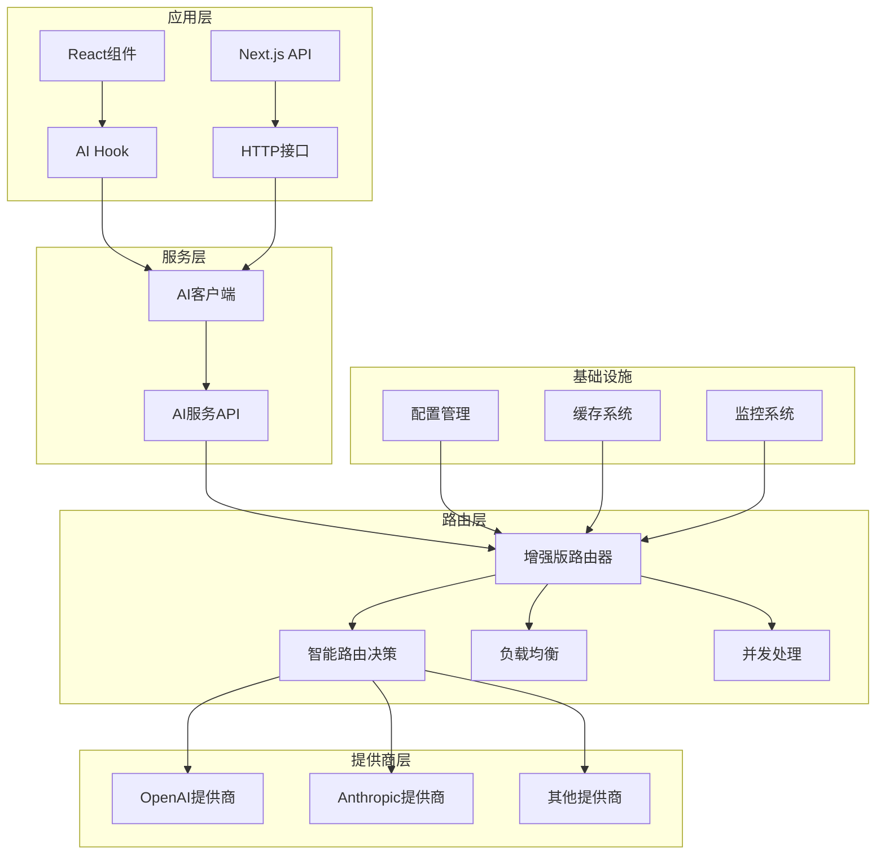

# MindNote AI服务集成指南

## 概述

MindNote AI服务是一个企业级的AI功能集成平台，提供统一的AI服务接口，支持多提供商、智能路由、并发处理和实时流式输出。本文档将详细介绍如何使用和集成AI服务到您的应用中。

## ★ Insight ─────────────────────────────────────
1. **统一架构设计**：通过抽象层设计，实现了OpenAI、Anthropic等多个AI提供商的统一接入
2. **智能路由系统**：基于质量、成本、速度的多维评分，自动选择最优AI服务
3. **企业级特性**：支持并发处理、负载均衡、错误降级、性能监控等生产级需求

─────────────────────────────────────────────────

## 架构概览



## 核心特性

### 🚀 多提供商支持
- **OpenAI**: GPT-4, GPT-3.5 Turbo, Text Embedding
- **Anthropic**: Claude 3 Opus, Sonnet, Haiku
- **扩展性**: 支持自定义提供商接入

### 🧠 智能路由
- **动态选择**: 基于质量、成本、速度的智能评分
- **负载均衡**: 支持轮询、权重、最少连接策略
- **故障降级**: 自动切换到备用提供商

### ⚡ 高性能处理
- **并发请求**: 同时处理多个AI请求，选择最佳结果
- **流式输出**: 实时流式响应，提升用户体验
- **批量处理**: 高效处理大量AI请求

### 🛡️ 企业级可靠性
- **错误处理**: 完善的错误处理和重试机制
- **性能监控**: 详细的性能指标和统计信息
- **缓存优化**: 智能缓存减少重复请求

## 快速开始

### 1. 基础配置

首先，确保您的环境配置了必要的AI提供商API密钥：

```bash
# OpenAI配置
export OPENAI_API_KEY="your-openai-api-key"
export OPENAI_ORGANIZATION_ID="your-org-id"

# Anthropic配置
export ANTHROPIC_API_KEY="your-anthropic-api-key"

# AI服务配置
export AI_DEFAULT_PROVIDER="openai"
export AI_FALLBACK_ENABLED="true"
export AI_CACHE_TTL="300000"
```

### 2. React Hook使用

```tsx
import { useAI } from '@/hooks/use-ai'

function MyComponent() {
  const ai = useAI({
    userId: 'user123',
    defaultPreferences: {
      quality: 'good',
      speed: 'medium'
    }
  })

  const handleGenerate = async () => {
    try {
      const result = await ai.generateText('请写一首关于春天的诗')
      console.log('AI回复:', result)
    } catch (error) {
      console.error('生成失败:', error)
    }
  }

  return (
    <div>
      <button onClick={handleGenerate} disabled={ai.loading}>
        {ai.loading ? '生成中...' : '生成文本'}
      </button>
      {ai.error && <div className="error">错误: {ai.error}</div>}
      {ai.response && <div className="result">{ai.response.content}</div>}
    </div>
  )
}
```

### 3. HTTP API调用

```javascript
// 文本生成
const response = await fetch('/api/ai/generate', {
  method: 'POST',
  headers: { 'Content-Type': 'application/json' },
  body: JSON.stringify({
    prompt: '解释什么是人工智能',
    preferences: { quality: 'excellent' },
    constraints: { maxCost: 0.02 }
  })
})

const result = await response.json()
console.log('AI回复:', result.content)
```

## 详细功能说明

### 文本生成

#### 基础生成
```typescript
const response = await ai.generateText({
  prompt: '请分析一下当前的技术趋势',
  temperature: 0.7,
  maxTokens: 500,
  preferences: {
    quality: 'excellent',
    speed: 'medium'
  }
})
```

#### 并发生成
```typescript
const response = await ai.generateTextConcurrent(
  {
    prompt: '快速回答这个问题',
    preferences: { speed: 'fast' }
  },
  3 // 最大并发数
)
```

#### 批量生成
```typescript
const batchRequest = {
  requests: [
    { prompt: '问题1' },
    { prompt: '问题2' },
    { prompt: '问题3' }
  ],
  strategy: 'concurrent',
  maxConcurrency: 2
}

const batchResult = await client.generateTextBatch(batchRequest)
```

### 对话功能

#### 继续对话
```typescript
const response = await ai.continueChat(
  'conversation_123',
  '你好，我想了解一下AI的发展历史',
  'user456',
  {
    preferences: { quality: 'good' }
  }
)
```

#### 使用聊天Hook
```typescript
const chat = useChat('conversation_123', { userId: 'user456' })

// 发送消息
await chat.sendMessage('你好')

// 获取历史
const messages = chat.messages

// 清除对话
await chat.clearMessages()
```

### 流式输出

```typescript
await ai.streamText('请写一个故事', {
  onChunk: (chunk) => {
    console.log('收到内容块:', chunk.content)
    // 实时更新UI
  },
  onComplete: (fullText) => {
    console.log('完整内容:', fullText)
  },
  onError: (error) => {
    console.error('流式输出错误:', error)
  }
})
```

### 文本分析

```typescript
// 文本摘要
const summary = await ai.analyzeText(
  '长文本内容...',
  'summary'
)

// 情感分析
const sentiment = await ai.analyzeText(
  '我很喜欢这个产品！',
  'sentiment'
)

// 关键词提取
const keywords = await ai.analyzeText(
  'AI技术正在改变世界...',
  'keywords'
)

// 主题识别
const topics = await ai.analyzeText(
  '关于可持续发展的讨论...',
  'topics'
)
```

### 翻译功能

```typescript
const translation = await ai.translateText(
  'Hello, world!',
  'Chinese',
  'English'
)
```

### 文本重写

```typescript
const formal = await ai.rewriteText(
  'Hey, what\'s up?',
  'formal'
)

const creative = await ai.rewriteText(
  '这个产品很好',
  'creative',
  {
    length: 'longer',
    targetAudience: '营销人员'
  }
)
```

## API参考

### 客户端方法

| 方法 | 描述 | 参数 | 返回值 |
|------|------|------|--------|
| `generateText()` | 生成文本 | `AIServiceRequest` | `Promise<AIServiceResponse>` |
| `generateTextConcurrent()` | 并发生成文本 | `request, maxConcurrency` | `Promise<AIServiceResponse>` |
| `continueChat()` | 继续对话 | `conversationId, message, userId, options` | `Promise<string>` |
| `analyzeText()` | 分析文本 | `text, analysisType, options` | `Promise<string>` |
| `translateText()` | 翻译文本 | `text, targetLanguage, sourceLanguage` | `Promise<string>` |
| `rewriteText()` | 重写文本 | `text, style, options` | `Promise<string>` |
| `streamText()` | 流式生成 | `prompt, options` | `Promise<void>` |

### 请求参数

```typescript
interface AIServiceRequest {
  prompt: string                    // 必需，提示词
  context?: string[]                // 可选，上下文信息
  temperature?: number             // 0-2，创造性
  maxTokens?: number               // 最大输出token数
  topP?: number                    // 0-1，核采样
  frequencyPenalty?: number        // -2到2，频率惩罚
  presencePenalty?: number         // -2到2，存在惩罚
  stop?: string[]                  // 停止词
  userId?: string                  // 用户ID
  sessionId?: string               // 会话ID
  preferences?: {                  // 用户偏好
    cost?: 'low' | 'medium' | 'high'
    speed?: 'fast' | 'normal' | 'slow'
    quality?: 'basic' | 'good' | 'excellent'
    provider?: string
    model?: string
  }
  constraints?: {                  // 约束条件
    maxResponseTime?: number
    maxCost?: number
    minQuality?: number
    allowedProviders?: string[]
    blockedProviders?: string[]
  }
  stream?: boolean                 // 是否流式输出
  metadata?: Record<string, any>   // 元数据
}
```

### 响应格式

```typescript
interface AIServiceResponse {
  success: boolean                  // 是否成功
  requestId: string                 // 请求ID
  provider: string                  // 使用的提供商
  model: string                     // 使用的模型
  content: string                   // 生成的内容
  usage: {                          // 使用统计
    promptTokens: number
    completionTokens: number
    totalTokens: number
    estimatedCost: number
  }
  responseTime: number              // 响应时间(ms)
  timestamp: Date                   // 时间戳
  metadata: {                       // 元数据
    routingDecision: any            // 路由决策
    fallbackUsed: boolean           // 是否使用了降级
    performanceScore: number        // 性能评分
    costEfficiency: number          // 成本效益
    qualityScore: number            // 质量评分
    cacheHit?: boolean              // 是否命中缓存
  }
  error?: string                    // 错误信息
}
```

## 性能优化

### 1. 缓存策略

```typescript
// 自动缓存相同请求
const response1 = await ai.generateText('什么是AI？')
const response2 = await ai.generateText('什么是AI？') // 从缓存返回

// 缓存命中统计
console.log('缓存命中率:', response.metadata.cacheHit)
```

### 2. 并发处理

```typescript
// 并发处理多个请求
const promises = [
  ai.generateText('问题1'),
  ai.generateText('问题2'),
  ai.generateText('问题3')
]

const results = await Promise.all(promises)
```

### 3. 预热服务

```typescript
// 预热AI服务，减少首次请求延迟
import { EnhancedAIRouter } from '@/lib/ai/routing/enhanced-ai-router'

const router = EnhancedAIRouter.getInstance()
await router.warmupServices(['openai', 'anthropic'])
```

## 错误处理

### 1. 基础错误处理

```typescript
try {
  const response = await ai.generateText('测试提示词')
  console.log('成功:', response.content)
} catch (error) {
  console.error('失败:', error.message)

  // 根据错误类型处理
  if (error.message.includes('quota')) {
    // 配额不足
  } else if (error.message.includes('timeout')) {
    // 超时处理
  } else {
    // 其他错误
  }
}
```

### 2. 错误监听

```typescript
const ai = useAI({
  userId: 'user123',
  onError: (error) => {
    console.error('AI错误:', error)
    // 发送错误报告
    analytics.track('ai_error', { error: error.message })
  }
})
```

### 3. 降级策略

```typescript
// 使用偏好设置实现降级
const response = await ai.generateText(prompt, {
  preferences: { quality: 'good' }, // 优先质量
  constraints: {
    maxCost: 0.01,
    allowedProviders: ['openai', 'anthropic'] // 允许的提供商
  }
})
```

## 监控和统计

### 1. 获取统计信息

```typescript
const stats = await ai.getStats({
  includeRouting: true,
  includeConversations: true
})

console.log('路由统计:', stats.routing)
console.log('对话统计:', stats.conversations)
```

### 2. 性能监控

```typescript
// 监控响应时间
const startTime = Date.now()
const response = await ai.generateText('测试')
const endTime = Date.now()

console.log('响应时间:', endTime - startTime, 'ms')
console.log('提供商:', response.provider)
console.log('成本:', response.usage.estimatedCost)
```

### 3. 健康检查

```typescript
const health = await ai.healthCheck()
if (health.status === 'unhealthy') {
  console.error('AI服务不健康:', health.error)
  // 启用备用方案
}
```

## 最佳实践

### 1. 提示词设计

```typescript
// 好的提示词设计
const goodPrompt = `
请作为一名专业的技术顾问，分析以下问题：

问题：${userQuestion}

要求：
1. 提供详细的技术分析
2. 包含具体的实施建议
3. 考虑成本和效益
4. 字数控制在500字以内

分析：
`

const response = await ai.generateText({
  prompt: goodPrompt,
  temperature: 0.3, // 较低温度保证准确性
  maxTokens: 800,
  preferences: { quality: 'excellent' }
})
```

### 2. 成本控制

```typescript
// 设置成本约束
const response = await ai.generateText({
  prompt: userPrompt,
  constraints: {
    maxCost: 0.05, // 最大成本0.05美元
    maxResponseTime: 5000 // 最大响应时间5秒
  },
  preferences: {
    cost: 'low', // 优先低成本
    speed: 'fast'
  }
})
```

### 3. 用户体验优化

```typescript
// 使用流式输出提升体验
const [streamingText, setStreamingText] = useState('')

await ai.streamText(prompt, {
  onChunk: (chunk) => {
    setStreamingText(prev => prev + chunk.content)
  },
  onComplete: (fullText) => {
    setStreamingText(fullText)
    // 保存完整结果
  }
})
```

### 4. 批量处理优化

```typescript
// 批量处理时使用合适的策略
const largeBatch = {
  requests: manyRequests,
  strategy: 'concurrent', // 使用并发策略
  maxConcurrency: 3       // 控制并发数
}

const results = await client.generateTextBatch(largeBatch)
```

## 故障排除

### 常见问题

1. **API密钥错误**
   ```
   错误: Provider not configured
   解决: 检查环境变量中的API密钥配置
   ```

2. **请求超时**
   ```
   错误: Request timeout
   解决: 增加timeout配置或简化提示词
   ```

3. **配额不足**
   ```
   错误: Quota exceeded
   解决: 检查API使用量或升级配额
   ```

4. **模型不可用**
   ```
   错误: Model not available
   解决: 使用fallback机制或选择其他模型
   ```

### 调试技巧

```typescript
// 启用详细日志
const ai = useAI({
  userId: 'debug_user',
  onSuccess: (response) => {
    console.log('AI响应详情:', response)
  },
  onError: (error) => {
    console.error('AI错误详情:', error)
  }
})

// 检查路由决策
console.log('路由决策:', response.metadata.routingDecision)
console.log('是否使用缓存:', response.metadata.cacheHit)
console.log('性能评分:', response.metadata.performanceScore)
```

## 版本更新

### v1.0.0 (当前版本)
- ✅ 多提供商支持 (OpenAI, Anthropic)
- ✅ 智能路由和负载均衡
- ✅ 并发处理和流式输出
- ✅ 完整的错误处理和监控
- ✅ React Hook和HTTP API
- ✅ TypeScript支持

### 计划功能
- 🔄 更多AI提供商支持
- 🔄 自定义模型微调
- 🔄 图像生成集成
- 🔄 语音转文字功能
- 🔄 更高级的缓存策略

## 支持和反馈

如果您在使用过程中遇到问题或有改进建议，请：

1. 查看本文档的故障排除部分
2. 检查代码示例和最佳实践
3. 联系开发团队获取技术支持
4. 提交Issue或Pull Request

---

**MindNote AI服务** - 让AI集成变得简单而强大 🚀