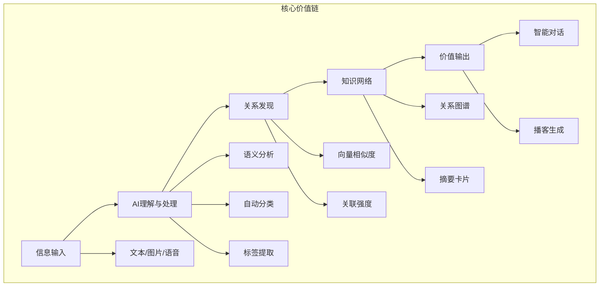
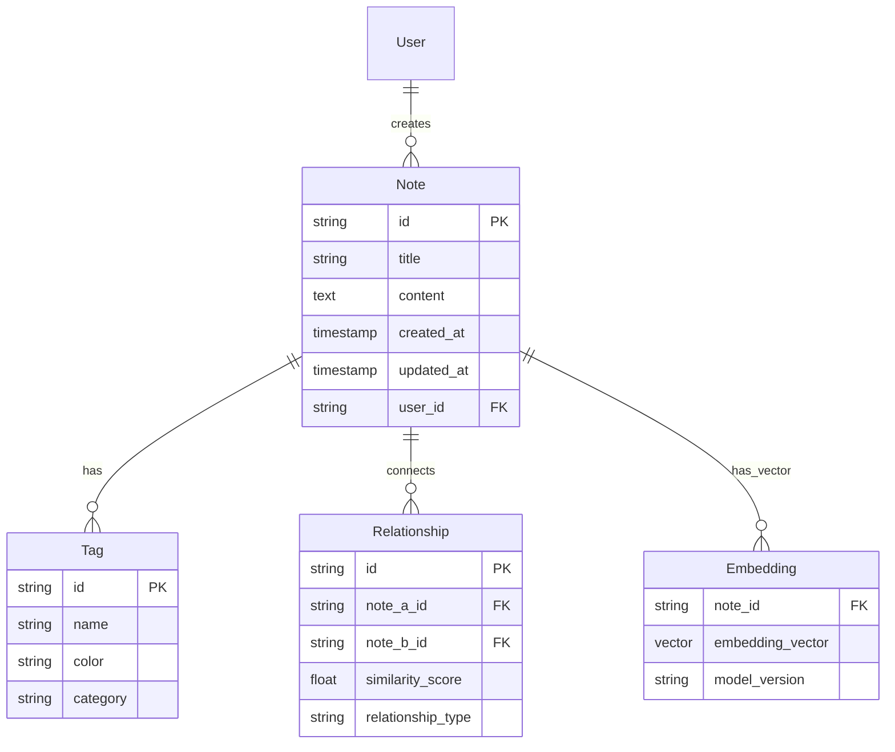

# AI协作会话：MindNote项目从规划到MVP实施路径

## 会话基本信息

- **会话ID**: AC-20251022-001
- **创建时间**: 2025-10-22
- **协作范式**: first-principles (第一性原理思维)
- **主题**: 分析MindNote项目从规划阶段到MVP阶段的具体实施路径
- **状态**: 已完成
- **参与者**: Claude AI Assistant

---

## 📋 协作范式说明

### first-principles - 第一性原理思维

**协作方式**: 通过解构问题到最基本的组成部分，从本质出发重新构建理解和解决方案。这种思维模式帮助我们摆脱传统思维框架的限制，找到更根本、更有效的解决方案。

**应用场景**: 适合复杂问题的深度分析、战略规划、技术架构设计等需要根本性思考的场景。

---

## 🧠 核心分析内容

### 1. 问题本质解构

**MindNote要解决的根本问题**：
- **信息过载** → 现代人面对的信息量远超处理能力
- **知识孤岛** → 信息之间缺乏有意义的连接
- **遗忘曲线** → 信息无法有效转化为长期知识
- **表达瓶颈** → 知识难以有效传递和分享

**核心价值主张**：将个人信息转化为互联的知识网络

### 2. 核心功能要素分解

基于章程中的AI-First原则，解构出最基础的功能要素：



### 3. 技术本质需求

**不可妥协的技术基础**：
1. **语义理解** - 需要高质量的文本嵌入模型
2. **关系计算** - 需要高效的向量相似度计算
3. **实时响应** - 需要优化的查询性能
4. **数据结构** - 需要支持向量搜索的存储方案

## 🎯 MVP定义

### 核心循环（必须实现）
1. **信息输入** - 基础的文本输入功能
2. **AI处理** - 自动分类和标签提取
3. **关系发现** - 基于相似度的笔记关联
4. **可视化** - 简单的关系图谱展示

### 延迟功能（MVP后实现）
- 复杂的多媒体支持
- 高级的对话交互
- 播客生成功能
- 协作编辑

## 🚀 具体实施路径

### 阶段0：基础设施搭建（1-2周）

**目标**：建立可开发的基础环境

**具体任务**：
1. 创建Next.js项目结构
2. 配置TypeScript和ESLint
3. 设置数据库（PostgreSQL + pgvector）
4. 集成AI SDK（Vercel AI SDK）
5. 建立基础的CI/CD流程

### 阶段1：核心数据模型（1-2周）

**目标**：建立支持AI处理的数据结构

**核心实体关系图**：



### 阶段2：AI集成核心（2-3周）

**目标**：实现基础的AI处理能力

**关键组件**：
1. **文本嵌入服务** - 集成OpenAI/Claude API
2. **分类算法** - 自动内容分类
3. **标签提取** - 关键词识别和标签生成
4. **相似度计算** - 向量相似度算法

### 阶段3：用户界面开发（2-3周）

**目标**：提供基础的用户交互界面

**核心页面**：
1. **笔记编辑器** - 基础的文本输入和编辑
2. **笔记列表** - 展示所有笔记和标签
3. **关系图谱** - 简单的网络可视化
4. **设置页面** - 基础的用户配置

### 阶段4：MVP集成测试（1周）

**目标**：确保核心功能正常工作

**测试重点**：
- 端到端的笔记创建流程
- AI处理的准确性和性能
- 关系发现的正确性
- 用户界面的响应性

## 💡 关键决策点

### 技术选型决策

1. **前端框架**：Next.js 15 + React 19
   - 原因：AI原生支持，全栈开发统一

2. **数据库**：PostgreSQL + pgvector
   - 原因：支持向量搜索，成熟稳定

3. **AI集成**：Vercel AI SDK
   - 原因：统一的AI接口，类型安全

4. **关系图谱**：D3.js 或 Cytoscape.js
   - 原因：成熟的图形可视化库

### 风险评估

**高风险**：
- AI API的成本和稳定性
- 向量搜索的性能优化
- 用户隐私和数据安全

**中风险**：
- 技术栈的学习曲线
- 开发进度的时间估算

**低风险**：
- 基础功能的实现
- 用户界面的开发

## 🎯 立即行动指南

### 本周可以开始的工作

**今天**：
```bash
# 1. 创建第一个功能规格
/speckit.specify "项目基础设施搭建和开发环境配置"
```

**本周内**：
1. 完成项目基础架构搭建
2. 配置开发环境和工具链
3. 创建核心数据模型规格
4. 开始AI集成服务的调研

**下周**：
1. 开始核心功能的实现
2. 建立基础的测试框架
3. 完成第一个可工作的原型

## 📊 时间线规划

| 阶段 | 时间 | 主要交付物 | 关键里程碑 |
|------|------|------------|------------|
| 阶段0 | 1-2周 | 基础开发环境 | 可运行的项目骨架 |
| 阶段1 | 1-2周 | 数据模型设计 | 可存储和查询笔记 |
| 阶段2 | 2-3周 | AI处理能力 | 自动分类和标签 |
| 阶段3 | 2-3周 | 用户界面 | 基础的用户交互 |
| 阶段4 | 1周 | MVP测试 | 可演示的完整功能 |
| **总计** | **8-11周** | **MVP版本** | **用户可测试的产品** |

## 🔍 核心洞察

### 关键发现

1. **AI-First不是选择而是必需** - 项目的核心价值完全依赖于AI能力，技术架构必须优先考虑AI集成的可靠性

2. **MVP应该聚焦核心循环** - "输入→AI处理→关系发现→价值输出"这个循环必须完整，而不是分散的功能集合

3. **数据模型是成功的关键** - 需要设计能够有效支持语义搜索和关系发现的数据结构

4. **用户体验需要渐进式** - 复杂的AI功能需要简单的用户界面，技术复杂性与用户简易性需要平衡

### 战略建议

1. **优先验证AI可行性** - 在大规模开发前，先验证核心AI功能的准确性和性能
2. **建立可扩展的架构** - 虽然MVP功能简单，但架构要支持未来的功能扩展
3. **重视用户隐私和安全** - 处理用户个人数据需要从第一天起就考虑安全和合规

## 📝 后续任务清单

### 立即执行
- [ ] 使用 `/speckit.specify` 创建基础设施搭建的详细规格
- [ ] 设置项目版本控制和CI/CD基础配置
- [ ] 开始技术栈的具体实现验证

### 本周内完成
- [ ] 完成开发环境搭建
- [ ] 创建基础项目结构
- [ ] 验证关键技术组件的可行性

### 下周计划
- [ ] 开始核心数据模型实现
- [ ] 集成第一个AI服务
- [ ] 创建基础的用户界面原型

## 🏁 总结

这次第一性原理分析帮助我们从根本上理解了MindNote项目的核心价值和技术要求。通过解构问题本质，我们制定了清晰的4阶段实施路径，明确了MVP的范围和优先级。

**关键成果**：
- 明确了项目的核心价值主张：将个人信息转化为互联的知识网络
- 定义了MVP的边界：聚焦于"输入→AI处理→关系发现→价值输出"核心循环
- 制定了详细的8-11周实施计划
- 识别了关键风险和决策点

**下一步行动**：立即开始项目基础设施搭建的规格说明制定，为实际开发做好准备。

---

*会话记录保存时间：2025-10-22*
*协作范式：first-principles*
*文档版本：v1.0*