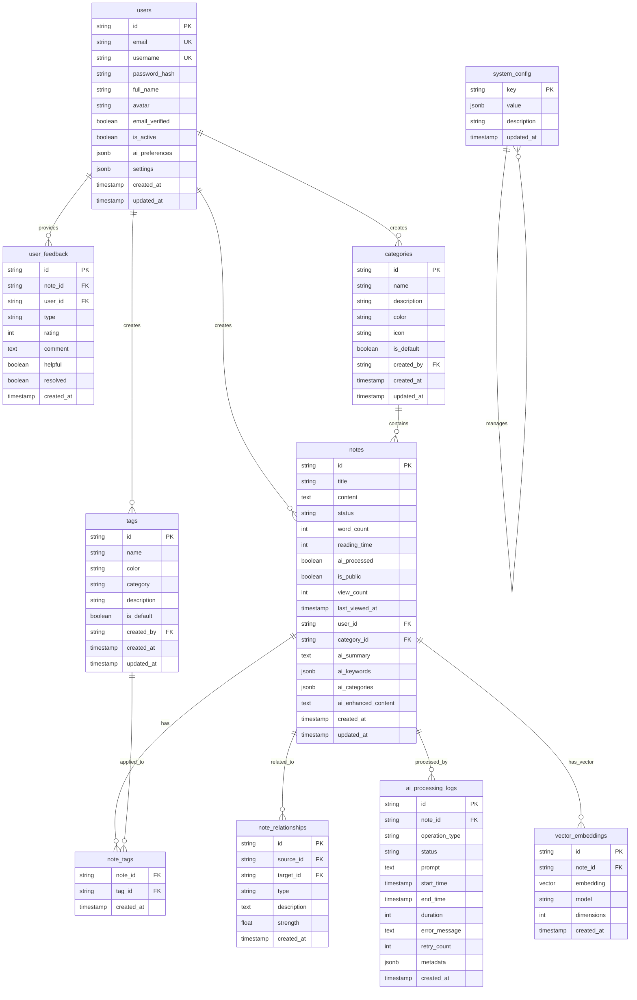

# MindNote 数据库架构文档

## 概述

MindNote 数据库采用 PostgreSQL 作为主数据库，配合 Prisma ORM 进行数据访问。数据库设计支持智能笔记管理的核心功能，包括用户管理、笔记存储、分类标签、AI 处理、向量搜索等。

## 数据库架构图



## 表结构详解

### 用户表 (users)

存储用户基本信息和偏好设置。

| 字段 | 类型 | 说明 |
|------|------|------|
| id | String | 用户唯一标识 |
| email | String | 用户邮箱（唯一） |
| username | String | 用户名（唯一） |
| password_hash | String | 密码哈希值 |
| full_name | String | 用户全名 |
| avatar | String | 头像URL |
| email_verified | Boolean | 邮箱是否已验证 |
| is_active | Boolean | 账户是否激活 |
| ai_preferences | JSONB | AI相关偏好设置 |
| settings | JSONB | 用户个性化设置 |

### 分类表 (categories)

笔记分类信息，支持层级结构和自定义颜色。

| 字段 | 类型 | 说明 |
|------|------|------|
| id | String | 分类唯一标识 |
| name | String | 分类名称 |
| description | String | 分类描述 |
| color | String | 分类颜色 |
| icon | String | 分类图标 |
| is_default | Boolean | 是否为默认分类 |
| created_by | String | 创建者用户ID |
| created_at | Timestamp | 创建时间 |
| updated_at | Timestamp | 更新时间 |

### 标签表 (tags)

笔记标签系统，支持多维度标签分类。

| 字段 | 类型 | 说明 |
|------|------|------|
| id | String | 标签唯一标识 |
| name | String | 标签名称 |
| color | String | 标签颜色 |
| category | String | 标签类别（priority/status/type/context） |
| description | String | 标签描述 |
| is_default | Boolean | 是否为默认标签 |
| created_by | String | 创建者用户ID |
| created_at | Timestamp | 创建时间 |
| updated_at | Timestamp | 更新时间 |

### 笔记表 (notes)

核心笔记数据，包含内容和AI处理结果。

| 字段 | 类型 | 说明 |
|------|------|------|
| id | String | 笔记唯一标识 |
| title | String | 笔记标题 |
| content | Text | 笔记内容 |
| status | String | 笔记状态（DRAFT/PUBLISHED/ARCHIVED） |
| word_count | Int | 字数统计 |
| reading_time | Int | 预计阅读时间（分钟） |
| ai_processed | Boolean | 是否经过AI处理 |
| is_public | Boolean | 是否公开 |
| view_count | Int | 浏览次数 |
| last_viewed_at | Timestamp | 最后浏览时间 |
| user_id | String | 用户ID（外键） |
| category_id | String | 分类ID（外键） |
| ai_summary | Text | AI生成的摘要 |
| ai_keywords | JSONB | AI提取的关键词 |
| ai_categories | JSONB | AI推荐的分类 |
| ai_enhanced_content | Text | AI增强的内容 |
| created_at | Timestamp | 创建时间 |
| updated_at | Timestamp | 更新时间 |

### 向量嵌入表 (vector_embeddings)

存储笔记的向量嵌入，支持语义搜索。

| 字段 | 类型 | 说明 |
|------|------|------|
| id | String | 嵌入唯一标识 |
| note_id | String | 笔记ID（外键） |
| embedding | Vector | 向量嵌入（pgvector） |
| model | String | 使用的嵌入模型 |
| dimensions | Int | 向量维度 |
| created_at | Timestamp | 创建时间 |

## 索引策略

### 主要索引

1. **用户相关索引**
   ```sql
   CREATE INDEX idx_users_email ON users(email);
   CREATE INDEX idx_users_username ON users(username);
   CREATE INDEX idx_users_is_active ON users(is_active);
   ```

2. **笔记相关索引**
   ```sql
   CREATE INDEX idx_notes_user_id ON notes(user_id);
   CREATE INDEX idx_notes_category_id ON notes(category_id);
   CREATE INDEX idx_notes_status ON notes(status);
   CREATE INDEX idx_notes_created_at ON notes(created_at DESC);
   CREATE INDEX idx_notes_ai_processed ON notes(ai_processed);
   ```

3. **向量搜索索引**
   ```sql
   CREATE INDEX idx_vector_embeddings_embedding
   ON vector_embeddings
   USING ivfflat (embedding vector_cosine_ops)
   WITH (lists = 100);
   ```

4. **标签关系索引**
   ```sql
   CREATE INDEX idx_note_tags_note_id ON note_tags(note_id);
   CREATE INDEX idx_note_tags_tag_id ON note_tags(tag_id);
   ```

5. **全文搜索索引**
   ```sql
   CREATE INDEX idx_notes_fulltext ON notes
   USING gin(to_tsvector('chinese', title || ' ' || content));
   ```

## 数据库扩展

### pgvector 扩展

用于向量搜索功能，支持相似性计算和近似搜索。

```sql
CREATE EXTENSION IF NOT EXISTS vector;
```

### pg_trgm 扩展

用于全文搜索和模糊匹配。

```sql
CREATE EXTENSION IF NOT EXISTS pg_trgm;
```

### uuid-ossp 扩展

用于UUID生成。

```sql
CREATE EXTENSION IF NOT EXISTS "uuid-ossp";
```

## 数据迁移策略

### 版本控制

使用 Prisma Migrate 进行数据库版本控制：

1. **迁移文件命名**: `001_initial_schema.sql`, `002_add_vector_support.sql`
2. **环境隔离**: 开发、测试、生产环境使用独立的迁移
3. **回滚支持**: 每个迁移都包含对应的回滚脚本

### 迁移命令

```bash
# 创建新迁移
npm run db:migrate

# 应用迁移
npm run db:migrate:apply

# 回滚迁移
npm run db:migrate:rollback

# 查看迁移状态
npm run db:migrate:status
```

## 性能优化

### 查询优化

1. **连接池配置**
   ```typescript
   const poolConfig = {
     min: 2,
     max: 10,
     idleTimeoutMillis: 30000,
     connectionTimeoutMillis: 5000
   };
   ```

2. **查询优化**
   - 使用适当的索引
   - 避免 N+1 查询问题
   - 使用分页查询
   - 实现查询缓存

3. **向量搜索优化**
   - 使用 IVFFLAT 索引
   - 调整 lists 参数
   - 优化 work_mem 设置

### 数据分区

针对大数据量场景，可考虑按时间分区：

```sql
-- 按月分区笔记表
CREATE TABLE notes_y2024m01 PARTITION OF notes
FOR VALUES FROM ('2024-01-01') TO ('2024-02-01');
```

## 备份与恢复

### 备份策略

1. **全量备份**: 每日凌晨执行
2. **增量备份**: 每小时执行
3. **WAL归档**: 实时归档

### 备份命令

```bash
# 全量备份
pg_dump -h localhost -U mindnote -d mindnote_dev > backup_$(date +%Y%m%d).sql

# 恢复数据库
psql -h localhost -U mindnote -d mindnote_dev < backup_20241024.sql
```

## 监控与维护

### 性能监控

1. **连接池监控**: 监控连接使用率和等待时间
2. **查询性能**: 监控慢查询和执行计划
3. **向量搜索**: 监控向量搜索响应时间

### 维护任务

1. **定期VACUUM**: 每周执行
2. **索引重建**: 根据需要执行
3. **统计信息更新**: 自动更新

## 安全考虑

### 数据安全

1. **数据加密**: 敏感数据加密存储
2. **访问控制**: 基于角色的访问控制
3. **SQL注入防护**: 使用参数化查询

### 连接安全

1. **SSL连接**: 强制使用SSL连接
2. **连接限制**: 限制连接数和并发数
3. **IP白名单**: 限制访问来源

## API集成

### 数据库API端点

- `GET /api/dev/database` - 数据库状态和配置
- `POST /api/dev/database/pool` - 连接池管理
- `GET /api/dev/health` - 健康检查
- `POST /api/v1/search/vector` - 向量搜索
- `PUT /api/v1/search/vector` - 生成向量嵌入

### 数据库操作示例

```typescript
// 向量搜索示例
const searchResults = await fetch('/api/v1/search/vector', {
  method: 'POST',
  headers: { 'Content-Type': 'application/json' },
  body: JSON.stringify({
    query: 'React组件优化',
    limit: 10,
    threshold: 0.7,
    filters: {
      categoryId: 'tech-category-id',
      tags: ['前端', 'React']
    }
  })
});
```

## 故障排除

### 常见问题

1. **连接超时**: 检查网络和防火墙设置
2. **向量搜索慢**: 检查索引和参数配置
3. **迁移失败**: 检查数据库权限和空间

### 调试工具

1. **Prisma Studio**: 可视化数据库管理
2. **pgAdmin**: PostgreSQL管理工具
3. **查询分析器**: 分析查询性能

## 版本历史

- **v1.0.0**: 初始架构设计
- **v1.1.0**: 添加向量搜索支持
- **v1.2.0**: 优化性能和索引策略
- **v1.3.0**: 增强AI处理功能

## 参考资料

- [PostgreSQL 官方文档](https://www.postgresql.org/docs/)
- [Prisma 文档](https://www.prisma.io/docs/)
- [pgvector 文档](https://github.com/pgvector/pgvector)
- [数据库设计最佳实践](https://www.postgresql.org/docs/current/ddl-design.html)

---

本文档最后更新时间: 2024年10月24日