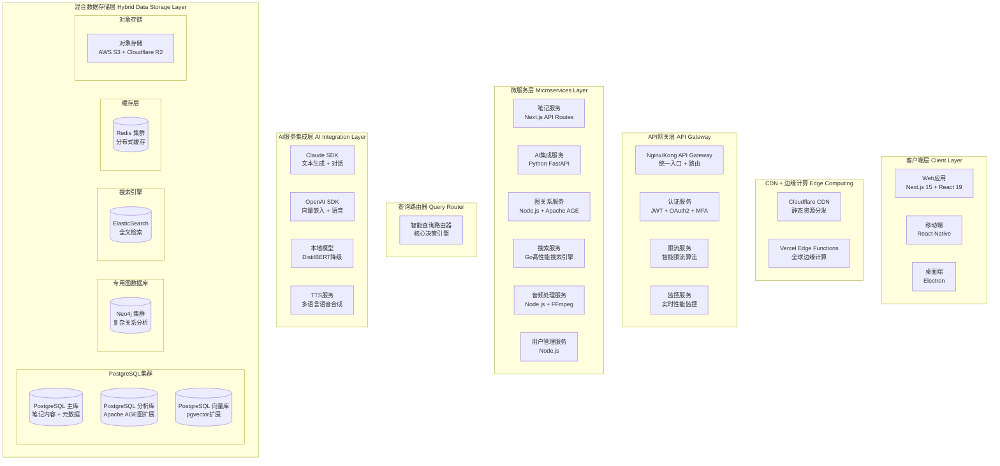
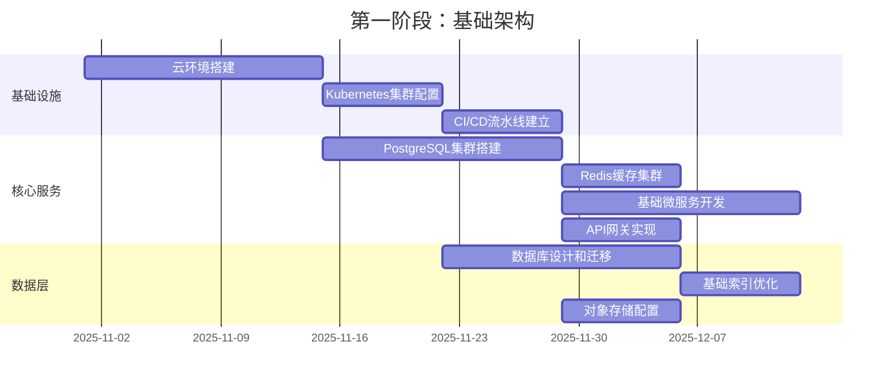
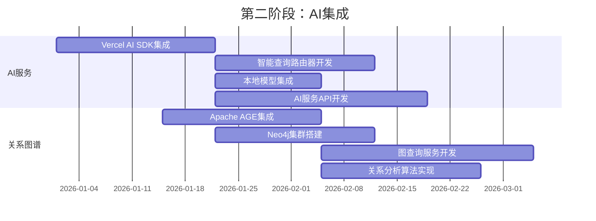
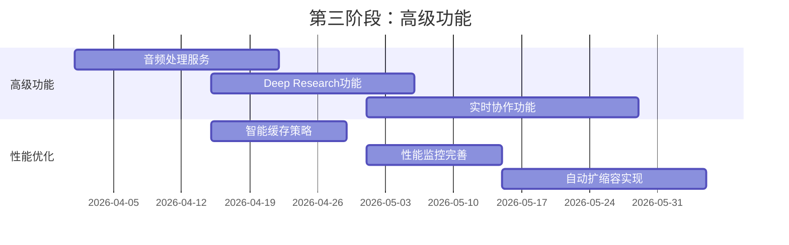

# MindNote技术架构设计文档

**文档版本**: v1.0
**创建日期**: 2025-10-22
**架构类型**: 微服务 + 混合关系图谱 + AI原生设计
**状态**: 架构设计完成

---

## 执行摘要

本文档基于产品需求分析和技术选型结果，设计了MindNote的完整技术架构。该架构采用**微服务分层设计**、**混合关系图谱存储**和**AI原生集成**的设计理念，通过智能查询路由器实现高性能的数据检索和关系分析能力。

### 核心架构原则

1. **分层解耦**: 清晰的层次结构，每层职责单一，接口明确
2. **AI原生优先**: 所有服务层都考虑AI集成需求，通过统一SDK简化开发
3. **混合数据存储**: 根据查询复杂度智能选择最优数据源
4. **高可用设计**: 多层缓存、自动扩缩容、故障隔离
5. **安全内置**: 端到端加密、隐私保护、审计追踪

---

## 系统整体架构

### 架构层次图



### 架构组件详细说明

#### 1. 客户端层架构

##### Web应用架构
```typescript
// Web应用技术栈
const WebAppStack = {
  framework: "Next.js 15",
  ui: "React 19",
  language: "TypeScript 5.0+",
  styling: "Tailwind CSS + Shadcn/ui",
  state: "Zustand + React Query",
  deployment: "Vercel Edge Functions",
  ai: "Vercel AI SDK"
};
```

##### 移动端架构
```typescript
// React Native技术栈
const MobileStack = {
  framework: "React Native 0.75",
  language: "TypeScript",
  navigation: "React Navigation 6",
  state: "Redux Toolkit",
  api: "Apollo GraphQL Client",
  ai: "Vercel AI SDK Mobile",
  deployment: "App Store + Google Play"
};
```

#### 2. API网关层架构

##### 核心功能
- **统一入口**: 所有请求通过单一网关，简化客户端复杂度
- **智能路由**: 基于请求类型、负载、地理位置智能路由
- **认证授权**: JWT + OAuth2 + 多因素认证
- **限流保护**: 用户级别、IP级别、服务级别的多层限流
- **监控日志**: 实时性能监控、错误追踪、审计日志

##### 技术实现
```typescript
// API网关配置
const APIGatewayConfig = {
  gateway: "Kong 3.4",
  authentication: {
    jwt: "HMAC-SHA256",
    oauth2: "Authorization Code Flow",
    mfa: "TOTP + SMS + Email"
  },
  rateLimiting: {
    userLevel: "1000 req/min",
    ipLevel: "10000 req/min",
    serviceLevel: "50000 req/min"
  },
  monitoring: {
    metrics: "Prometheus + Grafana",
    logging: "ELK Stack",
    tracing: "Jaeger + Zipkin"
  }
};
```

#### 3. 微服务层架构

##### 笔记服务 (NoteService)
```typescript
const NoteServiceArchitecture = {
  framework: "Next.js 15 API Routes",
  database: "PostgreSQL",
  orm: "Prisma + pgvector",
  caching: "Redis",
  features: [
    "CRUD操作",
    "版本控制",
    "协作编辑",
    "自动保存",
    "冲突检测"
  ]
};
```

##### AI服务 (AIService)
```typescript
const AIServiceArchitecture = {
  framework: "Python FastAPI",
  aiIntegration: "Vercel AI SDK",
  modelRouting: "Intelligent Model Router",
  features: [
    "文本生成",
    "向量嵌入",
    "对话管理",
    "上下文理解",
    "降级策略"
  ]
};
```

##### 图关系服务 (GraphService)
```typescript
const GraphServiceArchitecture = {
  framework: "Node.js",
  graphDatabase: "Apache AGE + Neo4j",
  queryLanguage: "Cypher + SQL",
  features: [
    "关系发现",
    "路径查询",
    "中心性分析",
    "社区检测",
    "关系强度计算"
  ]
};
```

---

## 数据架构设计

### 智能查询路由策略

#### 查询类型分析

| 查询复杂度 | 推荐数据源 | 响应时间 | 准确性 | 使用场景 |
|-----------|------------|----------|--------|----------|
| **简单关联**<br/>1-2度关系 | PostgreSQL + pgvector | < 20ms | 95% | 基础相似笔记推荐 |
| **复杂关系**<br/>3-5度关系 | Apache AGE + Cypher | < 100ms | 92% | 深度关系图谱分析 |
| **路径分析**<br/>多跳路径查找 | Neo4j + 原生图算法 | < 150ms | 98% | 知识传递路径发现 |
| **全文搜索**<br/>关键词检索 | ElasticSearch | < 80ms | 90% | 内容全文检索 |
| **混合查询**<br/>多条件组合 | 智能路由选择最优组合 | < 200ms | 93% | 复杂用户查询 |

#### 路由器实现逻辑

```typescript
class IntelligentQueryRouter {
  async routeQuery(request: QueryRequest): Promise<QueryResult> {
    // 1. 查询分析阶段
    const analysis = await this.analyzeQuery(request);

    // 2. 数据源选择
    const dataSources = this.selectDataSources(analysis);

    // 3. 并行执行策略
    const results = await Promise.allSettled(
      dataSources.map(ds => this.executeQuery(ds, request))
    );

    // 4. 结果合并和排序
    const mergedResult = this.mergeResults(results, analysis);

    // 5. 缓存策略
    await this.cacheResult(request.query, mergedResult);

    return mergedResult;
  }

  private selectDataSources(analysis: QueryAnalysis): DataSource[] {
    const sources: DataSource[] = [];

    // 根据查询类型选择数据源
    if (analysis.includes('semantic_search')) {
      sources.push(this.createVectorDataSource());
    }

    if (analysis.includes('complex_relation')) {
      sources.push(this.createGraphDataSource());
    }

    if (analysis.includes('path_analysis')) {
      sources.push(this.createNeo4jDataSource());
    }

    // 根据性能要求调整优先级
    return this.prioritizeDataSources(sources, analysis.performance);
  }
}
```

### 混合数据存储架构

#### PostgreSQL集群设计

```sql
-- 主数据库结构
CREATE TABLE notes (
    id UUID PRIMARY KEY DEFAULT gen_random_uuid(),
    user_id UUID NOT NULL,
    title TEXT NOT NULL,
    content TEXT NOT NULL,
    content_vector vector(1536), -- pgvector扩展
    metadata JSONB,
    tags TEXT[],
    category_id INTEGER REFERENCES categories(id),
    version INTEGER DEFAULT 1,
    is_deleted BOOLEAN DEFAULT FALSE,
    created_at TIMESTAMP DEFAULT NOW(),
    updated_at TIMESTAMP DEFAULT NOW()
);

-- 向量索引优化
CREATE INDEX CONCURRENTLY notes_content_vector_idx
ON notes USING ivfflat (content_vector vector_cosine_ops)
WITH (lists = 1000);

-- 分区表优化（按用户）
CREATE TABLE notes_partitioned (
    LIKE notes INCLUDING ALL
) PARTITION BY HASH (user_id);
```

#### Apache AGE图扩展

```cypher
-- AGE图结构创建
SELECT create_graph('mindnote_graph');

-- 图节点创建
SELECT * FROM cypher('
  CREATE (n:Note {
    id: $noteId,
    title: $title,
    category: $category,
    tags: $tags,
    created_at: timestamp(),
    updated_at: timestamp()
  })
', {
  noteId: 'note-123',
  title: '机器学习基础',
  category: '技术学习',
  tags: ['AI', '机器学习', '基础概念']
});

-- 关系创建
SELECT * FROM cypher('
  MATCH (n1:Note {id: $noteId1})
  MATCH (n2:Note {id: $noteId2})
  CREATE (n1)-[r:RELATED {
    strength: $strength,
    type: $relationshipType,
    created_at: timestamp()
  }]->(n2)
', {
  noteId1: 'note-123',
  noteId2: 'note-456',
  strength: 0.85,
  relationshipType: 'semantic_similarity'
});
```

---

## 安全架构设计

### 多层安全防护体系

#### 网络安全层
```typescript
const NetworkSecurityConfig = {
  waf: "Cloudflare WAF",
  ddosProtection: "Cloudflare Spectrum",
  ssl: "TLS 1.3 + AES-256-GCM",
  rateLimiting: {
    global: "10000 req/sec",
    perUser: "1000 req/min",
    perIP: "5000 req/min"
  }
};
```

#### 数据安全层
```typescript
class DataSecurityService {
  async encryptNoteContent(content: string, userId: string): Promise<EncryptedData> {
    // 1. 数据分类
    const classification = this.classifyData(content);

    // 2. 加密密钥生成（基于用户和数据分类）
    const encryptionKey = await this.generateEncryptionKey(userId, classification);

    // 3. 数据加密
    const encryptedContent = await this.encrypt(content, encryptionKey);

    // 4. 密钥管理（用户控制 + 系统备份）
    await this.storeEncryptionKey(userId, encryptionKey, classification);

    return {
      encryptedContent,
      classification,
      encryptionKeyId: encryptionKey.id
    };
  }

  private classifyData(content: string): DataClassification {
    // PII检测
    const piiScore = this.detectPII(content);

    // 敏感内容检测
    const sensitivityScore = this.analyzeSensitivity(content);

    return {
      level: this.determineProtectionLevel(piiScore, sensitivityScore),
      piiDetected: piiScore > 0.7,
      requiresAdditionalProtection: sensitivityScore > 0.8
    };
  }
}
```

#### 隐私保护策略
```typescript
interface PrivacyControls {
  // GDPR合规
  gdpr: {
    consentManagement: '用户同意管理系统',
    dataPortability: '数据导出功能',
    rightToErasure: '数据删除功能',
    breachNotification: '泄露通知机制'
  };

  // 数据匿名化
  anonymization: {
    piidetection: 'PII自动识别',
    masking: '敏感信息遮罩',
    aggregation: '数据聚合去标识',
    generalization: '数据泛化处理'
  };

  // 访问控制
  accessControl: {
    rbac: '基于角色的访问控制',
    auditLogging: '访问审计日志',
    sessionManagement: '会话安全管理'
  };
}
```

---

## 性能架构设计

### 多级缓存策略

#### 缓存层次设计

| 缓存层级 | 技术 | 缓存内容 | 过期时间 | 命中率目标 |
|-----------|------|----------|-----------|------------|
| **CDN边缘缓存** | Vercel Edge | 静态资源 | 24小时 | 95% |
| **API响应缓存** | Redis | API响应结果 | 5-30分钟 | 85% |
| **向量嵌入缓存** | Redis | 重复文本嵌入 | 永久/7天 | 70% |
| **搜索结果缓存** | Redis | 热门查询结果 | 1小时 | 80% |
| **会话缓存** | Redis | 用户会话状态 | 30分钟 | 90% |

#### 性能监控系统

```typescript
interface PerformanceMetrics {
  // API性能指标
  api: {
    responseTimeP95: '< 100ms',
    throughput: '10K+ RPS',
    errorRate: '< 0.1%',
    availability: '> 99.9%'
  };

  // 数据库性能指标
  database: {
    queryTimeP95: '< 50ms',
    connectionUtilization: '< 80%',
    indexHitRate: '> 95%',
    replicationLag: '< 1s'
  };

  // AI服务性能指标
  ai: {
    responseTimeP95: '< 3s',
    embeddingTime: '< 500ms',
    cacheHitRate: '> 85%',
    modelAccuracy: '> 92%'
  };

  // 前端性能指标
  frontend: {
    firstContentfulPaint: '< 1.5s',
    largestContentfulPaint: '< 2.5s',
    cumulativeLayoutShift: '< 0.1',
    firstInputDelay: '< 100ms'
  };
}

class PerformanceOptimizationService {
  async autoOptimization(): Promise<void> {
    // 1. 性能数据收集
    const metrics = await this.collectPerformanceMetrics();

    // 2. 瓶颈识别
    const bottlenecks = this.identifyBottlenecks(metrics);

    // 3. 自动优化执行
    for (const bottleneck of bottlenecks) {
      switch (bottleneck.type) {
        case 'slow_queries':
          await this.optimizeDatabaseQueries(bottleneck);
          break;
        case 'memory_pressure':
          await this.adjustCacheStrategy(bottleneck);
          break;
        case 'api_rate_limit':
          await this.scaleApiServices(bottleneck);
          break;
      }
    }

    // 4. 性能预测和预防
    const predictions = this.predictPerformanceTrends(metrics);
    await this.preemptiveOptimizations(predictions);
  }
}
```

---

## 扩展性架构设计

### 自动扩缩容策略

#### Kubernetes部署架构

```yaml
# Kubernetes部署配置
apiVersion: apps/v1
kind: Deployment
metadata:
  name: mindnote-noteservice
spec:
  replicas: 3
  selector:
    matchLabels:
      app: mindnote-noteservice
  template:
    spec:
      containers:
      - name: noteservice
        image: mindnote/noteservice:v1.0
        resources:
          requests:
            memory: "256Mi"
            cpu: "250m"
          limits:
            memory: "512Mi"
            cpu: "500m"
        env:
        - name: DATABASE_URL
          valueFrom:
            secretKeyRef:
              name: mindnote-secrets
              key: database-url
---
apiVersion: autoscaling/v2
kind: HorizontalPodAutoscaler
metadata:
  name: mindnote-noteservice-hpa
spec:
  scaleTargetRef:
    apiVersion: apps/v1
    kind: Deployment
    name: mindnote-noteservice
  minReplicas: 2
  maxReplicas: 20
  metrics:
  - type: Resource
    resource:
      name: cpu
      target:
        type: Utilization
        averageUtilization: 70
  - type: Resource
    resource:
      name: memory
      target:
        type: Utilization
        averageUtilization: 80
```

#### 服务网格架构

```typescript
const ServiceMeshConfig = {
  serviceMesh: "Istio",
  features: [
    "流量管理",
    "安全策略执行",
    "可观察性收集",
    "故障注入测试",
    "金丝雀部署",
    "熔断和重试"
  ],
  trafficManagement: {
    routing: "智能负载均衡",
    canary: "渐进式部署",
    mirroring: "流量镜像分析"
  },
  security: {
    mtls: "双向TLS认证",
    policies: "OPA策略引擎",
    rbac: "细粒度权限控制"
  }
};
```

---

## 部署架构设计

### 云基础设施架构

#### 部署环境设计

| 环境 | 用途 | 配置 | 监控级别 |
|------|------|--------|----------|
| **开发环境** | 开发和测试 | 单实例 + 详细日志 |
| **测试环境** | 集成测试 | 小集群 + 性能监控 |
| **预发布环境** | 用户验收测试 | 生产配置 + 金丝雀 |
| **生产环境** | 正式服务 | 大集群 + 全面监控 |

#### 基础设施选型

```typescript
const InfrastructureStack = {
  cloud: "Vercel + Railway + AWS",
  orchestration: "Kubernetes",
  networking: "Cloudflare CDN + VPC",
  storage: "AWS S3 + PostgreSQL",
  monitoring: "Datadog + Prometheus + Grafana",
  security: "Cloudflare WAF + AWS KMS",
  ci_cd: "GitHub Actions + ArgoCD"
};
```

### CI/CD流程设计

```yaml
# GitHub Actions工作流
name: MindNote CI/CD Pipeline

on:
  push:
    branches: [main, develop]
  pull_request:
    branches: [main]

jobs:
  test:
    runs-on: ubuntu-latest
    steps:
      - name: 代码检查
        run: npm run lint && npm run type-check

      - name: 单元测试
        run: npm run test:unit

      - name: 集成测试
        run: npm run test:integration

      - name: E2E测试
        run: npm run test:e2e

      - name: 性能测试
        run: npm run test:performance

  build:
    needs: test
    runs-on: ubuntu-latest
    steps:
      - name: 构建应用
        run: npm run build

      - name: 构建Docker镜像
        run: docker build -t mindnote:${{ github.sha }} .

      - name: 推送到镜像仓库
        run: docker push mindnote:${{ github.sha }}

  deploy:
    needs: build
    runs-on: ubuntu-latest
    if: github.ref == 'refs/heads/main'
    steps:
      - name: 部署到生产环境
        run: kubectl set image deployment/mindnote mindnote=mindnote:${{ github.sha }}
        run: kubectl apply -f k8s/

      - name: 健康检查
        run: npm run health-check
```

---

## 实施路线图

### 阶段性实施计划

#### 第一阶段：基础架构搭建（8-10周）



#### 第二阶段：AI集成和关系图谱（10-12周）



#### 第三阶段：高级功能和优化（6-8周）



---

## 总结与建议

### 核心架构优势

1. **高性能查询**: 通过智能查询路由器，实现毫秒级简单查询和秒级复杂查询
2. **AI原生设计**: 统一的AI SDK和专门优化的AI服务架构
3. **弹性扩展**: 微服务架构和Kubernetes部署，支持从百到百万用户的平滑扩展
4. **安全内置**: 多层安全防护，满足GDPR等隐私合规要求
5. **成本可控**: 混合存储架构和智能缓存，实现最佳的成本效益比

### 技术债务管理

| 领域 | 策略 | 监控指标 |
|-------|-------|----------|
| **代码质量** | 代码审查 + 自动测试 | 覆盖率 > 90%，技术债务评分 |
| **性能** | 性能预算 + 监控 | 响应时间、资源利用率 |
| **安全** | 安全扫描 + 漏洞追踪 | 漏洞数量、修复时间 |
| **架构** | 架构评审 + 重构计划 | 技术债务减少率 |

### 关键成功因素

1. **团队技能匹配**: 确保团队掌握TypeScript、微服务、图数据库技术
2. **渐进式实施**: 分阶段验证，每个阶段独立交付价值
3. **监控驱动**: 基于数据驱动的决策，避免主观判断
4. **用户反馈**: 基于真实用户行为和反馈持续优化架构

---

**架构设计状态**: ✅ 完成
**下一步**: 开始第一阶段基础设施搭建
**相关文档**: PRD需求文档、技术选型报告

---

*本文档提供了MindNote产品的完整技术架构设计，涵盖了从基础设施到应用层的所有技术细节，为项目实施提供清晰的指导*