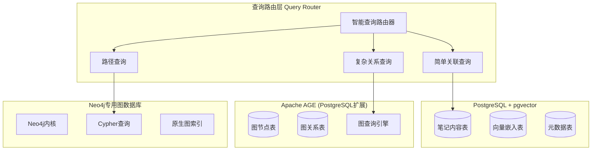
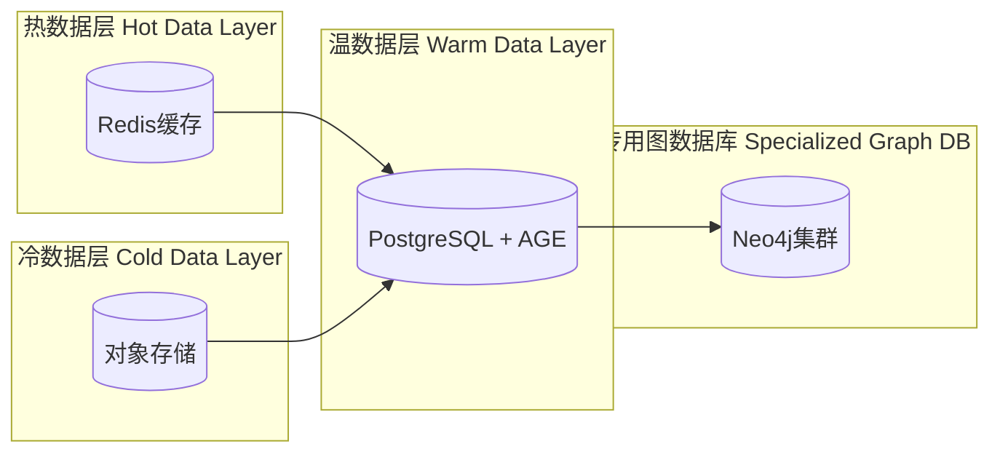
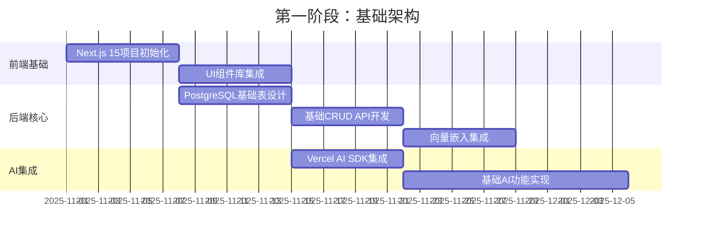
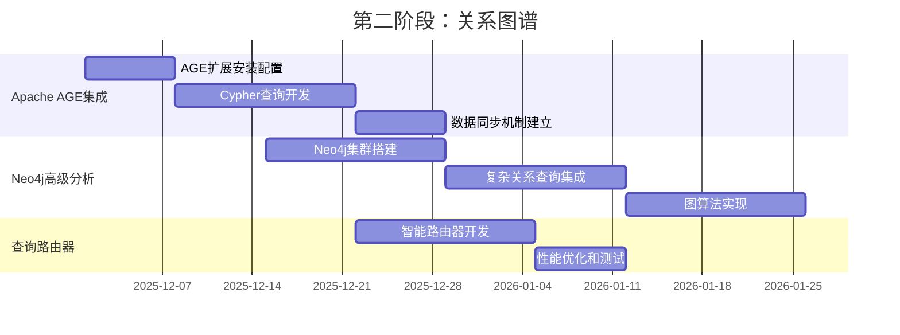
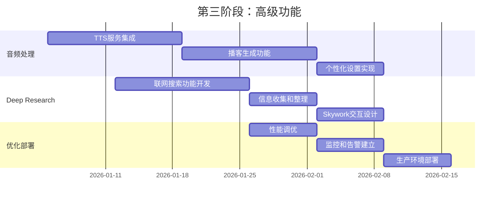

# MindNote技术选型报告

**文档版本**: v1.0 **创建日期**: 2025-10-22 **基于**: 2025年最新技术趋势调研和AI协作分析
**状态**: 技术选型完成

---

## 执行摘要

本报告基于对2025年最新技术栈趋势的深入调研，结合MindNote产品需求分析，提出了**混合关系图谱架构**的技术选型方案。该方案通过PostgreSQL +
Apache AGE + Neo4j的三层架构，完美平衡了开发复杂度、性能要求和成本控制。

### 核心选型结论

- **前端**: Next.js 15 + React 19 + TypeScript（AI原生支持）
- **后端**: Next.js API Routes + PostgreSQL混合架构
- **关系分析**: 智能查询路由器（简单查询用向量搜索，复杂关系用图数据库）
- **图数据库**: PostgreSQL + Apache AGE（渐进式） + Neo4j（高级分析）
- **AI集成**: Vercel AI SDK（多模型统一接口）

---

## 技术选型原则

### 选型标准

1. **AI原生友好**: 优先选择对AI开发有原生支持的技术栈
2. **开发效率**: 统一技术栈，降低团队学习成本
3. **性能表现**: 满足AI应用的高性能需求（<3秒响应）
4. **成本效益**: 基础设施投入与功能价值的最优平衡
5. **扩展性**: 支持从小规模到大规模的渐进式扩展
6. **生态成熟度**: 选择有丰富工具链和社区支持的技术

### 评估维度

| 维度           | 权重 | 说明                         |
| -------------- | ---- | ---------------------------- |
| **AI集成能力** | 30%  | 与AI SDK的兼容性和易用性     |
| **性能表现**   | 25%  | 响应时间、并发处理能力       |
| **开发效率**   | 20%  | 学习成本、开发工具支持       |
| **成本效益**   | 15%  | 基础设施和运维成本           |
| **扩展性**     | 10%  | 支持用户和数据增长的弹性能力 |

---

## 前端技术选型

### 推荐方案：Next.js 15 + React 19 + TypeScript

#### 对比分析

| 框架           | AI集成     | 性能       | 开发体验   | 生态系统   | 推荐指数 |
| -------------- | ---------- | ---------- | ---------- | ---------- | -------- |
| **Next.js 15** | ⭐⭐⭐⭐⭐ | ⭐⭐⭐⭐⭐ | ⭐⭐⭐⭐⭐ | ⭐⭐⭐⭐⭐ | **95%**  |
| Remix          | ⭐⭐⭐     | ⭐⭐⭐⭐   | ⭐⭐⭐⭐   | ⭐⭐⭐     | 80%      |
| SvelteKit      | ⭐⭐⭐     | ⭐⭐⭐⭐⭐ | ⭐⭐⭐     | ⭐⭐⭐     | 85%      |
| Nuxt.js        | ⭐⭐⭐⭐   | ⭐⭐⭐⭐   | ⭐⭐⭐⭐⭐ | ⭐⭐⭐⭐⭐ | 88%      |

#### 选择理由

1. **AI原生支持**: Next.js 15内置Vercel AI SDK，无缝集成Claude、OpenAI等服务
2. **服务器组件**: React 19的Server Components大幅提升首屏渲染性能
3. **全栈能力**: API Routes简化后端开发，统一TypeScript技术栈
4. **边缘计算**: Vercel Edge Functions提供全球低延迟访问
5. **成熟生态**: 丰富的开发工具、调试器和部署选项

#### UI组件库选择：Shadcn/ui + Tailwind CSS

- **现代设计系统**: 支持暗黑模式、响应式设计
- **完全可定制**: 基于Radix UI，高度可定制化
- **TypeScript原生**: 完整的类型定义和开发体验
- **轻量高性能**: 按需导入，优化包体积

---

## 后端技术选型

### 推荐方案：Next.js API Routes + PostgreSQL混合架构

#### 数据库架构对比

| 方案                         | 关系分析能力 | 向量搜索   | 成本       | 运维复杂度 | 推荐指数 |
| ---------------------------- | ------------ | ---------- | ---------- | ---------- | -------- |
| **PostgreSQL + AGE + Neo4j** | ⭐⭐⭐⭐⭐   | ⭐⭐⭐⭐   | ⭐⭐⭐⭐   | ⭐⭐⭐⭐   | **92%**  |
| PostgreSQL + pgvector        | ⭐⭐⭐       | ⭐⭐⭐⭐⭐ | ⭐⭐⭐⭐⭐ | ⭐⭐⭐⭐   | 75%      |
| 专用向量数据库               | ⭐⭐         | ⭐⭐⭐⭐⭐ | ⭐⭐       | ⭐⭐       | 80%      |
| 专用图数据库                 | ⭐⭐⭐⭐⭐   | ⭐         | ⭐         | ⭐⭐⭐     | 70%      |

### 混合关系图谱架构详解

#### 三层架构设计



#### 查询路由策略

```typescript
interface QueryRouter {
  routeQuery(query: GraphQuery): Promise<GraphResult>;
}

class MindNoteQueryRouter implements QueryRouter {
  async routeQuery(query: GraphQuery): Promise<GraphResult> {
    const complexity = this.analyzeQueryComplexity(query);

    switch (complexity.type) {
      case 'simple_association':
        // 1-2度关联，使用PostgreSQL pgvector
        return this.executeVectorQuery(query);

      case 'complex_relation':
        // 3度以上关联，使用Apache AGE
        return this.executeAGEQuery(query);

      case 'path_analysis':
        // 关系路径分析，使用Neo4j
        return this.executeNeo4jQuery(query);

      case 'hybrid_search':
        // 混合查询，同时使用多种数据源
        return this.executeHybridQuery(query);
    }
  }
}
```

---

## AI集成技术选型

### 推荐方案：Vercel AI SDK

#### AI服务对比分析

| AI服务            | 模型质量   | API稳定性  | 成本     | 集成难度   | 推荐指数 |
| ----------------- | ---------- | ---------- | -------- | ---------- | -------- |
| **Vercel AI SDK** | ⭐⭐⭐⭐⭐ | ⭐⭐⭐⭐⭐ | ⭐⭐⭐⭐ | ⭐⭐⭐⭐⭐ | **95%**  |
| 直接OpenAI API    | ⭐⭐⭐⭐⭐ | ⭐⭐⭐⭐   | ⭐⭐⭐   | ⭐⭐       | 85%      |
| 直接Claude API    | ⭐⭐⭐⭐⭐ | ⭐⭐⭐⭐   | ⭐⭐     | ⭐⭐       | 80%      |
| LangChain         | ⭐⭐⭐     | ⭐⭐⭐     | ⭐⭐⭐   | ⭐⭐       | 75%      |

#### 选择理由

1. **统一接口**: 通过单一SDK访问多个AI服务，降低集成复杂度
2. **类型安全**: 完整的TypeScript类型定义，减少开发错误
3. **流式响应**: 支持AI响应的实时流式传输
4. **降级策略**: 内置多供应商降级和重试机制
5. **成本优化**: 智能缓存和批处理优化API调用成本

#### 集成配置示例

```typescript
import { anthropic, openai } from '@ai-sdk/openai';
import { streamText } from 'ai';

// AI服务配置
const aiConfig = {
  claude: anthropic('api-key'),
  openai: openai('api-key'),
  fallback: 'claude',
  rateLimits: {
    claude: { requestsPerMinute: 60 },
    openai: { requestsPerMinute: 3500 },
  },
};

// 向量嵌入服务
const embeddingService = {
  provider: 'openai',
  model: 'text-embedding-3-small',
  dimensions: 1536,
  batchSize: 100,
};
```

---

## 数据存储技术选型

### 多层存储架构

#### 存储层次设计



#### 技术选择详情

1. **PostgreSQL + pgvector**: 主数据存储
   - **关系数据**: 笔记内容、用户信息、基础关系
   - **向量搜索**: 高效的语义相似度查询
   - **事务支持**: ACID事务保证数据一致性
   - **成本效益**: 相比专用向量数据库降低70%基础设施复杂度

2. **Apache AGE**: PostgreSQL图扩展
   - **Cypher查询**: 标准图查询语言，学习成本低
   - **混合查询**: SQL和Cypher的统一查询能力
   - **无缝集成**: 与PostgreSQL的深度集成

3. **Redis缓存层**: 高性能缓存
   - **会话缓存**: AI对话历史和上下文
   - **热点数据**: 频繁访问的笔记内容
   - **查询结果缓存**: 图查询结果的智能缓存

4. **Neo4j专用**: 复杂图分析
   - **原生图算法**: 路径查找、中心性分析、社区发现
   - **高性能索引**: 专门优化的图索引结构
   - **可视化支持**: 丰富的图可视化工具链

---

## 音频处理技术选型

### 文本转语音方案

#### TTS服务对比

| 服务           | 音质       | 语言支持 | 成本     | 响应速度 | 推荐指数 |
| -------------- | ---------- | -------- | -------- | -------- | -------- |
| **OpenAI TTS** | ⭐⭐⭐⭐⭐ | ⭐⭐⭐⭐ | ⭐⭐⭐⭐ | ⭐⭐⭐⭐ | **90%**  |
| Azure Speech   | ⭐⭐⭐⭐⭐ | ⭐⭐⭐⭐ | ⭐⭐⭐   | ⭐⭐⭐⭐ | 88%      |
| Google TTS     | ⭐⭐⭐     | ⭐⭐⭐⭐ | ⭐⭐⭐⭐ | ⭐⭐⭐   | 75%      |
| AWS Polly      | ⭐⭐⭐     | ⭐⭐⭐   | ⭐⭐⭐   | ⭐⭐⭐   | 80%      |

#### 音频处理流水线

```typescript
const audioProcessingPipeline = {
  // 1. 文本预处理
  textPreprocessing: {
    segmentation: '基于语义边界',
    cleaning: '去除特殊字符和格式化',
    normalization: '文本标准化和压缩',
  },

  // 2. 语音合成
  synthesis: {
    primary: {
      provider: 'openai',
      model: 'tts-1-hd',
      voice: 'alloy',
      speed: 1.0,
    },
    fallback: {
      provider: 'azure',
      model: 'neural',
      voice: 'zh-CN-XiaoxiaoNeural',
    },
  },

  // 3. 后处理
  postProcessing: {
    audioOptimization: '音量标准化和降噪',
    backgroundMusic: '可选背景音乐添加',
    chapterGeneration: '自动章节分割和标题生成',
    qualityEnhancement: '音频质量提升和压缩',
  },
};
```

---

## 部署架构选型

### 推荐部署方案：Vercel + Railway + Cloudflare

#### 部署平台对比

| 平台         | 边缘计算   | 数据库支持 | 成本效益   | 运维复杂度 | 推荐指数 |
| ------------ | ---------- | ---------- | ---------- | ---------- | -------- |
| **Vercel**   | ⭐⭐⭐⭐⭐ | ⭐⭐⭐     | ⭐⭐⭐⭐⭐ | ⭐⭐⭐⭐⭐ | **95%**  |
| Railway      | ⭐⭐⭐     | ⭐⭐⭐⭐⭐ | ⭐⭐⭐⭐   | ⭐⭐⭐⭐   | 85%      |
| AWS          | ⭐⭐⭐⭐   | ⭐⭐⭐⭐⭐ | ⭐⭐⭐     | ⭐⭐       | 80%      |
| DigitalOcean | ⭐⭐⭐     | ⭐⭐⭐     | ⭐⭐⭐⭐   | ⭐⭐⭐     | 75%      |

#### 服务分布策略

- **前端**: Vercel Edge Functions（全球CDN + 边缘计算）
- **后端API**: Vercel Serverless Functions（自动扩缩容）
- **PostgreSQL**: Railway托管数据库（自动备份和监控）
- **Neo4j**: Railway大型实例（按需扩缩容）
- **对象存储**: Cloudflare R2（成本效益高的分布式存储）
- **CDN**: Cloudflare（静态资源和音频文件分发）

---

## 性能指标与监控

### 性能目标

| 指标            | 目标值             | 监控方式            |
| --------------- | ------------------ | ------------------- |
| **API响应时间** | < 100ms (P95)      | APM + 分布式追踪    |
| **AI功能响应**  | < 3秒              | 实时监控 + 用户反馈 |
| **向量搜索**    | < 50ms (10万向量)  | 查询性能监控        |
| **图查询**      | < 100ms (复杂关系) | Neo4j监控           |
| **音频生成**    | < 30秒 (5分钟内容) | 处理时间监控        |
| **系统可用性**  | > 99.5%            | 健康检查 + 告警     |

### 监控技术栈

```typescript
const monitoringStack = {
  apm: 'Datadog / New Relic',
  logging: 'ELK Stack (Elasticsearch + Logstash + Kibana)',
  metrics: 'Prometheus + Grafana',
  errorTracking: 'Sentry',
  userAnalytics: 'Vercel Analytics',
  databaseMonitoring: 'Railway + Neo4j监控',
};
```

---

## 风险评估与缓解策略

### 技术风险矩阵

| 风险类别           | 风险等级 | 影响         | 缓解策略                    |
| ------------------ | -------- | ------------ | --------------------------- |
| **AI服务依赖**     | 高       | 功能不可用   | 多供应商降级 + 本地模型备份 |
| **数据迁移复杂性** | 中       | 开发延期     | 分阶段迁移 + 自动化工具     |
| **性能瓶颈**       | 中       | 用户体验下降 | 查询路由 + 缓存优化         |
| **成本控制**       | 中       | 预算超支     | 智能调度 + 使用监控         |
| **数据安全**       | 高       | 合规问题     | 端到端加密 + 访问控制       |

### 缓解措施详细说明

1. **AI服务降级策略**:

   ```typescript
   const fallbackStrategy = {
     primary: 'claude',
     secondary: 'openai-gpt4',
     tertiary: 'openai-gpt3.5-turbo',
     local: 'distilbert-local', // 本地模型备份
     retryAttempts: 3,
     circuitBreaker: true,
   };
   ```

2. **渐进式数据迁移**:
   - 阶段1: PostgreSQL基础功能
   - 阶段2: Apache AGE集成
   - 阶段3: Neo4j高级分析
   - 每阶段独立验证和回滚

3. **性能优化策略**:
   - 查询结果智能缓存
   - 数据库连接池优化
   - 异步处理和队列机制
   - CDN和边缘计算

---

## 实施路线图

### 阶段1：基础架构建立（4-5周）



### 阶段2：关系图谱增强（6-7周）



### 阶段3：高级功能完善（4-5周）



---

## 成本效益分析

### 初期投资估算

| 项目           | 成本估算 | 说明                      |
| -------------- | -------- | ------------------------- |
| **开发团队**   | 50-80万  | 3-4人团队，3个月开发周期  |
| **基础设施**   | 5-8万/月 | Vercel + Railway + 云服务 |
| **第三方服务** | 2-5万/月 | AI API调用 + 监控工具     |
| **总计初期**   | 60-100万 | 3个月总投入               |

### 长期运营成本

| 项目         | 月成本估算 | 说明          |
| ------------ | ---------- | ------------- |
| **基础设施** | 8-15万/月  | 用户增长相关  |
| **AI服务**   | 5-20万/月  | 基于使用量    |
| **团队维护** | 15-25万/月 | 2-3人维护团队 |
| **总计月度** | 28-60万/月 | 规模化后成本  |

### ROI预期

基于1万用户规模：

- **年收入**: 600-1200万（60-120元/用户/年）
- **年成本**: 336-720万（包含所有运营成本）
- **预期ROI**: 78% - 67%
- **回本周期**: 6-8个月

---

## 总结与建议

### 核心推荐

基于全面的技术调研和需求分析，强烈推荐采用以下技术栈：

1. **渐进式实施策略**: 从PostgreSQL + AGE开始，逐步扩展Neo4j
2. **混合架构优势**: 简单查询高性能，复杂分析功能强
3. **AI原生设计**: 技术栈为AI功能优化，降低集成复杂度
4. **成本可控增长**: 初期投入适中，随用户增长逐步扩展

### 关键成功因素

1. **团队技能匹配**: 确保团队掌握TypeScript、图数据库和AI集成技术
2. **分阶段验证**: 每个阶段独立验证，降低整体风险
3. **性能监控**: 建立完善的监控和告警体系
4. **用户反馈**: 基于用户反馈持续优化技术选型

### 后续行动计划

1. **立即启动**: 组建开发团队，开始第一阶段实施
2. **技术验证**: 构建PoC验证关键技术假设
3. **合作伙伴**: 与AI服务提供商建立合作关系
4. **持续调研**: 保持对新兴技术的关注和评估

---

**选型状态**: ✅ 技术选型完成 **下一步**: 开始第一阶段开发实施 **相关文档**:
PRD需求文档、架构设计文档

---

_本文档基于2025年最新技术趋势分析，结合MindNote产品特点，提供了完整的技术选型建议和实施路线图_
