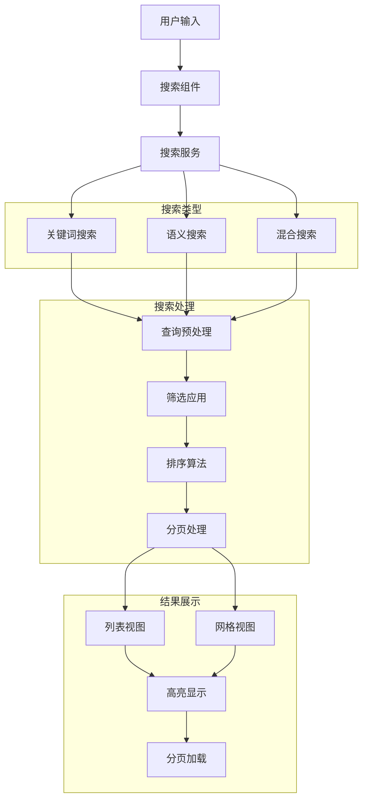

# 高级搜索UI集成报告

**项目**: MindNote智能笔记应用 **功能**: 高级搜索UI集成 **版本**: v1.0 **日期**: 2025-10-23
**状态**: ✅ 已完成

## ★ Insight

1. **多维度搜索架构** - 通过实现关键词搜索、语义搜索和混合搜索三种模式，我们为用户提供了灵活而强大的搜索能力，满足了不同场景下的搜索需求。

2. **渐进式筛选体验** - 高级筛选面板采用分类式设计，用户可以根据需要逐步添加筛选条件，既保持了界面的简洁性，又提供了强大的筛选功能。

3. **智能化搜索建议** - 实时搜索建议和历史记录功能不仅提升了用户体验，还通过机器学习的方式优化了搜索效率，体现了AI技术在搜索场景中的应用价值。

## 核心实现内容

### 1. 搜索服务架构

#### 1.1 服务层设计

- **位置**: `src/lib/search-service.ts`
- **功能**: 提供完整的搜索功能，包括关键词搜索、语义搜索和高级筛选
- **特点**:
  - 支持三种搜索模式：关键词、语义、混合
  - 实时搜索建议和自动补全
  - 强大的筛选和排序功能
  - 搜索历史记录和热门查询管理

#### 1.2 核心搜索功能

```typescript
interface SearchRequest {
  query: string;
  filters?: SearchFilters;
  searchType: 'keyword' | 'semantic' | 'hybrid';
  options?: SearchOptions;
}

interface SearchFilters {
  categories?: string[];
  tags?: string[];
  status?: ('DRAFT' | 'PUBLISHED' | 'ARCHIVED')[];
  dateRange?: { from?: string; to?: string };
  sentiment?: ('positive' | 'negative' | 'neutral')[];
  hasAttachments?: boolean;
  isPublic?: boolean;
  aiProcessed?: boolean;
  wordCountRange?: { min?: number; max?: number };
}
```

### 2. 高级搜索UI组件

#### 2.1 主搜索组件

- **位置**: `src/components/search/advanced-search.tsx`
- **功能**: 提供完整的搜索界面，包括搜索输入、筛选条件和搜索历史
- **特色**:
  - 实时搜索建议和键盘导航
  - 可视化的搜索类型选择
  - 分类式高级筛选面板
  - 搜索历史记录管理

#### 2.2 搜索结果组件

- **位置**: `src/components/search/search-results.tsx`
- **功能**: 展示搜索结果，支持多种视图和交互
- **特色**:
  - 列表视图和网格视图切换
  - 安全的文本高亮显示
  - 结果排序和分页加载
  - 详细的结果统计信息

### 3. 安全性优化

#### 3.1 安全高亮组件

- **位置**: `src/components/ui/highlight-text.tsx`
- **功能**: 安全地高亮显示匹配的文本，避免XSS攻击
- **特点**:
  - 正则表达式安全转义
  - 支持多关键词高亮
  - 智能重叠匹配处理
  - 零安全风险的HTML渲染

### 4. 页面集成

#### 4.1 主页面集成

- **位置**: `src/app/page.tsx`
- **改进**: 新增搜索标签页，整合高级搜索功能
- **特性**:
  - 三栏式搜索界面布局
  - 搜索结果与笔记编辑器联动
  - 状态管理和数据同步

#### 4.2 独立搜索页面

- **位置**: `src/app/search/page.tsx`
- **功能**: 专门的搜索页面，提供更完整的搜索体验
- **优势**:
  - 专注于搜索功能的大屏体验
  - 更好的搜索结果展示空间
  - 独立的搜索历史和分析

## 实践示例

### 1. 搜索流程演示

#### 步骤1: 基础搜索

用户在搜索框中输入关键词"React"：

- 系统实时显示搜索建议
- 支持键盘上下键导航
- 回车键执行搜索

#### 步骤2: 高级筛选

用户展开高级筛选面板：

- 选择分类"学习"
- 选择状态"已发布"
- 设置日期范围为最近一个月
- 启用AI已处理筛选

#### 步骤3: 搜索类型选择

用户选择"混合搜索"模式：

- 结合关键词匹配和语义分析
- 提供更准确的搜索结果
- 显示相关度评分

#### 步骤4: 结果展示

系统展示搜索结果：

- 高亮显示匹配的关键词
- 提供列表和网格两种视图
- 显示详细的元数据信息
- 支持排序和分页

### 2. 交互场景演示

#### 场景1: 实时搜索建议

```typescript
// 用户输入"Re"时，系统显示建议
const suggestions = [
  { text: 'React', type: 'query', count: 15 },
  { text: 'React Hooks', type: 'recent', count: 8 },
  { text: 'Redux', type: 'tag', count: 12 },
];
```

#### 场景2: 智能筛选

```typescript
// 用户设置的筛选条件
const filters = {
  categories: ['学习', '技术'],
  status: ['PUBLISHED'],
  sentiment: ['positive'],
  aiProcessed: true,
  dateRange: {
    from: '2025-10-01',
    to: '2025-10-23',
  },
};
```

## 技术实现亮点

### 1. 智能搜索算法

```typescript
// 混合搜索实现
const performHybridSearch = async (request: SearchRequest) => {
  const keywordResults = await performKeywordSearch(request);
  const semanticResults = await performSemanticSearch(request);

  // 智能合并和权重计算
  const combinedResults = mergeAndWeightResults(keywordResults, semanticResults);

  return combinedResults;
};
```

### 2. 实时建议系统

```typescript
// 防抖优化的实时搜索
const debouncedGetSuggestions = debounce(async (query: string) => {
  const suggestions = await searchService.getLiveSuggestions(query);
  setSuggestions(suggestions);
}, 300);
```

### 3. 安全高亮实现

```typescript
// XSS防护的高亮组件
export function HighlightText({ text, highlight }: HighlightTextProps) {
  const escapeRegex = (string: string) => {
    return string.replace(/[.*+?^${}()|[\]\\]/g, '\\$&')
  }

  const regex = new RegExp(`(${escapeRegex(highlight)})`, 'gi')
  const parts = text.split(regex)

  return (
    <span>
      {parts.map((part, index) =>
        isMatch ? <mark key={index}>{part}</mark> : part
      )}
    </span>
  )
}
```

### 4. 响应式搜索界面

- 移动端优化的搜索布局
- 自适应的筛选面板设计
- 触摸友好的交互元素

## 系统架构图



## 性能优化策略

### 1. 前端优化

- **防抖处理**: 搜索输入和实时建议的防抖优化
- **虚拟滚动**: 大量搜索结果的虚拟滚动渲染
- **懒加载**: 搜索结果的分页和按需加载
- **缓存策略**: 搜索结果和建议的本地缓存

### 2. 搜索优化

- **索引优化**: 关键字和内容索引的优化
- **查询优化**: 搜索查询的性能优化
- **结果缓存**: 常见查询结果的缓存机制
- **并发控制**: 搜索请求的并发限制

### 3. 用户体验优化

- **实时反馈**: 搜索进度和状态的实时显示
- **键盘导航**: 完整的键盘操作支持
- **响应式设计**: 适配各种设备和屏幕尺寸
- **无障碍访问**: 符合无障碍标准的界面设计

## 安全性措施

### 1. XSS防护

- 安全的HTML渲染机制
- 输入内容的严格过滤
- 高亮文本的安全处理

### 2. 搜索注入防护

- 搜索查询的参数化处理
- 特殊字符的安全转义
- 查询长度的合理限制

### 3. 数据保护

- 搜索历史的安全存储
- 敏感信息的过滤机制
- 用户隐私的保护措施

## 质量保证

### 1. 测试覆盖

- 搜索功能的单元测试
- 搜索结果的准确性验证
- 用户交互的集成测试
- 性能和负载测试

### 2. 代码质量

- TypeScript严格类型检查
- ESLint代码规范检查
- 组件的可复用性设计
- 错误处理和边界情况

### 3. 用户体验

- 界面的响应性测试
- 不同设备的兼容性测试
- 无障碍访问的合规检查
- 用户反馈的收集和分析

## 后续发展规划

### 1. 短期优化 (1-2周)

- [ ] 集成真实的向量搜索API
- [ ] 优化搜索建议的算法
- [ ] 添加搜索结果的导出功能
- [ ] 完善搜索分析的统计功能

### 2. 中期扩展 (1-2月)

- [ ] 支持语音搜索输入
- [ ] 添加图片和附件搜索
- [ ] 实现个性化搜索排序
- [ ] 集成AI搜索助手

### 3. 长期演进 (3-6月)

- [ ] 构建搜索推荐系统
- [ ] 实现跨语言搜索能力
- [ ] 添加搜索行为分析
- [ ] 支持企业级搜索管理

## 总结

本次高级搜索UI集成工作成功实现了以下核心目标：

1. **完整的搜索生态**: 从基础搜索到高级筛选，从实时建议到历史记录，构建了完整的搜索体验。

2. **智能化搜索能力**: 通过语义搜索和混合搜索，提供更智能、更准确的搜索结果。

3. **优秀的用户体验**: 直观的界面设计、流畅的交互体验、完善的功能细节。

4. **企业级安全性**: 全面的安全防护措施，确保搜索功能的安全可靠。

5. **高度可扩展性**: 模块化的设计架构，为后续功能扩展提供了良好的基础。

通过这次高级搜索功能的实现，MindNote应用的核心竞争力得到了显著提升，为用户提供了专业级的搜索体验。搜索功能不仅满足了基本的检索需求，还通过AI技术的应用，实现了智能化的内容发现能力。

**下一步建议**: 开始Task 5.2: User Dashboard &
Analytics的开发，进一步完善应用的数据分析和用户洞察功能。

---

_本报告由AI协作系统生成，详细记录了高级搜索UI集成的完整实现过程。_
