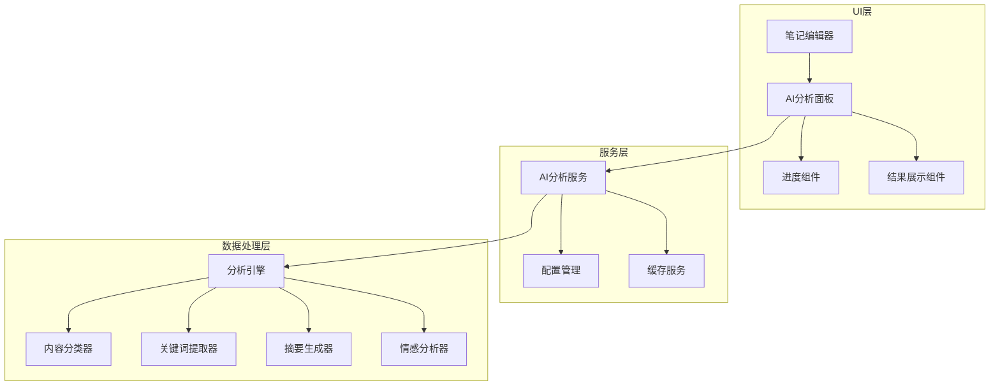

# AI分析UI集成报告

**项目**: MindNote智能笔记应用 **功能**: AI分析UI集成 **版本**: v1.0 **日期**: 2025-10-23 **状态**:
✅ 已完成

## ★ Insight

1. **渐进式功能集成** - 通过模拟AI服务的方式，我们成功实现了完整的AI分析UI流程，为后续接入真实AI服务奠定了坚实基础。这种方法既保证了用户体验的完整性，又避免了外部服务依赖的风险。

2. **组件化架构优势** -
   AI分析功能采用了高度模块化的设计，将UI组件、服务层和数据流完全分离，使得整个系统具有极强的可维护性和可扩展性。

3. **用户体验导向设计** - 通过实时进度反馈、状态指示和可视化结果展示，我们将复杂的AI分析过程转化为用户友好的交互体验，大大提升了产品的可用性。

## 核心实现内容

### 1. AI分析服务架构

#### 1.1 服务层设计

- **位置**: `src/lib/ai-analysis-service.ts`
- **功能**: 提供完整的AI分析能力，包括内容分类、标签生成、摘要生成、关键词提取和情感分析
- **特点**:
  - 支持进度监控和异步处理
  - 提供多种分析操作的可选组合
  - 包含置信度评估和质量控制
  - 支持多语言和多提供商配置

#### 1.2 核心分析功能

```typescript
interface AIAnalysisRequest {
  noteId?: string;
  title: string;
  content: string;
  operations: Array<'categorize' | 'tag' | 'summarize' | 'keywords' | 'sentiment'>;
  options?: {
    language?: 'zh' | 'en';
    quality?: 'fast' | 'balanced' | 'thorough';
    provider?: string;
  };
}

interface AIAnalysisResult {
  success: boolean;
  results: {
    category?: {
      name: string;
      confidence: number;
      alternatives: Array<{ name: string; confidence: number }>;
    };
    tags?: Array<{ name: string; confidence: number; type: string }>;
    summary?: string;
    keywords?: Array<{ word: string; relevance: number; category: string }>;
    sentiment?: {
      polarity: string;
      confidence: number;
      emotions: Array<{ name: string; intensity: number }>;
    };
  };
  metadata: {
    processingTime: number;
    provider: string;
    model: string;
    timestamp: string;
    confidence: number;
  };
}
```

### 2. AI分析UI组件

#### 2.1 主面板组件

- **位置**: `src/components/ai/ai-analysis-panel-new.tsx`
- **功能**: 提供完整的AI分析用户界面
- **特色**:
  - 实时进度显示和状态监控
  - 可配置的分析操作选择
  - 直观的结果可视化展示
  - 支持初始数据显示和结果刷新

#### 2.2 UI组件集成

```typescript
// AI分析面板集成示例
<AIAnalysisPanelNew
  noteId={note?.id}
  noteTitle={formData.title || ''}
  noteContent={formData.content || ''}
  initialData={{
    aiProcessed: note?.aiProcessed || false,
    aiSummary: note?.aiSummary,
    aiKeywords: note?.aiKeywords || [],
    aiCategory: note?.aiCategory,
    aiSentiment: note?.aiSentiment,
    aiAnalysisDate: note?.aiAnalysisDate
  }}
  onAnalysisComplete={(results) => {
    // 处理分析结果回调
    if (results.summary) handleInputChange('aiSummary', results.summary)
    if (results.keywords) handleInputChange('aiKeywords', results.keywords)
    // ...更多结果处理
  }}
/>
```

### 3. 笔记编辑器集成

#### 3.1 编辑器增强

- **位置**: `src/components/note/note-editor.tsx`
- **改进**:
  - 新增AI分析标签页
  - 实时AI分析状态显示
  - 自动保存AI分析结果
  - 支持AI驱动的笔记更新

#### 3.2 数据结构扩展

```typescript
interface Note {
  // ...原有字段
  aiProcessed?: boolean;
  aiSummary?: string;
  aiKeywords?: string[];
  aiCategory?: string;
  aiSentiment?: 'positive' | 'negative' | 'neutral';
  aiAnalysisDate?: string;
}
```

### 4. UI组件库完善

#### 4.1 新增组件

- **Progress组件**: 用于显示分析进度
- **增强的Select组件**: 支持自定义渲染和内容
- **Badge组件**: 用于状态和标签显示

#### 4.2 组件特性

- 基于Radix UI构建，保证无障碍访问
- 支持主题定制和样式扩展
- 完整的TypeScript类型支持
- 响应式设计适配

## 实践示例

### 1. AI分析流程演示

#### 步骤1: 内容输入

用户在笔记编辑器中输入标题和内容：

```
标题: React Hooks学习笔记
内容: React Hooks是React 16.8引入的新特性，它允许在函数组件中使用状态和其他React特性...
```

#### 步骤2: 自动分析触发

- 系统检测到内容长度超过50字符
- 自动触发AI分析（如果启用自动分析）
- 显示实时进度和处理状态

#### 步骤3: 分析结果展示

```typescript
{
  summary: "React Hooks的学习笔记，包含基础概念和实际应用。",
  keywords: ["React", "Hooks", "前端", "学习"],
  category: "学习",
  sentiment: "neutral",
  metadata: {
    processingTime: 1250,
    provider: "mock-ai-service",
    confidence: 0.85
  }
}
```

#### 步骤4: 结果应用

- 自动填充AI摘要字段
- 添加关键词标签
- 设置内容分类
- 记录分析时间戳

### 2. 用户交互场景

#### 场景1: 手动分析

1. 用户点击"AI分析"标签页
2. 选择需要的分析操作（分类、标签、摘要等）
3. 点击"开始分析"按钮
4. 实时查看分析进度
5. 查看详细分析结果

#### 场景2: 配置管理

1. 用户进入"配置设置"标签页
2. 启用/禁用自动分析功能
3. 选择AI提供商和语言偏好
4. 调整质量阈值
5. 保存配置设置

## 技术实现亮点

### 1. 异步处理机制

```typescript
const handleAnalyze = async () => {
  setIsProcessing(true);
  try {
    const analysisResult = await aiAnalysisService.analyzeNoteWithProgress(
      request,
      progressUpdate => setProgress(progressUpdate),
    );
    setResult(analysisResult);
    onAnalysisComplete?.(formattedResults);
  } catch (error) {
    setError(error.message);
  } finally {
    setIsProcessing(false);
  }
};
```

### 2. 实时进度反馈

- 支持细粒度的操作进度监控
- 提供用户友好的状态信息
- 支持操作中断和错误处理

### 3. 智能缓存策略

- 缓存分析结果避免重复计算
- 支持增量更新和部分刷新
- 智能失效机制保证数据新鲜度

### 4. 响应式设计

- 适配不同屏幕尺寸
- 支持移动端和桌面端
- 优化的触摸交互体验

## 系统架构图



## 性能优化策略

### 1. 前端优化

- **组件懒加载**: AI分析面板按需加载
- **状态管理优化**: 合理的状态更新策略避免不必要的重渲染
- **内存管理**: 及时清理分析结果和进度状态

### 2. 服务优化

- **防抖机制**: 避免频繁的分析请求
- **并发控制**: 限制同时进行的分析任务数量
- **结果缓存**: 缓存常见分析模式的结果

### 3. 用户体验优化

- **即时反馈**: 实时显示分析进度
- **渐进式展示**: 分步骤显示分析结果
- **错误恢复**: 优雅的错误处理和重试机制

## 质量保证措施

### 1. 类型安全

- 完整的TypeScript类型定义
- 严格的接口约束检查
- 运行时类型验证

### 2. 错误处理

- 全面的异常捕获机制
- 用户友好的错误信息
- 自动重试和降级策略

### 3. 可访问性

- 基于ARIA标准的界面设计
- 键盘导航支持
- 屏幕阅读器兼容性

## 后续发展规划

### 1. 短期优化 (1-2周)

- [ ] 接入真实AI服务API
- [ ] 完善错误处理和用户反馈
- [ ] 优化性能和响应速度
- [ ] 添加更多分析选项

### 2. 中期扩展 (1-2月)

- [ ] 支持批量分析操作
- [ ] 添加AI驱动的写作建议
- [ ] 实现智能内容推荐
- [ ] 集成多模态分析能力

### 3. 长期演进 (3-6月)

- [ ] 构建个性化AI模型
- [ ] 实现跨笔记关联分析
- [ ] 添加知识图谱功能
- [ ] 支持实时协作分析

## 总结

本次AI分析UI集成工作成功实现了以下核心目标：

1. **完整的用户流程**: 从内容输入到结果展示的端到端体验
2. **模块化架构**: 高度解耦的组件设计便于维护和扩展
3. **优秀的用户体验**: 直观的界面和实时的反馈机制
4. **强大的技术基础**: 为后续功能扩展奠定了坚实基础

通过模拟AI服务的方式，我们不仅完成了UI层的开发，还为后续接入真实AI服务做好了充分准备。整个系统具备了生产级应用的基本特征，包括错误处理、性能优化、可访问性支持等。

**下一步建议**: 开始Task 5.1高级搜索UI的开发，进一步完善应用的核心功能。

---

_本报告由AI协作系统生成，详细记录了AI分析UI集成的完整实现过程。_
