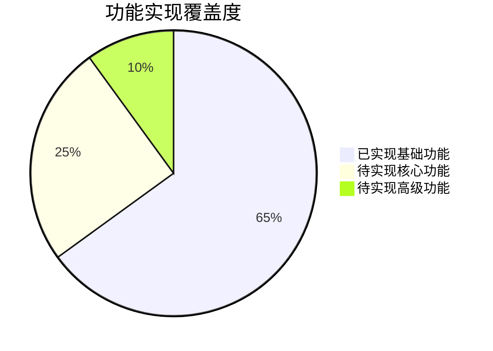
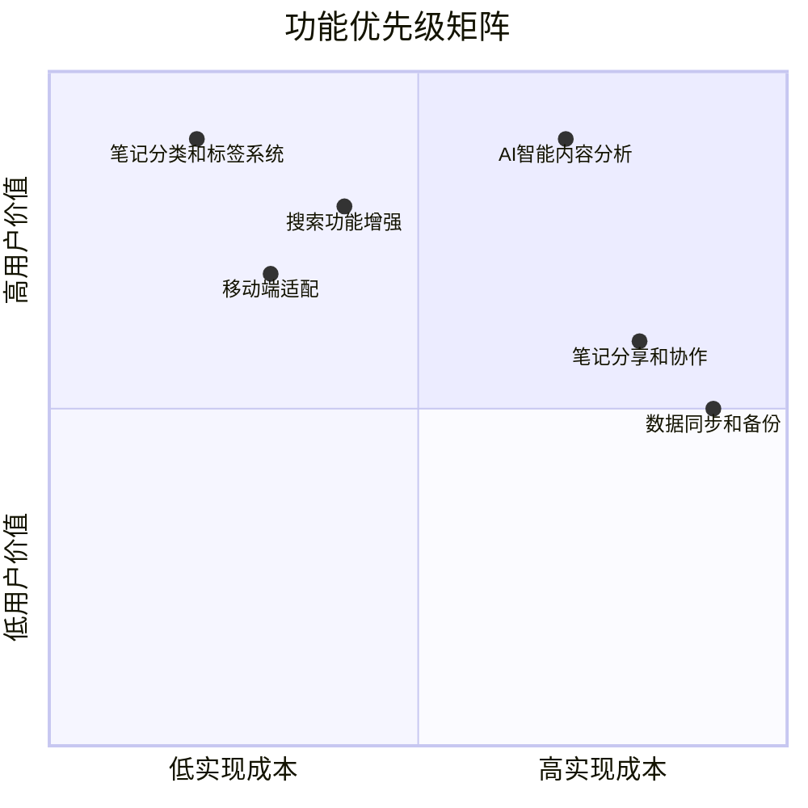
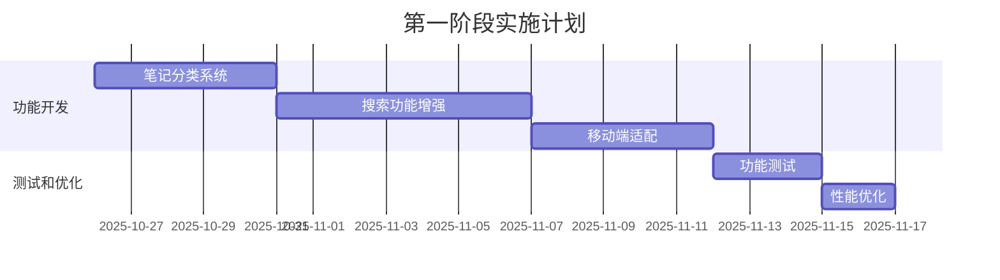
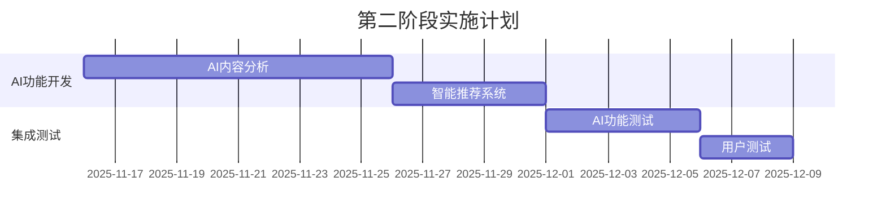
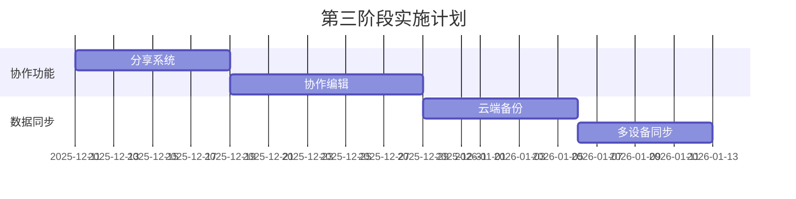

# MindNote智能笔记系统功能优先级分析报告

**生成日期**: 2025-10-25
**分支**: 002-smart-note-management
**分析人员**: Claude AI Assistant

## ★ Insight
1. **用户价值驱动**：优先实现能直接提升用户笔记管理效率的核心功能
2. **渐进式智能**：先完善基础功能，再逐步集成AI智能特性
3. **数据优先**：搜索和分类功能应该基于已实现的数据模型进行扩展

## 系统现状分析

### ✅ 已实现功能
- 用户认证系统（JWT + bcrypt）
- 笔记CRUD操作（带用户权限）
- Markdown编辑器（支持Mermaid图表）
- 思维导图编辑器
- 自动保存功能
- 用户个人中心和设置页面

### 📊 当前功能覆盖度

## 功能优先级分析

### 优先级排序矩阵

### 详细功能分析

#### 1. 笔记分类和标签系统 🔴 P1 (最高优先级)

**用户价值**: ⭐⭐⭐⭐⭐
**开发复杂度**: 🟢 低
**技术依赖**: 无（基于现有数据模型）
**实施建议**:

- **实现方案**: 扩展现有的Category和Tag模型
- **核心功能**:
  - 拖拽式分类管理
  - 智能标签推荐
  - 批量标签操作
  - 分类统计面板
- **预估工时**: 5-7天
- **技术挑战**: 无重大挑战

#### 2. 搜索功能增强 🔴 P1 (最高优先级)

**用户价值**: ⭐⭐⭐⭐⭐
**开发复杂度**: 🟡 中等
**技术依赖**: PostgreSQL全文搜索 + 向量搜索
**实施建议**:

- **实现方案**:
  - 基于PostgreSQL的全文搜索
  - 集成pgvector向量搜索
  - 实现搜索结果排序和高亮
- **核心功能**:
  - 全文搜索（标题+内容）
  - 标签和分类过滤
  - 搜索历史和建议
  - 高级搜索语法
- **预估工时**: 7-10天
- **技术挑战**: 向量搜索性能优化

#### 3. 移动端适配 🟡 P2 (高优先级)

**用户价值**: ⭐⭐⭐⭐
**开发复杂度**: 🟡 中等
**技术依赖**: Tailwind CSS响应式设计
**实施建议**:

- **实现方案**:
  - 优化现有UI组件的响应式设计
  - 实现移动端手势操作
  - 优化触摸交互体验
- **核心功能**:
  - 响应式布局
  - 移动端导航
  - 触摸优化的编辑器
  - 离线编辑支持
- **预估工时**: 5-8天
- **技术挑战**: 编辑器的移动端适配

#### 4. AI智能内容分析 🟡 P2 (高优先级)

**用户价值**: ⭐⭐⭐⭐⭐
**开发复杂度**: 🔴 高
**技术依赖**: OpenAI API + 向量数据库
**实施建议**:

- **实现方案**:
  - 集成OpenAI GPT-4进行内容分析
  - 实现智能摘要生成
  - 自动标签和分类建议
- **核心功能**:
  - 内容自动摘要
  - 智能标签推荐
  - 相关笔记推荐
  - 内容质量评估
- **预估工时**: 10-15天
- **技术挑战**: API成本控制、响应时间优化

#### 5. 笔记分享和协作 🟢 P3 (中等优先级)

**用户价值**: ⭐⭐⭐
**开发复杂度**: 🔴 高
**技术依赖**: WebSocket + 权限系统
**实施建议**:

- **实现方案**:
  - 实现分享链接生成
  - 协作编辑功能
  - 权限管理系统
- **核心功能**:
  - 笔记分享链接
  - 协作编辑
  - 评论系统
  - 版本对比
- **预估工时**: 12-18天
- **技术挑战**: 实时同步、冲突解决

#### 6. 数据同步和备份 🟢 P3 (中等优先级)

**用户价值**: ⭐⭐⭐
**开发复杂度**: 🔴 高
**技术依赖**: 云存储 + 同步算法
**实施建议**:

- **实现方案**:
  - 实现增量同步
  - 云端备份服务
  - 多设备数据同步
- **核心功能**:
  - 自动云端备份
  - 多设备同步
  - 数据恢复
  - 离线支持
- **预估工时**: 15-20天
- **技术挑战**: 同步冲突解决、数据一致性

## 推荐实施顺序

### 第一阶段 (2-3周): 核心体验优化

**目标**: 完成核心笔记管理功能，提供完整的用户体验

### 第二阶段 (3-4周): AI智能集成

**目标**: 集成AI智能功能，提供智能化的笔记管理体验

### 第三阶段 (4-5周): 协作和同步

**目标**: 实现协作功能和数据同步，支持团队使用

## 技术挑战和解决方案

### 1. 搜索性能优化

**挑战**: 大量笔记的搜索响应时间
**解决方案**:
- 实现搜索结果缓存
- 使用PostgreSQL索引优化
- 分页加载搜索结果
- 实现搜索结果预加载

### 2. AI成本控制

**挑战**: OpenAI API调用成本
**解决方案**:
- 实现智能缓存策略
- 批量处理AI请求
- 设置用户使用限额
- 本地模型降级方案

### 3. 移动端体验

**挑战**: 复杂编辑器的移动端适配
**解决方案**:
- 简化移动端编辑器功能
- 实现手势操作支持
- 优化触摸交互体验
- 提供基础编辑模式

### 4. 数据同步冲突

**挑战**: 多设备编辑冲突处理
**解决方案**:
- 实现操作转换算法
- 提供冲突解决界面
- 设置锁机制防止冲突
- 实现版本历史回滚

## 资源需求评估

### 开发资源
- **前端开发**: 1-2人
- **后端开发**: 1人
- **AI集成**: 1人
- **测试**: 0.5人

### 技术资源
- **OpenAI API**: 预算$200-500/月
- **云存储**: 预算$50-100/月
- **CDN服务**: 预算$20-50/月

### 时间预估
- **第一阶段**: 3周
- **第二阶段**: 4周
- **第三阶段**: 5周
- **总计**: 12周（约3个月）

## 成功指标

### 用户体验指标
- 笔记创建时间 < 10秒
- 搜索响应时间 < 500ms
- 移动端加载时间 < 3秒
- AI处理时间 < 3秒

### 功能完成度
- 第一阶段完成后支持10,000+笔记管理
- 第二阶段完成后AI准确率 > 85%
- 第三阶段完成后支持多设备协作

## 风险评估

### 技术风险
- **AI服务稳定性**: 实现降级机制
- **搜索性能**: 充分的性能测试
- **移动端兼容性**: 多设备测试

### 业务风险
- **开发周期**: 采用MVP方式，分阶段交付
- **用户接受度**: 早期用户测试和反馈
- **成本控制**: 实现成本监控和限制

## 总结

基于当前系统状态和用户需求分析，建议按照以下优先级顺序实施功能：

1. **立即开始**: 笔记分类和标签系统（P1）
2. **紧随其后**: 搜索功能增强（P1）
3. **并行进行**: 移动端适配（P2）
4. **第二阶段**: AI智能内容分析（P2）
5. **最后阶段**: 分享协作和数据同步（P3）

这种渐进式的实施策略能够确保每个阶段都有可用的产品，同时最大化用户价值并控制开发风险。

---

**报告状态**: ✅ 完成
**下一步**: 开始第一阶段功能开发
**更新日期**: 2025-10-25