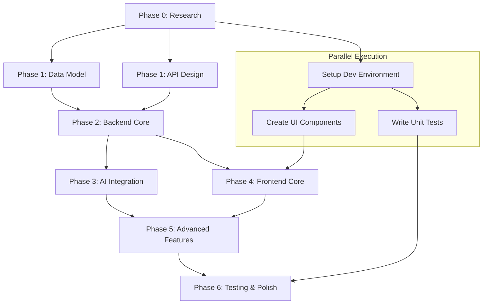

# Development Tasks: 智能笔记管理

**Branch**: `002-smart-note-management` | **Date**: 2025-10-23
**Based on**: Implementation Plan ([plan.md](./plan.md))
**Status**: Ready for Implementation

## Task Dependency Graph

## Phase 0: Research & Setup (P0)

### Task 0.1: AI Service Research
- **ID**: TASK-001
- **Priority**: P1
- **Description**: Research and select AI service for content categorization
- **Dependencies**: None
- **Acceptance Criteria**:
  - [ ] Document comparison of OpenAI GPT-4, Claude, and local Ollama models
  - [ ] Define API integration patterns and fallback strategies
  - [ ] Estimate costs and performance characteristics
  - [ ] Create proof-of-concept for content classification
- **Estimated Time**: 1 day
- **Assignee**: TBD

### Task 0.2: Development Environment Setup
- **ID**: TASK-002
- **Priority**: P1
- **Description**: Setup development environment for the feature branch
- **Dependencies**: None
- **Acceptance Criteria**:
  - [ ] Create feature branch from main
  - [ ] Install and configure all dependencies
  - [ ] Setup database with required extensions (pgvector)
  - [ ] Configure environment variables for AI services
  - [ ] Verify all services are running correctly
- **Estimated Time**: 0.5 day
- **Assignee**: TBD

## Phase 1: Data Model & API Design (P1)

### Task 1.1: Database Schema Design
- **ID**: TASK-003
- **Priority**: P1
- **Description**: Design and implement database schema for notes and related entities
- **Dependencies**: TASK-002
- **Acceptance Criteria**:
  - [ ] Extend existing Prisma schema with note-related models
  - [ ] Add vector embeddings support with pgvector
  - [ ] Implement proper indexes for performance
  - [ ] Add database constraints and validation rules
  - [ ] Create and run database migration
- **Estimated Time**: 1 day
- **Assignee**: TBD

### Task 1.2: API Contract Definition
- **ID**: TASK-004
- **Priority**: P1
- **Description**: Define REST API contracts for note management operations
- **Dependencies**: TASK-003
- **Acceptance Criteria**:
  - [ ] Document all API endpoints with request/response schemas
  - [ ] Define error handling and status codes
  - [ ] Create OpenAPI specification
  - [ ] Setup API validation middleware
  - [ ] Document AI service integration endpoints
- **Estimated Time**: 0.5 day
- **Assignee**: TBD

## Phase 2: Backend Core Features (P1)

### Task 2.1: Note CRUD Operations
- **ID**: TASK-005
- **Priority**: P1
- **Description**: Implement core note CRUD operations with database integration
- **Dependencies**: TASK-004
- **Acceptance Criteria**:
  - [ ] Implement POST /api/notes (create note)
  - [ ] Implement GET /api/notes (list notes with pagination)
  - [ ] Implement GET /api/notes/[id] (get single note)
  - [ ] Implement PUT /api/notes/[id] (update note)
  - [ ] Implement DELETE /api/notes/[id] (delete note)
  - [ ] Add input validation and error handling
  - [ ] Implement user authorization (users can only access their own notes)
- **Estimated Time**: 2 days
- **Assignee**: TBD

### Task 2.2: Auto-save Functionality
- **ID**: TASK-006
- **Priority**: P1
- **Description**: Implement automatic saving mechanism for note content
- **Dependencies**: TASK-005
- **Acceptance Criteria**:
  - [ ] Implement debounced auto-save (every 2 seconds of inactivity)
  - [ ] Add conflict resolution for simultaneous edits
  - [ ] Implement draft saving for unsaved changes
  - [ ] Add save status indicators in API responses
  - [ ] Handle offline scenarios gracefully
- **Estimated Time**: 1 day
- **Assignee**: TBD

## Phase 3: AI Integration (P2)

### Task 3.1: AI Service Integration
- **ID**: TASK-007
- **Priority**: P2
- **Description**: Integrate AI service for automatic content categorization
- **Dependencies**: TASK-001, TASK-005
- **Acceptance Criteria**:
  - [ ] Implement OpenAI API client with error handling
  - [ ] Create content analysis service
  - [ ] Implement automatic tag generation
  - [ ] Add category suggestion based on content
  - [ ] Implement fallback when AI service is unavailable
  - [ ] Add caching for AI responses to reduce costs
- **Estimated Time**: 2 days
- **Assignee**: TBD

### Task 3.2: Vector Search Implementation
- **ID**: TASK-008
- **Priority**: P2
- **Description**: Implement vector embeddings and similarity search
- **Dependencies**: TASK-003, TASK-007
- **Acceptance Criteria**:
  - [ ] Generate vector embeddings for note content
  - [ ] Implement similarity search using pgvector
  - [ ] Add related notes suggestion feature
  - [ ] Optimize vector search performance
  - [ ] Implement vector search API endpoint
- **Estimated Time**: 1.5 days
- **Assignee**: TBD

## Phase 4: Frontend Core Features (P1)

### Task 4.1: Note Editor Component
- **ID**: TASK-009
- **Priority**: P1
- **Description**: Create rich text editor component for note creation and editing
- **Dependencies**: TASK-002
- **Acceptance Criteria**:
  - [ ] Implement rich text editor with formatting options
  - [ ] Add markdown support with live preview
  - [ ] Implement auto-save integration
  - [ ] Add keyboard shortcuts for common operations
  - [ ] Ensure responsive design for mobile devices
  - [ ] Add accessibility features (ARIA labels, keyboard navigation)
- **Estimated Time**: 2 days
- **Assignee**: TBD

### Task 4.2: Note List Interface
- **ID**: TASK-010
- **Priority**: P1
- **Description**: Create note list interface with filtering and sorting
- **Dependencies**: TASK-009
- **Acceptance Criteria**:
  - [ ] Implement note list with pagination
  - [ ] Add sorting options (date, title, category)
  - [ ] Create note cards with preview
  - [ ] Add quick actions (edit, delete, favorite)
  - [ ] Implement infinite scroll option
  - [ ] Add loading states and error handling
- **Estimated Time**: 1.5 days
- **Assignee**: TBD

## Phase 5: Advanced Features (P2-P3)

### Task 5.1: Search and Filtering
- **ID**: TASK-011
- **Priority**: P2
- **Description**: Implement advanced search and filtering capabilities
- **Dependencies**: TASK-008, TASK-010
- **Acceptance Criteria**:
  - [ ] Implement full-text search across note content
  - [ ] Add tag-based filtering
  - [ ] Implement category filtering
  - [ ] Add date range filtering
  - [ ] Create search result highlighting
  - [ ] Add search history and saved searches
- **Estimated Time**: 2 days
- **Assignee**: TBD

### Task 5.2: AI Tag Management
- **ID**: TASK-012
- **Priority**: P2
- **Description**: Create AI-powered tag management interface
- **Dependencies**: TASK-007, TASK-009
- **Acceptance Criteria**:
  - [ ] Display AI-suggested tags with confidence scores
  - [ ] Allow users to accept/reject tag suggestions
  - [ ] Implement tag auto-completion
  - [ ] Create tag management interface
  - [ ] Add tag analytics and usage statistics
- **Estimated Time**: 1 day
- **Assignee**: TBD

### Task 5.3: Import/Export Functionality
- **ID**: TASK-013
- **Priority**: P3
- **Description**: Implement note import and export capabilities
- **Dependencies**: TASK-005
- **Acceptance Criteria**:
  - [ ] Import notes from Markdown files
  - [ ] Export notes to Markdown format
  - [ ] Bulk import with format validation
  - [ ] Export with customizable templates
  - [ ] Handle special characters and formatting preservation
- **Estimated Time**: 1 day
- **Assignee**: TBD

## Phase 6: Testing & Polish (P1)

### Task 6.1: Unit Tests
- **ID**: TASK-014
- **Priority**: P1
- **Description**: Write comprehensive unit tests for all business logic
- **Dependencies**: TASK-005, TASK-007, TASK-009
- **Acceptance Criteria**:
  - [ ] Unit tests for all API endpoints (>90% coverage)
  - [ ] Tests for AI service integration with mocking
  - [ ] Component tests for React components
  - [ ] Database operation tests with fixtures
  - [ ] Performance benchmarks for critical operations
- **Estimated Time**: 2 days
- **Assignee**: TBD

### Task 6.2: Integration Tests
- **ID**: TASK-015
- **Priority**: P1
- **Description**: Write integration tests for end-to-end workflows
- **Dependencies**: TASK-011, TASK-012
- **Acceptance Criteria**:
  - [ ] Integration tests for complete note creation workflow
  - [ ] Tests for AI categorization pipeline
  - [ ] Search functionality integration tests
  - [ ] Multi-user scenario tests
  - [ ] Error recovery and fallback testing
- **Estimated Time**: 1.5 days
- **Assignee**: TBD

### Task 6.3: E2E Tests
- **ID**: TASK-016
- **Priority**: P2
- **Description**: Create end-to-end tests with Playwright
- **Dependencies**: TASK-014, TASK-015
- **Acceptance Criteria**:
  - [ ] E2E test for complete user journey
  - [ ] Cross-browser compatibility tests
  - [ ] Mobile responsive testing
  - [ ] Performance testing scenarios
  - [ ] Accessibility testing
- **Estimated Time**: 1 day
- **Assignee**: TBD

## Phase 7: Deployment & Documentation (P1)

### Task 7.1: Performance Optimization
- **ID**: TASK-017
- **Priority**: P1
- **Description**: Optimize application performance for production
- **Dependencies**: TASK-016
- **Acceptance Criteria**:
  - [ ] Optimize database queries and add caching
  - [ ] Implement React performance optimizations
  - [ ] Add CDN for static assets
  - [ ] Optimize bundle size and implement code splitting
  - [ ] Performance monitoring and alerting
- **Estimated Time**: 1 day
- **Assignee**: TBD

### Task 7.2: Documentation Update
- **ID**: TASK-018
- **Priority**: P1
- **Description**: Update project documentation with new features
- **Dependencies**: TASK-017
- **Acceptance Criteria**:
  - [ ] Update README.md with new feature descriptions
  - [ ] Create API documentation
  - [ ] Write user guide for note management
  - [ ] Document AI integration architecture
  - [ ] Update troubleshooting guide
- **Estimated Time**: 0.5 day
- **Assignee**: TBD

### Task 7.3: Deployment Preparation
- **ID**: TASK-019
- **Priority**: P1
- **Description**: Prepare feature for production deployment
- **Dependencies**: TASK-018
- **Acceptance Criteria**:
  - [ ] Configure production environment variables
  - [ ] Setup monitoring and logging
  - [ ] Create deployment scripts
  - [ ] Perform security audit
  - [ ] Create rollback plan
- **Estimated Time**: 0.5 day
- **Assignee**: TBD

## Summary Statistics

- **Total Tasks**: 19
- **Estimated Total Time**: 24.5 days
- **Critical Path**: TASK-001 → TASK-003 → TASK-005 → TASK-007 → TASK-011 → TASK-014 → TASK-017 → TASK-019
- **Parallel Work Opportunities**: UI development (TASK-009, TASK-010) can proceed in parallel with backend development
- **Testing Strategy**: Unit tests integrated throughout development, dedicated testing phase at the end

## Risk Assessment

| Risk | Probability | Impact | Mitigation Strategy |
|------|-------------|--------|-------------------|
| AI service reliability | Medium | High | Implement fallback to manual categorization |
| Performance at scale | Medium | Medium | Early performance testing and optimization |
| Database migration issues | Low | High | Thorough testing in staging environment |
| User adoption of AI features | Medium | Medium | User feedback collection and iterative improvement |

## Success Metrics

- **Functional**: All P1 user stories completed and tested
- **Performance**: Meet or exceed all performance targets defined in plan
- **Quality**: >90% test coverage, zero critical bugs
- **User Experience**: Smooth auto-save, responsive UI, helpful AI suggestions
- **AI Accuracy**: >85% classification accuracy based on user feedback

---

**Next Steps**:
1. Review and approve this task list
2. Assign tasks to team members
3. Begin with Task 0.1 (AI Service Research)
4. Set up regular progress reviews
5. Monitor risks and adjust timeline as needed