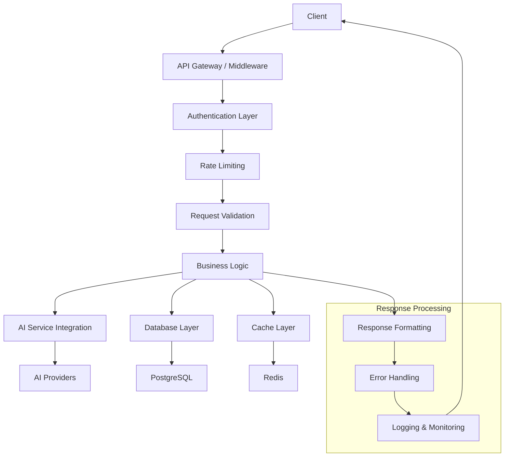

# API Contracts: Smart Note Management

**Version**: 1.0.0
**Date**: 2025-10-23
**Base URL**: `http://localhost:3000/api/v1`
**Authentication**: Bearer Token (NextAuth.js)

## Overview

智能笔记管理功能的RESTful API设计，支持笔记的完整生命周期管理、AI分析处理和高级搜索功能。API遵循REST设计原则，提供统一的错误处理和响应格式。

## API Architecture



## Authentication & Authorization

### Authentication Header
```http
Authorization: Bearer <JWT_TOKEN>
```

### User Context
所有API请求都需要有效的用户会话，系统会自动从JWT token中提取用户信息。

## Common Response Format

### Success Response
```json
{
  "success": true,
  "data": {
    // Response data
  },
  "meta": {
    "timestamp": "2025-10-23T10:30:00Z",
    "requestId": "req_123456789",
    "version": "1.0.0"
  }
}
```

### Error Response
```json
{
  "success": false,
  "error": {
    "code": "VALIDATION_ERROR",
    "message": "Request validation failed",
    "details": {
      "field": "title",
      "reason": "Title is required"
    }
  },
  "meta": {
    "timestamp": "2025-10-23T10:30:00Z",
    "requestId": "req_123456789",
    "version": "1.0.0"
  }
}
```

### Paginated Response
```json
{
  "success": true,
  "data": {
    "items": [...],
    "pagination": {
      "page": 1,
      "limit": 20,
      "total": 150,
      "totalPages": 8,
      "hasNext": true,
      "hasPrev": false
    }
  },
  "meta": {
    "timestamp": "2025-10-23T10:30:00Z",
    "requestId": "req_123456789",
    "version": "1.0.0"
  }
}
```

## Error Codes

| Code | HTTP Status | Description |
|------|-------------|-------------|
| `VALIDATION_ERROR` | 400 | Request validation failed |
| `UNAUTHORIZED` | 401 | Authentication required |
| `FORBIDDEN` | 403 | Access denied |
| `NOT_FOUND` | 404 | Resource not found |
| `CONFLICT` | 409 | Resource conflict |
| `RATE_LIMITED` | 429 | Rate limit exceeded |
| `AI_SERVICE_ERROR` | 502 | AI service unavailable |
| `INTERNAL_ERROR` | 500 | Internal server error |
| `DATABASE_ERROR` | 500 | Database operation failed |

## Core API Endpoints

### 1. Notes Management

#### Create Note
```http
POST /api/v1/notes
Content-Type: application/json

{
  "title": "My First Smart Note",
  "content": "This is the content of my note...",
  "categoryId": 1,
  "tags": ["important", "work"],
  "metadata": {
    "source": "web",
    "priority": "high"
  }
}
```

**Response**:
```json
{
  "success": true,
  "data": {
    "id": "note_123456789",
    "title": "My First Smart Note",
    "content": "This is the content of my note...",
    "contentHash": "abc123def456",
    "categoryId": 1,
    "tags": ["important", "work"],
    "metadata": {
      "source": "web",
      "priority": "high"
    },
    "aiProcessed": false,
    "status": "DRAFT",
    "isPublic": false,
    "viewCount": 0,
    "createdAt": "2025-10-23T10:30:00Z",
    "updatedAt": "2025-10-23T10:30:00Z"
  }
}
```

#### Get Note by ID
```http
GET /api/v1/notes/{noteId}
```

**Response**:
```json
{
  "success": true,
  "data": {
    "id": "note_123456789",
    "title": "My First Smart Note",
    "content": "This is the content of my note...",
    "contentHash": "abc123def456",
    "categoryId": 1,
    "category": {
      "id": 1,
      "name": "Work",
      "color": "#3B82F6"
    },
    "tags": [
      {
        "id": 1,
        "name": "important",
        "color": "#EF4444"
      }
    ],
    "metadata": {
      "source": "web",
      "priority": "high"
    },
    "aiProcessed": true,
    "aiSummary": "A smart note about important work topics...",
    "aiKeywords": ["work", "important", "productivity"],
    "status": "PUBLISHED",
    "isPublic": false,
    "viewCount": 15,
    "createdAt": "2025-10-23T10:30:00Z",
    "updatedAt": "2025-10-23T11:15:00Z",
    "aiProcessedAt": "2025-10-23T10:35:00Z"
  }
}
```

#### Update Note
```http
PUT /api/v1/notes/{noteId}
Content-Type: application/json

{
  "title": "Updated Note Title",
  "content": "Updated content...",
  "categoryId": 2,
  "tags": ["updated", "important"],
  "metadata": {
    "priority": "medium"
  }
}
```

#### Delete Note
```http
DELETE /api/v1/notes/{noteId}
```

**Response**:
```json
{
  "success": true,
  "data": {
    "id": "note_123456789",
    "deleted": true
  }
}
```

#### List Notes
```http
GET /api/v1/notes?page=1&limit=20&status=PUBLISHED&categoryId=1&tags=important,work&search=productivity&sortBy=createdAt&sortOrder=desc
```

**Query Parameters**:
- `page`: Page number (default: 1)
- `limit`: Items per page (default: 20, max: 100)
- `status`: Filter by status (DRAFT, PUBLISHED, ARCHIVED)
- `categoryId`: Filter by category
- `tags`: Filter by tags (comma-separated)
- `search`: Search in title and content
- `sortBy`: Sort field (createdAt, updatedAt, title, viewCount)
- `sortOrder`: Sort order (asc, desc)

#### Auto-save Note
```http
POST /api/v1/notes/{noteId}/autosave
Content-Type: application/json

{
  "title": "Auto-saved title",
  "content": "Auto-saved content...",
  "tags": ["draft"]
}
```

**Response**:
```json
{
  "success": true,
  "data": {
    "id": "note_123456789",
    "autoSaved": true,
    "savedAt": "2025-10-23T10:30:00Z"
  }
}
```

### 2. Categories Management

#### Create Category
```http
POST /api/v1/categories
Content-Type: application/json

{
  "name": "Work Projects",
  "description": "All work-related projects",
  "parentId": 1,
  "color": "#3B82F6",
  "icon": "briefcase"
}
```

#### Get Categories
```http
GET /api/v1/categories?includeEmpty=false
```

**Response**:
```json
{
  "success": true,
  "data": [
    {
      "id": 1,
      "name": "Work",
      "description": "Work-related notes",
      "parentId": null,
      "color": "#3B82F6",
      "icon": "briefcase",
      "noteCount": 25,
      "children": [
        {
          "id": 2,
          "name": "Projects",
          "parentId": 1,
          "noteCount": 15
        }
      ]
    }
  ]
}
```

### 3. Tags Management

#### Get Popular Tags
```http
GET /api/v1/tags/popular?limit=20
```

**Response**:
```json
{
  "success": true,
  "data": [
    {
      "id": 1,
      "name": "important",
      "color": "#EF4444",
      "category": "priority",
      "usageCount": 45,
      "createdAt": "2025-10-15T08:00:00Z"
    }
  ]
}
```

#### Suggest Tags
```http
GET /api/v1/tags/suggest?q=productivity&limit=10
```

### 4. Search & Discovery

#### Full-text Search
```http
POST /api/v1/search
Content-Type: application/json

{
  "query": "productivity tools",
  "filters": {
    "categories": [1, 2],
    "tags": ["important"],
    "dateRange": {
      "from": "2025-10-01",
      "to": "2025-10-31"
    },
    "status": ["PUBLISHED"]
  },
  "sort": {
    "field": "relevance",
    "order": "desc"
  },
  "pagination": {
    "page": 1,
    "limit": 20
  }
}
```

**Response**:
```json
{
  "success": true,
  "data": {
    "items": [
      {
        "id": "note_123456789",
        "title": "Productivity Tools Review",
        "content": "Review of latest productivity tools...",
        "relevanceScore": 0.95,
        "highlights": [
          "Latest <mark>productivity</mark> <mark>tools</mark> for remote work"
        ],
        "createdAt": "2025-10-20T14:30:00Z"
      }
    ],
    "pagination": {
      "page": 1,
      "limit": 20,
      "total": 15,
      "totalPages": 1
    },
    "searchMeta": {
      "queryTime": 45,
      "totalResults": 15
    }
  }
}
```

#### Similar Notes
```http
GET /api/v1/notes/{noteId}/similar?limit=5&excludeProcessed=false
```

**Response**:
```json
{
  "success": true,
  "data": {
    "similarNotes": [
      {
        "id": "note_234567890",
        "title": "Related productivity article",
        "similarityScore": 0.87,
        "sharedTags": ["productivity", "tools"],
        "preview": "This note discusses similar productivity concepts..."
      }
    ]
  }
}
```

### 5. AI Processing

#### Trigger AI Analysis
```http
POST /api/v1/notes/{noteId}/ai-analyze
Content-Type: application/json

{
  "operations": ["categorize", "tag", "summarize"],
  "provider": "auto", // or "openai", "zhipu", etc.
  "options": {
    "language": "zh-CN",
    "summaryLength": 200,
    "maxTags": 5
  }
}
```

**Response**:
```json
{
  "success": true,
  "data": {
    "taskId": "ai_task_123456789",
    "status": "QUEUED",
    "estimatedTime": 3000
  }
}
```

#### Get AI Analysis Status
```http
GET /api/v1/ai/tasks/{taskId}
```

**Response**:
```json
{
  "success": true,
  "data": {
    "id": "ai_task_123456789",
    "status": "COMPLETED",
    "progress": 100,
    "result": {
      "category": "Work",
      "tags": ["productivity", "tools", "review"],
      "summary": "A comprehensive review of productivity tools...",
      "confidence": 0.92,
      "provider": "zhipu",
      "model": "glm-4",
      "processingTime": 2450,
      "cost": 0.025
    },
    "createdAt": "2025-10-23T10:30:00Z",
    "completedAt": "2025-10-23T10:30:02Z"
  }
}
```

#### Batch AI Analysis
```http
POST /api/v1/ai/batch-analyze
Content-Type: application/json

{
  "noteIds": ["note_1", "note_2", "note_3"],
  "operations": ["categorize", "tag"],
  "provider": "auto",
  "options": {
    "batchSize": 5,
    "delayBetweenBatches": 1000
  }
}
```

#### AI Provider Status
```http
GET /api/v1/ai/providers/status
```

**Response**:
```json
{
  "success": true,
  "data": {
    "providers": [
      {
        "name": "openai",
        "status": "AVAILABLE",
        "responseTime": 1250,
        "models": ["gpt-4-turbo-preview"],
        "costPerToken": {
          "input": 0.01,
          "output": 0.03
        }
      },
      {
        "name": "zhipu",
        "status": "AVAILABLE",
        "responseTime": 850,
        "models": ["glm-4"],
        "costPerToken": {
          "input": 0.005,
          "output": 0.025
        }
      }
    ],
    "primaryProvider": "zhipu",
    "fallbackProviders": ["openai", "ollama"]
  }
}
```

### 6. Import/Export

#### Import Notes
```http
POST /api/v1/import
Content-Type: multipart/form-data

file: notes.json
format: json // or markdown, csv
options: {
  "skipDuplicates": true,
  "preserveIds": false,
  "autoAnalyze": true
}
```

#### Export Notes
```http
POST /api/v1/export
Content-Type: application/json

{
  "format": "json", // or markdown, csv
  "filters": {
    "categories": [1, 2],
    "dateRange": {
      "from": "2025-10-01",
      "to": "2025-10-31"
    }
  },
  "options": {
    "includeAIResults": true,
    "includeMetadata": true
  }
}
```

### 7. Analytics & Insights

#### Get Note Statistics
```http
GET /api/v1/analytics/notes?period=30d&groupBy=day
```

**Response**:
```json
{
  "success": true,
  "data": {
    "summary": {
      "totalNotes": 150,
      "notesCreated": 25,
      "notesUpdated": 18,
      "aiProcessedNotes": 142,
      "averageNoteLength": 850,
      "topCategories": [
        {"name": "Work", "count": 45},
        {"name": "Personal", "count": 38}
      ],
      "topTags": [
        {"name": "important", "count": 62},
        {"name": "todo", "count": 48}
      ]
    },
    "timeline": [
      {
        "date": "2025-10-23",
        "notesCreated": 3,
        "notesUpdated": 2,
        "aiProcessed": 3
      }
    ]
  }
}
```

#### Get AI Usage Statistics
```http
GET /api/v1/analytics/ai-usage?period=30d
```

**Response**:
```json
{
  "success": true,
  "data": {
    "summary": {
      "totalRequests": 1250,
      "totalCost": 12.45,
      "totalTokens": 250000,
      "averageResponseTime": 1850,
      "successRate": 98.4
    },
    "byProvider": [
      {
        "provider": "zhipu",
        "requests": 800,
        "cost": 6.40,
        "tokens": 160000,
        "avgResponseTime": 1200
      }
    ],
    "byOperation": [
      {
        "operation": "categorize",
        "requests": 500,
        "successRate": 99.2
      }
    ]
  }
}
```

## Request/Response Validation

### Note Creation/Update Schema
```typescript
interface NoteRequest {
  title: string; // Required, max 200 chars
  content: string; // Required, max 100000 chars
  categoryId?: number; // Optional
  tags?: string[]; // Optional, max 10 tags
  metadata?: Record<string, any>; // Optional
  status?: 'DRAFT' | 'PUBLISHED' | 'ARCHIVED'; // Optional
  isPublic?: boolean; // Optional, default false
}

interface NoteResponse {
  id: string;
  title: string;
  content: string;
  contentHash: string;
  categoryId?: number;
  category?: Category;
  tags: Tag[];
  metadata: Record<string, any>;
  aiProcessed: boolean;
  aiSummary?: string;
  aiKeywords?: string[];
  status: NoteStatus;
  isPublic: boolean;
  viewCount: number;
  createdAt: string;
  updatedAt: string;
  aiProcessedAt?: string;
}
```

### AI Analysis Request Schema
```typescript
interface AIAnalysisRequest {
  operations: ('categorize' | 'tag' | 'summarize')[];
  provider?: string; // Optional, default "auto"
  options?: {
    language?: string; // Optional, default "zh-CN"
    summaryLength?: number; // Optional, default 200
    maxTags?: number; // Optional, default 5
    temperature?: number; // Optional, default 0.3
  };
}
```

## Rate Limiting

| Endpoint | Limit | Window |
|----------|-------|--------|
| Notes CRUD | 1000 requests | 15 minutes |
| AI Analysis | 100 requests | 15 minutes |
| Search | 500 requests | 15 minutes |
| Import/Export | 10 requests | 1 hour |

## Webhook Events

### Note Events
```json
{
  "event": "note.created",
  "data": {
    "noteId": "note_123456789",
    "userId": "user_123456789",
    "title": "New Note"
  },
  "timestamp": "2025-10-23T10:30:00Z"
}
```

### AI Processing Events
```json
{
  "event": "ai.processing.completed",
  "data": {
    "taskId": "ai_task_123456789",
    "noteId": "note_123456789",
    "provider": "zhipu",
    "operations": ["categorize", "tag"],
    "result": { ... }
  },
  "timestamp": "2025-10-23T10:30:00Z"
}
```

## SDK Examples

### JavaScript/TypeScript
```typescript
import { MindNoteAPI } from '@mindnote/sdk';

const api = new MindNoteAPI({
  baseURL: 'http://localhost:3000/api/v1',
  token: 'your-jwt-token'
});

// Create note
const note = await api.notes.create({
  title: 'My Note',
  content: 'Note content',
  tags: ['important']
});

// AI analysis
const analysis = await api.ai.analyze(note.id, {
  operations: ['categorize', 'tag', 'summarize']
});
```

### Python
```python
from mindnote_sdk import MindNoteClient

client = MindNoteClient(
    base_url='http://localhost:3000/api/v1',
    token='your-jwt-token'
)

# Search notes
results = client.search.notes(
    query='productivity',
    filters={'tags': ['important']}
)
```

## Versioning

- Current version: `v1.0.0`
- Version format: `v{major}.{minor}.{patch}`
- Backward compatibility: Minor versions are backward compatible
- Deprecation notice: Major changes will be announced 30 days in advance

## Testing

### API Testing Examples
```bash
# Health check
curl -X GET http://localhost:3000/api/v1/health

# Create note
curl -X POST http://localhost:3000/api/v1/notes \
  -H "Authorization: Bearer <token>" \
  -H "Content-Type: application/json" \
  -d '{"title":"Test Note","content":"Test content"}'

# Search notes
curl -X POST http://localhost:3000/api/v1/search \
  -H "Authorization: Bearer <token>" \
  -H "Content-Type: application/json" \
  -d '{"query":"test","filters":{"status":["PUBLISHED"]}}'
```

## Security Considerations

1. **Authentication**: All endpoints require valid JWT tokens
2. **Authorization**: Users can only access their own data
3. **Input Validation**: All inputs are validated and sanitized
4. **Rate Limiting**: API calls are rate limited per user
5. **HTTPS**: Production deployments must use HTTPS
6. **CORS**: Cross-origin requests are properly configured

## Monitoring & Logging

- All API requests are logged with request IDs
- Performance metrics are collected for all endpoints
- Error rates and response times are monitored
- AI service usage and costs are tracked

---

**Next Steps**:
1. Implement API routes in Next.js
2. Create request/response validation schemas
3. Set up authentication middleware
4. Implement rate limiting
5. Add comprehensive error handling
6. Create API documentation with Swagger/OpenAPI