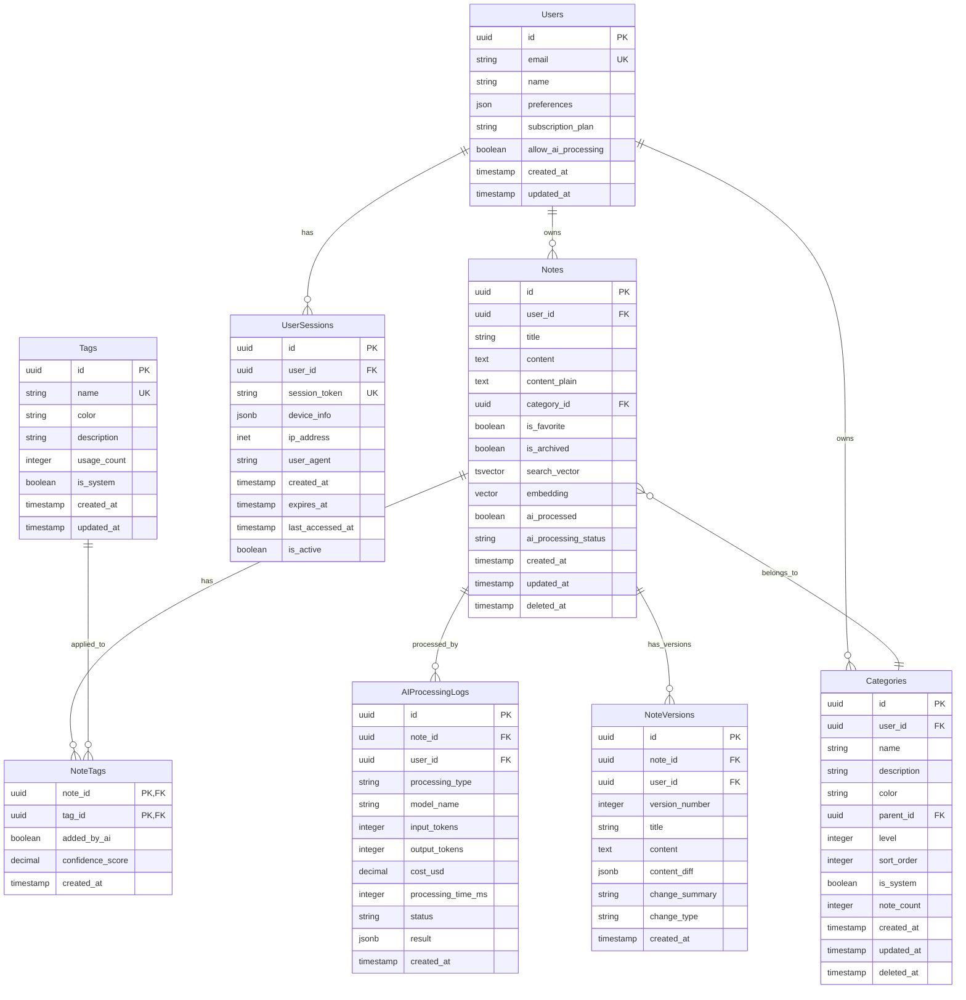

# Data Model: 智能笔记管理

**Branch**: `002-smart-note-management` | **Date**: 2025-10-25
**Focus**: Database schema and data relationships for smart note management system

## Data Model Overview

This document defines the complete data model for the smart note management system, including database schema, relationships, and data access patterns. The model is designed to support AI-powered features while maintaining data integrity and performance.

## Database Schema

### Core Entities

#### 1. Users (用户)

```sql
CREATE TABLE users (
  id UUID PRIMARY KEY DEFAULT gen_random_uuid(),
  email TEXT UNIQUE NOT NULL,
  name TEXT NOT NULL,
  avatar_url TEXT,
  email_verified BOOLEAN DEFAULT FALSE,
  created_at TIMESTAMP DEFAULT NOW(),
  updated_at TIMESTAMP DEFAULT NOW(),

  -- User preferences
  preferences JSONB DEFAULT '{}',

  -- Subscription and usage limits
  subscription_plan TEXT DEFAULT 'free',
  monthly_ai_tokens_used INTEGER DEFAULT 0,
  monthly_ai_tokens_limit INTEGER DEFAULT 10000,

  -- Privacy settings
  allow_ai_processing BOOLEAN DEFAULT TRUE,
  data_retention_days INTEGER DEFAULT 365
);
```

**Indexes**:
```sql
CREATE INDEX idx_users_email ON users(email);
CREATE INDEX idx_users_subscription ON users(subscription_plan);
```

#### 2. Notes (笔记)

```sql
CREATE TABLE notes (
  id UUID PRIMARY KEY DEFAULT gen_random_uuid(),
  user_id UUID NOT NULL REFERENCES users(id) ON DELETE CASCADE,

  -- Basic content
  title TEXT NOT NULL,
  content TEXT NOT NULL,
  content_plain TEXT, -- Plain text version for search

  -- Organization
  category_id UUID REFERENCES categories(id) ON DELETE SET NULL,
  is_favorite BOOLEAN DEFAULT FALSE,
  is_archived BOOLEAN DEFAULT FALSE,
  is_public BOOLEAN DEFAULT FALSE,

  -- Metadata
  word_count INTEGER DEFAULT 0,
  reading_time_minutes INTEGER DEFAULT 0,
  version INTEGER DEFAULT 1,

  -- AI processing
  ai_processed BOOLEAN DEFAULT FALSE,
  ai_processing_status TEXT DEFAULT 'pending', -- pending, processing, completed, failed
  ai_last_processed_at TIMESTAMP,

  -- Search optimization
  search_vector tsvector,
  embedding vector(1536),

  -- Timestamps
  created_at TIMESTAMP DEFAULT NOW(),
  updated_at TIMESTAMP DEFAULT NOW(),

  -- Soft delete
  deleted_at TIMESTAMP
);
```

**Indexes**:
```sql
CREATE INDEX idx_notes_user_id ON notes(user_id);
CREATE INDEX idx_notes_category_id ON notes(category_id);
CREATE INDEX idx_notes_created_at ON notes(created_at DESC);
CREATE INDEX idx_notes_updated_at ON notes(updated_at DESC);
CREATE INDEX idx_notes_favorite ON notes(is_favorite) WHERE is_favorite = TRUE;
CREATE INDEX idx_notes_search ON notes USING gin(search_vector);
CREATE INDEX idx_notes_embedding ON notes USING ivfflat (embedding vector_l2_ops);
CREATE UNIQUE INDEX idx_notes_user_deleted ON notes(user_id, id) WHERE deleted_at IS NULL;
```

#### 3. Categories (分类)

```sql
CREATE TABLE categories (
  id UUID PRIMARY KEY DEFAULT gen_random_uuid(),
  user_id UUID NOT NULL REFERENCES users(id) ON DELETE CASCADE,

  -- Basic info
  name TEXT NOT NULL,
  description TEXT,
  color TEXT DEFAULT '#3B82F6',
  icon TEXT,

  -- Hierarchy
  parent_id UUID REFERENCES categories(id) ON DELETE CASCADE,
  level INTEGER DEFAULT 0,
  sort_order INTEGER DEFAULT 0,

  -- Metadata
  note_count INTEGER DEFAULT 0,
  is_system BOOLEAN DEFAULT FALSE, -- System categories like "Uncategorized"

  -- Timestamps
  created_at TIMESTAMP DEFAULT NOW(),
  updated_at TIMESTAMP DEFAULT NOW(),

  -- Soft delete
  deleted_at TIMESTAMP
);
```

**Indexes**:
```sql
CREATE INDEX idx_categories_user_id ON categories(user_id);
CREATE INDEX idx_categories_parent_id ON categories(parent_id);
CREATE INDEX idx_categories_level ON categories(level);
CREATE UNIQUE INDEX idx_categories_user_deleted ON categories(user_id, id) WHERE deleted_at IS NULL;
```

#### 4. Tags (标签)

```sql
CREATE TABLE tags (
  id UUID PRIMARY KEY DEFAULT gen_random_uuid(),
  name TEXT NOT NULL,
  color TEXT DEFAULT '#3B82F6',
  description TEXT,

  -- Usage statistics
  usage_count INTEGER DEFAULT 0,

  -- System tags
  is_system BOOLEAN DEFAULT FALSE,

  -- Timestamps
  created_at TIMESTAMP DEFAULT NOW(),
  updated_at TIMESTAMP DEFAULT NOW()
);
```

**Indexes**:
```sql
CREATE UNIQUE INDEX idx_tags_name ON tags(name);
CREATE INDEX idx_tags_usage_count ON tags(usage_count DESC);
```

#### 5. Note Tags (笔记标签关联)

```sql
CREATE TABLE note_tags (
  note_id UUID NOT NULL REFERENCES notes(id) ON DELETE CASCADE,
  tag_id UUID NOT NULL REFERENCES tags(id) ON DELETE CASCADE,

  -- Metadata
  added_by_ai BOOLEAN DEFAULT FALSE,
  confidence_score DECIMAL(3,2), -- 0.00-1.00 for AI-suggested tags

  -- Timestamps
  created_at TIMESTAMP DEFAULT NOW(),

  PRIMARY KEY (note_id, tag_id)
);
```

**Indexes**:
```sql
CREATE INDEX idx_note_tags_tag_id ON note_tags(tag_id);
CREATE INDEX idx_note_tags_ai_suggested ON note_tags(added_by_ai) WHERE added_by_ai = TRUE;
```

#### 6. AI Processing Logs (AI处理日志)

```sql
CREATE TABLE ai_processing_logs (
  id UUID PRIMARY KEY DEFAULT gen_random_uuid(),
  note_id UUID NOT NULL REFERENCES notes(id) ON DELETE CASCADE,
  user_id UUID NOT NULL REFERENCES users(id) ON DELETE CASCADE,

  -- Processing details
  processing_type TEXT NOT NULL, -- 'categorization', 'tagging', 'summary', 'embedding'
  model_name TEXT NOT NULL, -- 'gpt-4', 'text-embedding-ada-002', etc.

  -- Token usage
  input_tokens INTEGER,
  output_tokens INTEGER,
  total_tokens INTEGER,

  -- Cost tracking
  cost_usd DECIMAL(10, 6),

  -- Performance
  processing_time_ms INTEGER,
  queue_time_ms INTEGER,

  -- Results
  status TEXT NOT NULL, -- 'success', 'failed', 'timeout'
  result JSONB,
  error_message TEXT,

  -- Feedback
  user_feedback INTEGER, -- 1-5 rating
  user_feedback_text TEXT,

  -- Timestamps
  created_at TIMESTAMP DEFAULT NOW()
);
```

**Indexes**:
```sql
CREATE INDEX idx_ai_logs_note_id ON ai_processing_logs(note_id);
CREATE INDEX idx_ai_logs_user_id ON ai_processing_logs(user_id);
CREATE INDEX idx_ai_logs_type ON ai_processing_logs(processing_type);
CREATE INDEX idx_ai_logs_status ON ai_processing_logs(status);
CREATE INDEX idx_ai_logs_created_at ON ai_processing_logs(created_at DESC);
```

#### 7. Note Versions (笔记版本)

```sql
CREATE TABLE note_versions (
  id UUID PRIMARY KEY DEFAULT gen_random_uuid(),
  note_id UUID NOT NULL REFERENCES notes(id) ON DELETE CASCADE,
  user_id UUID NOT NULL REFERENCES users(id) ON DELETE CASCADE,

  -- Version content
  version_number INTEGER NOT NULL,
  title TEXT NOT NULL,
  content TEXT NOT NULL,
  content_diff JSONB, -- JSON patch diff from previous version

  -- Change metadata
  change_summary TEXT,
  change_type TEXT NOT NULL, -- 'create', 'edit', 'ai_process', 'restore'
  changed_fields TEXT[], -- Array of changed field names

  -- Timestamps
  created_at TIMESTAMP DEFAULT NOW()
);
```

**Indexes**:
```sql
CREATE INDEX idx_note_versions_note_id ON note_versions(note_id);
CREATE INDEX idx_note_versions_user_id ON note_versions(user_id);
CREATE INDEX idx_note_versions_created_at ON note_versions(created_at DESC);
```

#### 8. User Sessions (用户会话)

```sql
CREATE TABLE user_sessions (
  id UUID PRIMARY KEY DEFAULT gen_random_uuid(),
  user_id UUID NOT NULL REFERENCES users(id) ON DELETE CASCADE,

  -- Session data
  session_token TEXT UNIQUE NOT NULL,
  device_info JSONB,
  ip_address INET,
  user_agent TEXT,

  -- Timestamps
  created_at TIMESTAMP DEFAULT NOW(),
  expires_at TIMESTAMP NOT NULL,
  last_accessed_at TIMESTAMP DEFAULT NOW(),

  -- Status
  is_active BOOLEAN DEFAULT TRUE
);
```

**Indexes**:
```sql
CREATE UNIQUE INDEX idx_sessions_token ON user_sessions(session_token);
CREATE INDEX idx_sessions_user_id ON user_sessions(user_id);
CREATE INDEX idx_sessions_expires_at ON user_sessions(expires_at);
```

## Data Relationships

### Entity Relationship Diagram



### Relationship Descriptions

1. **Users → Notes**: One-to-many relationship. Each user can have multiple notes, but each note belongs to exactly one user.

2. **Users → Categories**: One-to-many relationship. Users can organize their notes into custom categories with hierarchical structure.

3. **Notes → Categories**: Many-to-one relationship. Each note can belong to one category (or none for "Uncategorized").

4. **Notes → Tags**: Many-to-many relationship through `note_tags` junction table. Notes can have multiple tags, and tags can be applied to multiple notes.

5. **Notes → AIProcessingLogs**: One-to-many relationship. Each AI processing operation creates a log entry for tracking and analytics.

6. **Notes → NoteVersions**: One-to-many relationship. Each content change creates a new version for history tracking and rollback capability.

## Data Access Patterns

### 1. Note Retrieval with Search

```sql
-- Full-text search with vector similarity
WITH search_results AS (
  SELECT *,
         ts_rank(search_vector, plainto_tsquery('english', $1)) as text_rank,
         1 - (embedding <=> $2) as vector_rank
  FROM notes
  WHERE user_id = $3
    AND deleted_at IS NULL
    AND (
      search_vector @@ plainto_tsquery('english', $1)
      OR (embedding <=> $2) < 0.7
    )
)
SELECT * FROM search_results
ORDER BY (text_rank * 0.4 + vector_rank * 0.6) DESC
LIMIT $4 OFFSET $5;
```

### 2. Category Tree Query

```sql
-- Recursive query for category hierarchy
WITH RECURSIVE category_tree AS (
  -- Base case: top-level categories
  SELECT id, name, parent_id, level, 0 as depth
  FROM categories
  WHERE user_id = $1 AND parent_id IS NULL AND deleted_at IS NULL

  UNION ALL

  -- Recursive case: child categories
  SELECT c.id, c.name, c.parent_id, c.level, ct.depth + 1
  FROM categories c
  JOIN category_tree ct ON c.parent_id = ct.id
  WHERE c.deleted_at IS NULL
)
SELECT * FROM category_tree
ORDER BY level, sort_order, name;
```

### 3. AI Processing Queue

```sql
-- Get notes pending AI processing
SELECT id, title, content, ai_processing_status
FROM notes
WHERE user_id = $1
  AND ai_processed = FALSE
  AND ai_processing_status = 'pending'
  AND deleted_at IS NULL
ORDER BY created_at ASC
LIMIT $2
FOR UPDATE SKIP LOCKED;
```

### 4. Tag Usage Analytics

```sql
-- Popular tags with usage statistics
SELECT
    t.id,
    t.name,
    t.color,
    COUNT(nt.note_id) as usage_count,
    COUNT(DISTINCT nt.note_id) as unique_notes,
    AVG(nt.confidence_score) as avg_confidence
FROM tags t
LEFT JOIN note_tags nt ON t.id = nt.tag_id
LEFT JOIN notes n ON nt.note_id = n.id
WHERE n.deleted_at IS NULL
GROUP BY t.id, t.name, t.color
ORDER BY usage_count DESC, name ASC
LIMIT $1;
```

## Data Validation Rules

### 1. Notes Validation

```typescript
interface NoteValidationRules {
  title: {
    required: true;
    minLength: 1;
    maxLength: 200;
  };
  content: {
    required: true;
    minLength: 1;
    maxLength: 1000000; // 1MB max content
  };
  userId: {
    required: true;
    format: 'uuid';
  };
}
```

### 2. Category Validation

```typescript
interface CategoryValidationRules {
  name: {
    required: true;
    minLength: 1;
    maxLength: 50;
    uniquePerUser: true;
  };
  parentId: {
    allowed: 'null' | 'uuid';
    noCircularReference: true;
  };
  level: {
    min: 0;
    max: 5; // Maximum 5 levels deep
  };
}
```

### 3. Tag Validation

```typescript
interface TagValidationRules {
  name: {
    required: true;
    minLength: 1;
    maxLength: 30;
    unique: true;
    format: 'alphanumeric-with-spaces';
  };
  color: {
    required: false;
    format: 'hex-color';
  };
}
```

## Performance Optimization

### 1. Indexing Strategy

- **Composite Indexes**: For frequently queried combinations (user_id + created_at, etc.)
- **Partial Indexes**: For boolean filters (is_favorite = TRUE)
- **GIN Indexes**: For full-text search and JSONB fields
- **Vector Indexes**: For similarity search with pgvector

### 2. Query Optimization

```sql
-- Optimized recent notes query
SELECT id, title, created_at, updated_at, is_favorite, category_id
FROM notes
WHERE user_id = $1
  AND deleted_at IS NULL
ORDER BY updated_at DESC
LIMIT 20;

-- Materialized view for user statistics
CREATE MATERIALIZED VIEW user_statistics AS
SELECT
    u.id as user_id,
    COUNT(n.id) as total_notes,
    COUNT(CASE WHEN n.is_favorite THEN 1 END) as favorite_notes,
    COUNT(CASE WHEN n.is_archived THEN 1 END) as archived_notes,
    COUNT(DISTINCT c.id) as total_categories,
    COUNT(DISTINCT t.id) as total_tags
FROM users u
LEFT JOIN notes n ON u.id = n.user_id AND n.deleted_at IS NULL
LEFT JOIN categories c ON u.id = c.user_id AND c.deleted_at IS NULL
LEFT JOIN note_tags nt ON n.id = nt.note_id
LEFT JOIN tags t ON nt.tag_id = t.id
GROUP BY u.id;
```

## Data Migration Strategy

### 1. Initial Schema Setup

```sql
-- Migration 001: Create core tables
CREATE EXTENSION IF NOT EXISTS "uuid-ossp";
CREATE EXTENSION IF NOT EXISTS "pgvector";

-- Migration 002: Create indexes
-- (Index creation statements)

-- Migration 003: Add constraints
-- (Constraint statements)
```

### 2. Data Backups

```sql
-- Regular backup strategy
-- 1. Full daily backups
pg_dump mindnote_db > backup_$(date +%Y%m%d).sql

-- 2. Incremental backups
-- Use pg_basebackup for WAL archiving

-- 3. User data export
COPY (SELECT * FROM notes WHERE user_id = 'user-uuid') TO 'user_notes.csv' WITH CSV HEADER;
```

## Security Considerations

### 1. Row-Level Security

```sql
-- Enable RLS on sensitive tables
ALTER TABLE notes ENABLE ROW LEVEL SECURITY;
ALTER TABLE categories ENABLE ROW LEVEL SECURITY;
ALTER TABLE ai_processing_logs ENABLE ROW LEVEL SECURITY;

-- Create RLS policies
CREATE POLICY user_notes_policy ON notes
    FOR ALL TO authenticated_users
    USING (user_id = current_user_id());

CREATE POLICY user_categories_policy ON categories
    FOR ALL TO authenticated_users
    USING (user_id = current_user_id());
```

### 2. Data Encryption

```sql
-- Encrypt sensitive columns
CREATE EXTENSION IF NOT EXISTS "pgcrypto";

-- Example: Encrypt user preferences
ALTER TABLE users
ADD COLUMN preferences_encrypted BYTEA;

UPDATE users
SET preferences_encrypted = pgp_sym_encrypt(preferences::text, current_setting('app.encryption_key'));
```

## Monitoring and Analytics

### 1. Database Statistics

```sql
-- Track table sizes
SELECT
    schemaname,
    tablename,
    pg_size_pretty(pg_total_relation_size(schemaname::text || '.' || tablename::text)) as size
FROM pg_tables
WHERE schemaname = 'public'
ORDER BY pg_total_relation_size(schemaname::text || '.' || tablename::text) DESC;

-- Track query performance
SELECT
    query,
    calls,
    total_time,
    mean_time,
    rows
FROM pg_stat_statements
ORDER BY total_time DESC
LIMIT 10;
```

### 2. AI Usage Analytics

```sql
-- Daily AI processing statistics
SELECT
    DATE(created_at) as date,
    processing_type,
    COUNT(*) as total_requests,
    SUM(input_tokens) as total_input_tokens,
    SUM(output_tokens) as total_output_tokens,
    SUM(cost_usd) as total_cost,
    AVG(processing_time_ms) as avg_processing_time
FROM ai_processing_logs
WHERE created_at >= CURRENT_DATE - INTERVAL '30 days'
GROUP BY DATE(created_at), processing_type
ORDER BY date DESC, processing_type;
```

## Conclusion

This data model provides a comprehensive foundation for the smart note management system, supporting:

1. **Scalability**: Optimized indexes and query patterns for large datasets
2. **AI Integration**: Structured data for AI processing and analytics
3. **Performance**: Efficient search and filtering capabilities
4. **Security**: Row-level security and encryption for sensitive data
5. **Extensibility**: Flexible schema that can accommodate future features

The model is designed to support the planned features while maintaining data integrity and performance at scale.

---

**Data Model Status**: ✅ Complete
**Date**: 2025-10-25
**Ready for Implementation**: ✅ Yes
**Database Version**: PostgreSQL 16+