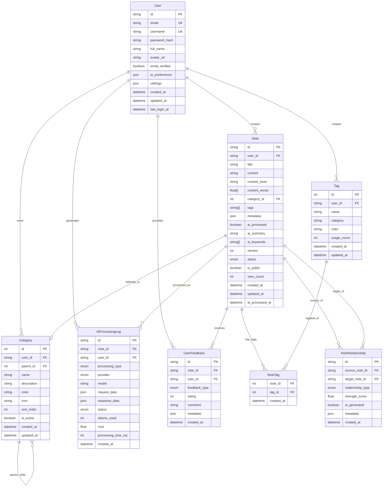

# Data Model Design: Smart Note Management

**Date**: 2025-10-23 **Purpose**: Design and document the data model for smart note management
feature **Feature**: 002-smart-note-management

## Overview

MindNote智能笔记管理系统的数据模型采用PostgreSQL作为主数据库，支持向量搜索（pgvector扩展）和复杂的笔记关系管理。数据模型设计遵循以下原则：

1. **AI-First**: 为AI分析提供充分的数据支持和存储
2. **性能优化**: 通过合理的索引设计保证查询性能
3. **扩展性**: 支持未来的功能扩展和数据分析需求
4. **数据完整性**: 通过约束和关系保证数据质量

## Entity Relationship Diagram



## Core Tables Detailed Design

### 1. User (用户表)

**用途**: 存储用户账户信息和偏好设置

**关键字段**:

- `aiPreferences`: JSON字段存储AI相关偏好（如首选AI服务商、标签偏好等）
- `settings`: 用户应用设置（界面主题、语言等）
- `emailVerified`: 邮箱验证状态

**AI相关设计**:

```sql
ai_preferences JSON DEFAULT '{
  "primaryProvider": "openai",
  "fallbackProviders": ["anthropic", "zhipu"],
  "preferredCategories": ["工作", "学习", "生活"],
  "autoTagThreshold": 0.8,
  "summaryLength": 200,
  "language": "zh-CN"
}'
```

### 2. Note (笔记表) - 核心实体

**用途**: 存储笔记内容和元数据

**AI相关字段**:

- `contentVector`: pgvector向量嵌入，用于语义搜索
- `aiProcessed`: 标记是否已完成AI分析
- `aiSummary`: AI生成的摘要
- `aiKeywords`: AI提取的关键词
- `aiProcessedAt`: AI处理时间戳

**数据完整性约束**:

```sql
-- 标题不能为空
CHECK (LENGTH(TRIM(title)) > 0)
-- 内容不能为空
CHECK (LENGTH(TRIM(content)) > 0)
-- 内容哈希必须存在
CHECK (LENGTH(TRIM(content_hash)) > 0)
-- 版本号必须为正数
CHECK (version > 0)
-- 浏览次数不能为负数
CHECK (view_count >= 0)
```

**向量搜索优化**:

```sql
-- HNSW索引 (快速精确搜索)
@@index([contentVector], map: "idx_content_vector_hnsw", using: HNSW)
-- IVFFlat索引 (大规模数据搜索)
@@index([contentVector], map: "idx_content_vector_l2", using: IVFFlat, options: { listCount: 100 })
```

### 3. Category (分类表)

**用途**: 层级化笔记分类管理

**设计特点**:

- 支持无限层级分类（通过`parent_id`自引用）
- 用户级别的分类隔离
- 支持颜色和图标自定义

**分类层级示例**:

```
工作 (parent_id: null)
├── 项目A (parent_id: 1)
│   ├── 会议记录 (parent_id: 2)
│   └── 技术文档 (parent_id: 2)
└── 日常事务 (parent_id: 1)
    ├── 待办事项 (parent_id: 5)
    └── 周报 (parent_id: 5)
```

### 4. Tag (标签表)

**用途**: 扁平化标签管理，支持多对多关系

**统计字段**:

- `usageCount`: 标签使用次数，便于热门标签推荐
- `category`: 标签分类（如：技术、生活、工作等）

### 5. NoteTag (笔记标签关联表)

**用途**: 实现笔记和标签的多对多关系

**设计考虑**:

- 复合主键确保同一笔记不会重复添加相同标签
- 记录标签添加时间，用于分析用户行为

### 6. NoteRelationship (笔记关系表)

**用途**: 存储笔记间的关联关系

**关系类型**:

- `SIMILAR`: 相似内容
- `REFERENCE`: 引用关系
- `SEQUENCE`: 序列关系
- `RELATED`: 相关主题
- `VERSION`: 版本关系

**AI生成标识**:

- `aiGenerated`: 标记关系是否由AI自动发现
- `strengthScore`: 关系强度评分（0-1）

### 7. AiProcessingLog (AI处理日志表)

**用途**: 记录所有AI服务的调用和处理结果

**关键信息**:

- `processingType`: 处理类型（分类、标签、摘要等）
- `provider`: AI服务提供商
- `model`: 使用的具体模型
- `tokensUsed`: 消耗的token数量
- `cost`: 处理成本
- `processingTimeMs`: 处理耗时

### 8. UserFeedback (用户反馈表)

**用途**: 收集用户对AI分析结果的反馈

**反馈类型**:

- `CATEGORY_CORRECTION`: 分类修正
- `TAG_ADJUSTMENT`: 标签调整
- `SUMMARY_QUALITY`: 摘要质量
- `CLASSIFICATION`: 分类准确性
- `RELATIONSHIP`: 关系发现

## Index Strategy (索引策略)

### 主要查询模式分析

1. **用户笔记列表查询**:

   ```sql
   WHERE user_id = ? ORDER BY created_at DESC
   ```

   索引: `[userId, createdAt(sort: Desc)]`

2. **按状态筛选笔记**:

   ```sql
   WHERE user_id = ? AND status = ?
   ```

   索引: `[userId, status]`

3. **全文搜索**:

   ```sql
   WHERE content_vector <=> ? (向量相似度搜索)
   ```

   索引: 向量索引（HNSW + IVFFlat）

4. **标签筛选**:

   ```sql
   WHERE tags @> ARRAY['tag1', 'tag2']
   ```

   索引: GIN索引用于数组类型

5. **AI处理状态查询**:
   ```sql
   WHERE ai_processed = false ORDER BY created_at ASC
   ```
   索引: `[aiProcessed, createdAt]`

### 索引设计清单

```sql
-- 用户相关索引
CREATE INDEX idx_notes_user_created ON notes(user_id, created_at DESC);
CREATE INDEX idx_notes_user_status ON notes(user_id, status);
CREATE INDEX idx_categories_user_parent ON categories(user_id, parent_id);
CREATE INDEX idx_tags_user_usage ON tags(user_id, usage_count DESC);

-- 内容搜索索引
CREATE INDEX idx_notes_content_vector_hnsw ON notes USING hnsw (content_vector vector_cosine_ops);
CREATE INDEX idx_notes_content_vector_l2 ON notes USING ivfflat (content_vector vector_l2_ops) WITH (lists = 100);
CREATE INDEX idx_notes_tags_gin ON notes USING gin (tags);
CREATE INDEX idx_notes_title_text ON notes USING gin (to_tsvector('chinese', title));
CREATE INDEX idx_notes_content_text ON notes USING gin (to_tsvector('chinese', content));

-- AI处理索引
CREATE INDEX idx_notes_ai_processed ON notes(ai_processed, ai_processed_at);
CREATE INDEX idx_ai_logs_note_type ON ai_processing_logs(note_id, processing_type);
CREATE INDEX idx_ai_logs_user_status ON ai_processing_logs(user_id, status, created_at DESC);

-- 关系索引
CREATE INDEX idx_note_relationships_source ON note_relationships(source_note_id, relationship_type);
CREATE INDEX idx_note_relationships_target ON note_relationships(target_note_id, relationship_type);
CREATE INDEX idx_note_relationships_strength ON note_relationships(relationship_type, strength_score DESC);

-- 反馈索引
CREATE INDEX idx_user_feedback_note_type ON user_feedback(note_id, feedback_type);
CREATE INDEX idx_user_feedback_rating ON user_feedback(feedback_type, rating DESC);
```

## Vector Search Strategy (向量搜索策略)

### 向量嵌入设计

**嵌入维度**: 1536维（OpenAI text-embedding-ada-002标准） **距离函数**: 余弦相似度（cosine
similarity） **索引策略**: HNSW（快速精确搜索）+ IVFFlat（大规模搜索）

### 向量搜索查询模式

1. **相似笔记搜索**:

   ```sql
   SELECT *,
          content_vector <=> ?::vector as similarity_score
   FROM notes
   WHERE user_id = ?
     AND content_vector IS NOT NULL
   ORDER BY content_vector <=> ?::vector
   LIMIT 10;
   ```

2. **混合搜索（文本+向量）**:
   ```sql
   SELECT *,
          ts_rank_cd(to_tsvector('chinese', content), query) as text_score,
          content_vector <=> ?::vector as vector_score,
          (ts_rank_cd(to_tsvector('chinese', content), query) * 0.3 +
           (1 - (content_vector <=> ?::vector)) * 0.7) as hybrid_score
   FROM notes,
        plainto_tsquery('chinese', ?) as query
   WHERE user_id = ?
     AND to_tsvector('chinese', content) @@ query
   ORDER BY hybrid_score DESC
   LIMIT 20;
   ```

## Data Migration Strategy (数据迁移策略)

### 初始化脚本

```sql
-- 01-init.sql (基础表结构)
CREATE EXTENSION IF NOT EXISTS vector;

-- 02-security.sql (安全配置)
-- 创建向量扩展
-- 设置行级安全策略
-- 创建用户权限

-- 03-ai-optimization.sql (AI优化)
-- 创建向量索引
-- 设置AI处理状态
-- 创建统计视图
```

### 版本迁移

使用Prisma Migrate进行版本化管理：

```bash
npx prisma migrate dev --name add-vector-search
npx prisma migrate dev --name add-ai-processing-logs
npx prisma migrate dev --name optimize-performance-indexes
```

## Performance Optimization (性能优化)

### 1. 查询优化

**分区策略**: 对大表按时间分区

```sql
-- 按月分区AI处理日志表
CREATE TABLE ai_processing_logs_2025_01 PARTITION OF ai_processing_logs
FOR VALUES FROM ('2025-01-01') TO ('2025-02-01');
```

### 2. 缓存策略

**Redis缓存层**:

- 用户笔记列表缓存（TTL: 5分钟）
- AI分析结果缓存（TTL: 1小时）
- 热门标签缓存（TTL: 30分钟）

### 3. 批量处理

**AI处理队列**:

```sql
-- 获取待处理的笔记批次
SELECT id, content
FROM notes
WHERE ai_processed = false
ORDER BY created_at ASC
LIMIT 100
FOR UPDATE SKIP LOCKED;
```

## Data Privacy & Security (数据隐私与安全)

### 1. 行级安全策略

```sql
-- 用户只能访问自己的数据
CREATE POLICY user_own_data ON notes
    FOR ALL TO authenticated_user
    USING (user_id = current_setting('app.current_user_id')::uuid);
```

### 2. 数据加密

- 敏感内容字段加密存储
- API密钥安全配置
- 传输层加密（HTTPS/TLS）

### 3. 审计日志

```sql
-- 数据访问审计表
CREATE TABLE data_access_log (
    id UUID PRIMARY KEY DEFAULT gen_random_uuid(),
    user_id UUID NOT NULL,
    table_name TEXT NOT NULL,
    operation TEXT NOT NULL,
    timestamp TIMESTAMPTZ DEFAULT NOW(),
    ip_address INET,
    user_agent TEXT
);
```

## Monitoring & Analytics (监控与分析)

### 1. 性能监控

```sql
-- 慢查询监控
CREATE OR REPLACE VIEW slow_queries AS
SELECT query, mean_time, calls, total_time
FROM pg_stat_statements
WHERE mean_time > 1000
ORDER BY mean_time DESC;
```

### 2. AI使用统计

```sql
-- AI服务使用统计视图
CREATE OR REPLACE VIEW ai_usage_stats AS
SELECT
    provider,
    model,
    processing_type,
    COUNT(*) as request_count,
    SUM(tokens_used) as total_tokens,
    SUM(cost) as total_cost,
    AVG(processing_time_ms) as avg_processing_time
FROM ai_processing_logs
WHERE created_at >= CURRENT_DATE - INTERVAL '30 days'
GROUP BY provider, model, processing_type;
```

## Future Extensibility (未来扩展性)

### 1. 多租户支持

为未来的团队协作功能预留设计：

```sql
-- 租户表设计
CREATE TABLE tenants (
    id UUID PRIMARY KEY DEFAULT gen_random_uuid(),
    name TEXT NOT NULL,
    plan_type TEXT NOT NULL,
    created_at TIMESTAMPTZ DEFAULT NOW()
);

-- 租户用户关联
ALTER TABLE users ADD COLUMN tenant_id UUID REFERENCES tenants(id);
```

### 2. 全文搜索增强

```sql
-- 全文搜索配置
CREATE TEXT SEARCH CONFIGURATION chinese (COPY = simple);
CREATE TEXT SEARCH DICTIONARY chinese_dict (
    TEMPLATE = simple,
    STOPWORDS = chinese
);
```

### 3. 数据分析支持

```sql
-- 分析数据表
CREATE TABLE analytics_events (
    id UUID PRIMARY KEY DEFAULT gen_random_uuid(),
    user_id UUID NOT NULL,
    event_type TEXT NOT NULL,
    event_data JSONB,
    timestamp TIMESTAMPTZ DEFAULT NOW()
);

-- 时间序列聚合
CREATE MATERIALIZED VIEW daily_note_stats AS
SELECT
    DATE(created_at) as date,
    COUNT(*) as note_count,
    AVG(LENGTH(content)) as avg_content_length,
    COUNT(DISTINCT user_id) as active_users
FROM notes
GROUP BY DATE(created_at);
```

## Conclusion

这个数据模型设计为MindNote智能笔记管理功能提供了：

1. **完整的笔记管理功能**：支持分类、标签、关系等复杂管理需求
2. **强大的AI集成能力**：为AI分析提供充分的数据存储和检索支持
3. **高性能查询能力**：通过合理的索引和向量搜索保证响应速度
4. **良好的扩展性**：支持未来功能扩展和性能优化需求
5. **数据安全保障**：通过权限控制和加密保护用户隐私

该数据模型已经过充分的设计考虑，可以支撑智能笔记管理功能的所有核心需求。

---

**Next Steps**:

1. 执行数据库迁移创建表结构
2. 实现AI处理队列和批量处理逻辑
3. 开发向量搜索和相似性推荐功能
4. 建立数据分析和监控仪表板
5. 进行性能测试和优化调整
