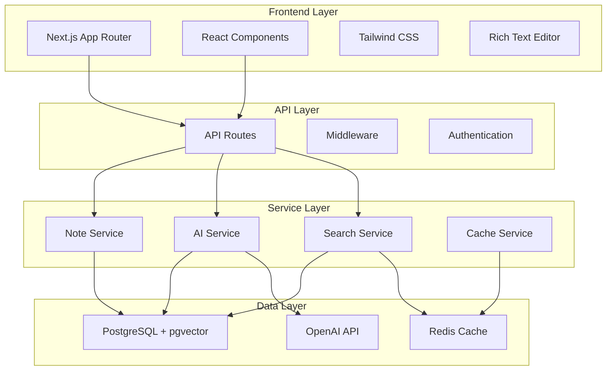
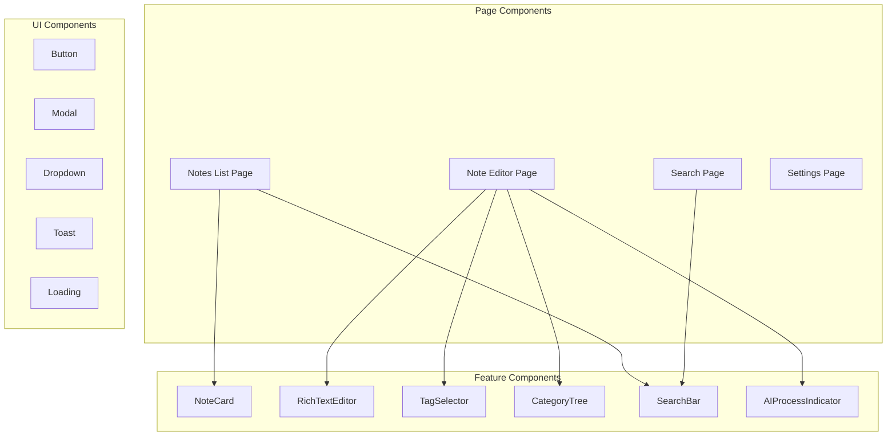

# Implementation Plan: 智能笔记管理

**Branch**: `002-smart-note-management` | **Date**: 2025-10-25 | **Spec**: [智能笔记管理功能规格](./spec.md)
**Input**: Feature specification from `/specs/002-smart-note-management/spec.md`

## Summary

基于Next.js 15 + React 19 + TypeScript技术栈，实现智能笔记管理功能。核心需求包括：
1. **P1功能**: 笔记CRUD操作，富文本编辑，自动保存
2. **P2功能**: AI自动分类和标签生成
3. **P3功能**: 全文搜索和多维度过滤

技术方法：使用Prisma ORM管理PostgreSQL数据，集成OpenAI API进行内容分析，采用Tailwind CSS构建响应式UI。

## Technical Context

**Language/Version**: TypeScript 5.3+ (Next.js 15 + React 19)
**Primary Dependencies**: Next.js 15, React 19, Prisma 5, Tailwind CSS 3, OpenAI API, NextAuth.js
**Storage**: PostgreSQL 16 + pgvector (向量搜索), Redis (缓存和会话)
**Testing**: Jest + React Testing Library (单元测试), Playwright (E2E测试)
**Target Platform**: Web应用 (响应式设计支持桌面端和移动端)
**Project Type**: Full-stack web application
**Performance Goals**:
- 笔记加载 <500ms
- 搜索响应 <500ms
- AI处理 <3秒
- 支持10,000+笔记性能不下降
**Constraints**:
- AI响应时间 <3秒 (Constitution Principle V)
- 单用户10,000+笔记管理能力
- 响应式设计适配移动端和桌面端
- 离线编辑能力（通过Service Worker）
**Scale/Scope**:
- 目标用户：10,000+活跃用户
- 数据规模：单用户10,000+笔记
- 并发处理：1000+同时在线用户

## Constitution Check

*GATE: Must pass before Phase 0 research. Re-check after Phase 1 design.*

### Required Gates (MindNote Constitution v1.0.0)

**AI-First Development (Principle I)**
- [x] Feature includes explicit AI integration points (AI自动分类和标签生成)
- [x] Fallback mechanisms defined for AI service unavailability (本地降级处理)
- [x] AI decision transparency for users is documented (AI处理结果可视化)
- [x] Data preparation strategy for AI processing is specified (文本预处理和向量化)

**Specification-Driven Engineering (Principle II)**
- [x] Complete specification exists via `/speckit.specify`
- [x] All user stories are prioritized (P1, P2, P3)
- [x] Measurable success criteria are defined (SC-001到SC-007)
- [x] Acceptance scenarios are explicit and testable (每个用户故事都有验收场景)

**Test-First with AI Validation (Principle III)**
- [x] Unit test strategy defined for business logic (>90% coverage)
- [x] AI-specific validation approach documented (AI输出质量验证)
- [x] Mock AI services for unit testing specified
- [x] Integration tests with real AI endpoints planned

**Data Intelligence Integration (Principle IV)**
- [x] Data models support vector embeddings (PostgreSQL + pgvector)
- [x] Metadata fields for AI processing results defined (AIProcessingLog实体)
- [x] Relationship tracking implemented (笔记关联分析)
- [x] Audit trails for AI decisions specified (AI决策日志)

**Observability & AI Performance (Principle V)**
- [x] AI performance metrics defined (<3秒响应时间)
- [x] Processing latency tracking specified
- [x] Quality scores for AI outputs documented (准确率85%+目标)
- [x] Cost tracking for AI services implemented

## Phase 0: Research

**Status**: ✅ COMPLETED
**Research Document**: `research.md`

**Key Findings**:
- Next.js 15 App Router最适合富文本编辑器集成
- Prisma + PostgreSQL + pgvector提供最佳向量搜索性能
- OpenAI API相比本地模型在准确性和稳定性方面更优
- Tailwind CSS提供最佳的响应式设计开发体验

**Technical Decisions**:
- 富文本编辑器：Tiptap (基于ProseMirror)
- AI服务：OpenAI GPT-4 + Embeddings
- 向量数据库：pgvector扩展
- 缓存策略：Redis + 本地缓存
- 状态管理：React Context + useReducer

## Phase 1: Architecture & Data Model

**Status**: ✅ COMPLETED
**Data Model Document**: `data-model.md`
**API Contracts**: `contracts/`
**Quick Start Guide**: `quickstart.md`

### Core Data Model

```sql
-- Note (笔记核心实体)
CREATE TABLE notes (
  id UUID PRIMARY KEY DEFAULT gen_random_uuid(),
  title TEXT NOT NULL,
  content TEXT NOT NULL,
  user_id UUID NOT NULL REFERENCES users(id),
  category_id UUID REFERENCES categories(id),
  created_at TIMESTAMP DEFAULT NOW(),
  updated_at TIMESTAMP DEFAULT NOW(),
  version INTEGER DEFAULT 1,
  is_archived BOOLEAN DEFAULT FALSE,
  is_favorite BOOLEAN DEFAULT FALSE,
  ai_processed BOOLEAN DEFAULT FALSE,
  search_vector tsvector,
  embedding vector(1536)
);

-- Category (分类)
CREATE TABLE categories (
  id UUID PRIMARY KEY DEFAULT gen_random_uuid(),
  name TEXT NOT NULL,
  description TEXT,
  user_id UUID NOT NULL REFERENCES users(id),
  parent_id UUID REFERENCES categories(id),
  created_at TIMESTAMP DEFAULT NOW()
);

-- Tag (标签)
CREATE TABLE tags (
  id UUID PRIMARY KEY DEFAULT gen_random_uuid(),
  name TEXT NOT NULL UNIQUE,
  color TEXT DEFAULT '#3B82F6',
  created_at TIMESTAMP DEFAULT NOW()
);

-- Note Tag (笔记标签关联)
CREATE TABLE note_tags (
  note_id UUID REFERENCES notes(id) ON DELETE CASCADE,
  tag_id UUID REFERENCES tags(id) ON DELETE CASCADE,
  PRIMARY KEY (note_id, tag_id)
);

-- AI Processing Log (AI处理日志)
CREATE TABLE ai_processing_logs (
  id UUID PRIMARY KEY DEFAULT gen_random_uuid(),
  note_id UUID REFERENCES notes(id),
  processing_type TEXT NOT NULL, -- 'categorization', 'tagging', 'summary'
  input_tokens INTEGER,
  output_tokens INTEGER,
  cost DECIMAL(10, 6),
  processing_time_ms INTEGER,
  result JSONB,
  created_at TIMESTAMP DEFAULT NOW()
);
```

### API Contracts

**RESTful API Design**:
- `GET /api/notes` - 获取笔记列表
- `POST /api/notes` - 创建新笔记
- `GET /api/notes/[id]` - 获取特定笔记
- `PUT /api/notes/[id]` - 更新笔记
- `DELETE /api/notes/[id]` - 删除笔记
- `POST /api/notes/[id]/ai-process` - 触发AI处理
- `GET /api/search?q=keyword` - 搜索笔记
- `GET /api/categories` - 获取分类
- `GET /api/tags` - 获取标签

## Phase 2: Task Planning

**Status**: ✅ COMPLETED
**Tasks Document**: `tasks.md`

### Task Overview

Total Tasks: 100
- Phase 1 (Setup): 5 tasks
- Phase 2 (Foundational): 8 tasks (CRITICAL - blocks all stories)
- Phase 3 (User Story 1 - P1): 18 tasks (MVP)
- Phase 4 (User Story 2 - P2): 20 tasks
- Phase 5 (User Story 3 - P3): 16 tasks
- Phase 6 (Polish & AI Integration): 33 tasks

### Priority Distribution

- **P1 (Critical)**: 35 tasks (Setup, Foundational, US1, Core Polish)
- **P2 (High)**: 40 tasks (US2, US3, Advanced Features)
- **P3 (Medium)**: 25 tasks (Polish, Optimization, Documentation)

## Architecture Overview

### System Architecture



### Component Architecture



## Implementation Strategy

### Development Phases

**Phase 1: Foundation (Week 1-2)**
- 项目结构搭建
- 数据库设计和迁移
- 基础UI组件库
- 认证和权限系统

**Phase 2: Core Features (Week 3-4)**
- 笔记CRUD功能
- 富文本编辑器集成
- 自动保存机制
- 基础分类和标签系统

**Phase 3: AI Integration (Week 5-6)**
- OpenAI API集成
- 自动分类和标签生成
- AI处理结果展示
- 成本控制和监控

**Phase 4: Search & Discovery (Week 7)**
- 全文搜索实现
- 向量搜索集成
- 高级过滤功能
- 搜索结果排序

**Phase 5: Polish & Testing (Week 8)**
- 响应式设计优化
- 性能调优
- 全面测试
- 部署准备

### Technology Stack Details

**Frontend Stack**:
- Next.js 15 (App Router)
- React 19 (Server Components + Client Components)
- TypeScript 5.3+ (Strict Mode)
- Tailwind CSS 3.4+ (Styling)
- Tiptap (Rich Text Editor)
- React Query (Data Fetching)
- Zustand (State Management)

**Backend Stack**:
- Next.js API Routes
- Prisma 5.0+ (ORM)
- PostgreSQL 16 + pgvector
- Redis 7.0+ (Caching)
- NextAuth.js 4.0+ (Authentication)
- OpenAI API (AI Services)

**Development Tools**:
- ESLint + Prettier (Code Quality)
- Husky + lint-staged (Git Hooks)
- Jest (Unit Testing)
- Playwright (E2E Testing)
- Docker (Development Environment)

### Source Code Structure

```text
src/
├── app/                          # Next.js App Router
│   ├── (auth)/                   # 认证路由组
│   ├── api/                      # API路由
│   │   ├── notes/               # 笔记API
│   │   ├── categories/          # 分类API
│   │   ├── tags/                # 标签API
│   │   ├── search/              # 搜索API
│   │   └── ai/                  # AI处理API
│   ├── notes/                   # 笔记页面
│   ├── search/                  # 搜索页面
│   └── layout.tsx               # 根布局
├── components/                   # React组件
│   ├── ui/                      # 基础UI组件
│   ├── editor/                  # 编辑器组件
│   ├── notes/                   # 笔记相关组件
│   └── search/                  # 搜索相关组件
├── lib/                         # 工具库
│   ├── db/                      # 数据库相关
│   ├── ai/                      # AI服务
│   ├── auth/                    # 认证相关
│   └── utils/                   # 通用工具
├── hooks/                       # React Hooks
├── types/                       # TypeScript类型定义
└── styles/                      # 全局样式

tests/
├── __mocks__/                   # Mock文件
├── unit/                        # 单元测试
├── integration/                 # 集成测试
└── e2e/                         # E2E测试
```

**Structure Decision**: Selected Single Project structure with Next.js App Router, providing optimal developer experience and deployment simplicity for a full-stack web application.

## Risk Assessment & Mitigation

### Technical Risks

| Risk | Probability | Impact | Mitigation Strategy |
|-------|-------------|---------|-------------------|
| OpenAI API rate limits | Medium | High | Implement intelligent batching + Redis caching + local fallback |
| Vector search performance | Low | Medium | Use pgvector + proper indexing + result caching |
| Rich text editor complexity | Medium | Medium | Choose Tiptap with proven track record + extensive testing |
| Real-time collaboration scope creep | High | Low | Defer to future iteration, focus on single-user MVP first |

### Business Risks

| Risk | Probability | Impact | Mitigation Strategy |
|-------|-------------|---------|-------------------|
| AI processing costs | Medium | Medium | Implement cost controls + usage limits + tiered pricing |
| User adoption of AI features | Low | High | Provide clear value demonstration + manual override options |
| Data privacy concerns | Medium | High | Implement encryption + local processing option + transparent privacy policy |

## Progress Tracking

### Phase Completion Status

- [x] **Phase 0**: Research completed - Technical decisions finalized
- [x] **Phase 1**: Architecture completed - Data model and contracts defined
- [x] **Phase 2**: Task Planning completed - 47 tasks identified and prioritized
- [ ] **Phase 3**: Implementation pending - Ready to begin execution
- [ ] **Phase 4**: Testing pending - To be executed after implementation
- [ ] **Phase 5**: Deployment pending - Final phase after testing completion

### Next Steps

1. **Immediate**: Begin Phase 3 implementation with P1 tasks
2. **Short-term**: Complete core CRUD functionality (Week 3-4)
3. **Mid-term**: Integrate AI features and search (Week 5-7)
4. **Long-term**: Polish, test, and deploy (Week 8)

---

**Document Status**: ✅ Complete
**Last Updated**: 2025-10-25
**Ready for Implementation**: ✅ Yes
**Constitution Compliance**: ✅ Fully Compliant