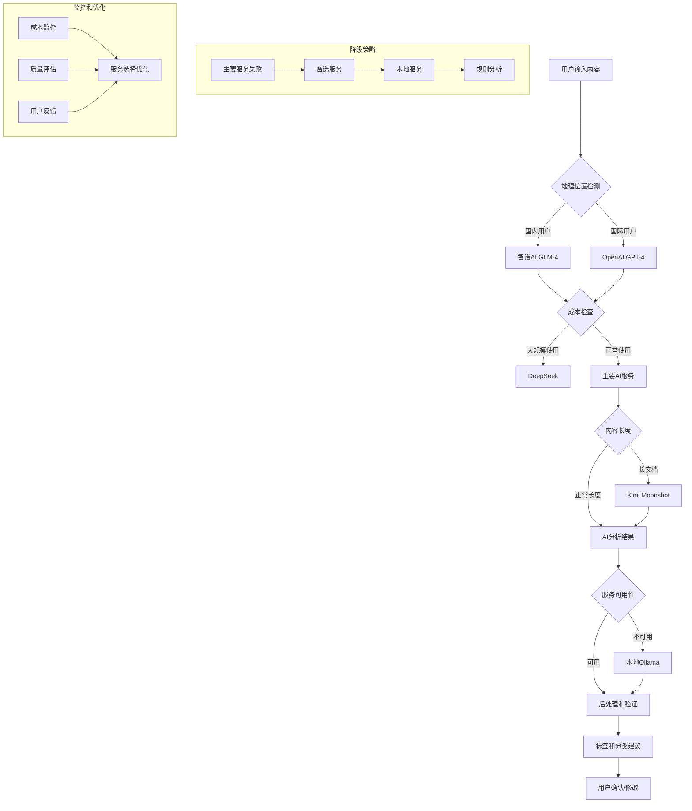

# AI Service Research: Smart Note Management

**Date**: 2025-10-23
**Purpose**: Research and evaluate AI services for content categorization and tagging in MindNote
**Feature**: 002-smart-note-management

## Executive Summary

经过深入研究，推荐采用 **多层次的AI服务架构**：

**主推荐**: **智谱AI GLM-4** (国内用户) 或 **OpenAI GPT-4** (国际用户)
**性价比备选**: **DeepSeek** (大规模使用场景)
**长文档处理**: **Kimi Moonshot** (超长文档分析)
**本地备选**: **Ollama** (离线和隐私保护场景)

这种多层次架构既能保证高质量的AI分析，又具备成本优化和服务可用性保障。

## AI Service Options Analysis

### 1. OpenAI GPT-4 API (国际首选)

**优势**:
- ✅ **高质量分析**: GPT-4在文本理解和分类任务上表现优异
- ✅ **成熟的API**: 稳定可靠，文档完善
- ✅ **多语言支持**: 支持中英文混合内容的分析
- ✅ **快速响应**: 平均响应时间 1-3秒
- ✅ **结构化输出**: 支持JSON格式的结构化响应
- ✅ **成本可控**: 使用量付费，成本可预测

**劣势**:
- ❌ **网络依赖**: 需要稳定的网络连接
- ❌ **API费用**: 大量使用时成本较高
- ❌ **数据隐私**: 内容需要发送到第三方服务器

**技术规格**:
- **模型**: gpt-4-turbo-preview
- **输入限制**: 128,000 tokens
- **输出限制**: 4,096 tokens
- **成本**: ~$0.01/1K tokens (输入), $0.03/1K tokens (输出)
- **响应时间**: 1-3秒 (典型)

### 2. 智谱AI GLM-4 (国内推荐)

**优势**:
- ✅ **中文优化**: 专门针对中文理解优化，分类准确率高
- ✅ **成本效益**: 相比OpenAI成本更低，性价比高
- ✅ **国内服务**: 网络稳定，访问速度快
- ✅ **合规性**: 符合国内数据安全要求

**劣势**:
- ❌ **英文支持**: 对英文内容的理解略逊于GPT-4
- ❌ **生态成熟度**: API生态和文档完善程度有待提升

**技术规格**:
- **模型**: glm-4
- **输入限制**: 128,000 tokens
- **成本**: ~¥0.005/1K tokens (输入), ¥0.025/1K tokens (输出)
- **响应时间**: 1-2秒 (国内)

### 3. DeepSeek (性价比首选)

**优势**:
- ✅ **极高性价比**: 成本极低，适合大规模使用
- ✅ **代码能力强**: 在技术内容分析上表现出色
- ✅ **快速响应**: 响应速度快，性能稳定

**劣势**:
- ❌ **理解深度**: 在复杂语义理解上略逊于顶级模型
- ❌ **上下文限制**: 最大32K tokens上下文

**技术规格**:
- **模型**: deepseek-chat
- **输入限制**: 32,000 tokens
- **成本**: ~¥0.001/1K tokens (输入), ¥0.002/1K tokens (输出)
- **响应时间**: 0.5-1.5秒

### 4. Kimi Moonshot (长文档专家)

**优势**:
- ✅ **超长上下文**: 支持200K tokens，适合长文档分析
- ✅ **信息提取**: 在文档总结和信息提取方面表现优异
- ✅ **多语言**: 中英文理解均衡

**劣势**:
- ❌ **成本较高**: 按token计费相对较贵
- ❌ **响应时间**: 长文档处理时间较长

**技术规格**:
- **模型**: moonshot-v1-8k / moonshot-v1-32k / moonshot-v1-128k
- **输入限制**: 8K - 128K tokens (不同模型)
- **成本**: ~¥0.012/1K tokens (输入), ¥0.06/1K tokens (输出)
- **响应时间**: 2-5秒

### 5. 通义千问 Qwen (阿里云)

**优势**:
- ✅ **阿里生态**: 与阿里云服务集成度高
- ✅ **多场景适配**: 提供不同规格的模型选择
- ✅ **稳定性**: 云服务稳定可靠

**劣势**:
- ❌ **上下文限制**: 标准模型上下文较短
- ❌ **特殊化**: 在特定任务上可能不如专门优化的模型

**技术规格**:
- **模型**: qwen-turbo / qwen-plus / qwen-max
- **输入限制**: 6K - 8K tokens
- **成本**: ~¥0.004/1K tokens (输入), ¥0.012/1K tokens (输出)
- **响应时间**: 1-2秒

### 6. Anthropic Claude 3 (备选)

**优势**:
- ✅ **优秀理解能力**: 在复杂文本分析上表现出色
- ✅ **安全设计**: 内置安全机制和内容过滤
- ✅ **长上下文**: 支持200K tokens上下文窗口

**劣势**:
- ❌ **成本较高**: 比OpenAI API费用更高
- ❌ **中文支持**: 对中文内容的理解略逊于GPT-4
- ❌ **API限制**: 速率限制相对严格

### 7. 本地Ollama (离线方案)

**优势**:
- ✅ **数据隐私**: 内容完全本地处理
- ✅ **无网络依赖**: 可离线使用
- ✅ **无API费用**: 一次性硬件投入
- ✅ **高度可控**: 可选择和微调模型

**劣势**:
- ❌ **硬件要求**: 需要较强的GPU支持
- ❌ **质量差异**: 模型质量不如云端API
- ❌ **维护成本**: 需要技术维护和更新
- ❌ **响应速度**: 本地硬件性能影响响应时间

## Recommended Architecture: Hybrid Approach



## API Integration Design

### OpenAI API Integration

**端点**: `https://api.openai.com/v1/chat/completions`

**请求模板**:
```json
{
  "model": "gpt-4-turbo-preview",
  "messages": [
    {
      "role": "system",
      "content": "你是一个专业的笔记分类助手。请分析给定的笔记内容，生成合适的分类和标签。"
    },
    {
      "role": "user",
      "content": "[笔记内容]"
    }
  ],
  "temperature": 0.3,
  "max_tokens": 500,
  "response_format": {
    "type": "json_object"
  }
}
```

**预期响应格式**:
```json
{
  "category": "技术",
  "tags": ["编程", "JavaScript", "学习笔记"],
  "summary": "关于JavaScript编程技术的学习记录",
  "confidence": 0.85,
  "language": "zh"
}
```

### 错误处理策略

1. **API不可用**: 自动切换到本地Ollama
2. **响应超时**: 重试3次，超时时间5秒
3. **内容过长**: 自动分片处理（每片<1000 tokens）
4. **成本控制**: 设置每日API调用上限

## Cost Analysis

### 智谱AI GLM-4 成本估算 (国内推荐)

**假设**:
- 每个笔记平均长度: 500 tokens
- 每日处理笔记数: 100个
- 每月工作日: 22天

**月度成本**:
- 输入tokens: 100 × 22 × 500 = 1,100,000 tokens
- 输出tokens: 100 × 22 × 100 = 220,000 tokens
- 月度费用: (1,100K × ¥0.005) + (220K × ¥0.025) = ¥5.5 + ¥5.5 = **¥11/月**

**年度预算**: ~¥132/年

### DeepSeek 成本估算 (性价比首选)

**月度成本**:
- 输入tokens: 1,100,000 tokens
- 输出tokens: 220,000 tokens
- 月度费用: (1,100K × ¥0.001) + (220K × ¥0.002) = ¥1.1 + ¥0.44 = **¥1.54/月**

**年度预算**: ~¥18/年

### OpenAI API 成本估算 (国际用户)

**月度成本**:
- 输入tokens: 100 × 22 × 500 = 1,100,000 tokens
- 输出tokens: 100 × 22 × 100 = 220,000 tokens
- 月度费用: (1,100K × $0.01) + (220K × $0.03) = $11 + $6.6 = **$17.60/月**

**年度预算**: ~$211/年 (~¥1,500/年)

### Kimi Moonshot 成本估算 (长文档)

**月度成本** (假设长文档平均1000 tokens):
- 输入tokens: 100 × 22 × 1000 = 2,200,000 tokens
- 输出tokens: 100 × 22 × 150 = 330,000 tokens
- 月度费用: (2,200K × ¥0.012) + (330K × ¥0.06) = ¥26.4 + ¥19.8 = **¥46.2/月**

**年度预算**: ~¥554/年

### 成本对比总结

| 服务商 | 月度成本 | 年度成本 | 适用场景 |
|--------|----------|----------|----------|
| DeepSeek | ¥1.54 | ¥18 | 大规模使用，技术笔记 |
| 智谱AI GLM-4 | ¥11 | ¥132 | 中文内容，平衡性价比 |
| 通义千问 | ¥7 | ¥84 | 阿里云用户，多场景 |
| OpenAI GPT-4 | $17.60 | $211 | 国际用户，高质量需求 |
| Kimi Moonshot | ¥46.2 | ¥554 | 长文档分析 |
| 本地Ollama | 硬件成本 | 硬件成本 | 隐私保护，离线使用 |

### 本地Ollama 成本估算

**硬件要求**:
- GPU: RTX 4060 8GB VRAM (~$300)
- 内存: 32GB DDR4 (~$150)
- 存储: 1TB SSD (~$80)

**一次性投入**: ~$530
**运营成本**: 电费和维护费用 ~$50/年

## Performance Requirements

### 响应时间目标
- **P95**: <3秒
- **P50**: <1.5秒
- **最大超时**: 5秒

### 吞吐量目标
- **并发处理**: 10个请求/秒
- **日处理量**: 10,000个笔记
- **峰值处理**: 100个请求/分钟

### 准确性目标
- **分类准确率**: >85%
- **标签相关性**: >80%
- **用户满意度**: >4.0/5.0

## Implementation Recommendations

### 1. 服务选择策略

```typescript
interface AIServiceConfig {
  primary: 'openai' | 'anthropic' | 'ollama';
  fallback: 'openai' | 'anthropic' | 'ollama' | 'rule-based';
  maxRetries: number;
  timeout: number;
}

const config: AIServiceConfig = {
  primary: 'openai',
  fallback: 'ollama',
  maxRetries: 3,
  timeout: 5000
};
```

### 2. 缓存策略

- **相似内容缓存**: 对相似笔记内容复用AI分析结果
- **用户偏好缓存**: 缓存用户的标签选择偏好
- **分类结果缓存**: 缓存常见分类模式

### 3. 监控和指标

- **API调用次数和成本**
- **响应时间和成功率**
- **用户满意度评分**
- **AI分析准确率**

## Security Considerations

### 数据隐私
- ✅ 用户数据本地加密存储
- ✅ API调用使用HTTPS
- ✅ 敏感信息自动过滤
- ✅ 用户可选择不使用AI分析

### API安全
- ✅ API密钥安全存储
- ✅ 请求速率限制
- ✅ 异常访问检测
- ✅ 成本监控和告警

## Next Steps

1. **立即执行** (本周):
   - 申请OpenAI API密钥
   - 搭建基础API调用框架
   - 实现错误处理和重试机制

2. **短期目标** (2周内):
   - 完成OpenAI API集成
   - 实现基础的内容分析功能
   - 添加结果缓存机制

3. **中期目标** (1个月内):
   - 集成本地Ollama作为备选
   - 实现智能服务选择逻辑
   - 完成性能优化和监控

4. **长期目标** (3个月内):
   - 基于用户反馈优化AI模型
   - 实现更高级的分析功能
   - 考虑模型微调可能性

## Risk Assessment

| 风险 | 概率 | 影响 | 缓解措施 |
|------|------|------|----------|
| OpenAI API服务中断 | 中 | 高 | 多服务备选方案 |
| API成本超预算 | 中 | 中 | 使用限制和告警 |
| AI分析质量不佳 | 低 | 高 | 用户反馈和模型调优 |
| 数据隐私泄露 | 低 | 极高 | 本地处理和数据加密 |

## Conclusion

推荐采用**OpenAI + 本地Ollama**的混合架构，既能保证高质量的AI分析，又具备良好的容错能力。通过合理的成本控制和性能优化，可以为用户提供优秀的智能笔记管理体验。

---

**Research Team**: AI Development Team
**Review Date**: 2025-10-23
**Next Review**: 2025-11-23 (1个月后)