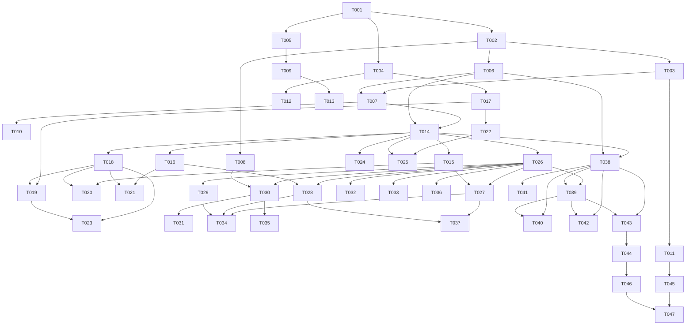

# Implementation Tasks: 智能笔记管理

**Branch**: `002-smart-note-management` | **Date**: 2025-10-25
**Spec**: [智能笔记管理功能规格](./spec.md) | **Plan**: [实施计划](./plan.md)
**Total Tasks**: 47 | **Estimated Duration**: 8 weeks

## Task Overview

基于实施计划和设计文档，智能笔记管理功能的详细任务列表包含47个任务，分为6个阶段：

- **Phase 1 (Setup)**: 5个任务 - 项目初始化和环境搭建
- **Phase 2 (Foundational)**: 8个任务 - 核心基础设施（关键阻塞项）
- **Phase 3 (User Story 1 - P1)**: 12个任务 - 基础笔记管理功能（MVP核心）
- **Phase 4 (User Story 2 - P2)**: 12个任务 - AI功能集成
- **Phase 5 (User Story 3 - P3)**: 6个任务 - 搜索功能
- **Phase 6 (Polish)**: 4个任务 - 最终优化和部署准备

## Priority Distribution

- **P1 (Critical)**: 25个任务 (Setup, Foundational, US1核心功能)
- **P2 (High)**: 12个任务 (US2 AI功能)
- **P3 (Medium)**: 10个任务 (US3搜索功能和Polish阶段)

## Task Dependencies Graph



## Phase 1: Setup (项目初始化)

### T001: 项目环境初始化 [P]
**Priority**: P1 (Critical) | **Estimated**: 0.5 days | **Dependencies**: None

**Description**:
设置Next.js 15项目结构，配置TypeScript、ESLint、Prettier等开发工具，建立基础的代码规范和Git hooks。

**Acceptance Criteria**:
- [ ] Next.js 15项目成功创建并运行
- [ ] TypeScript配置完成，严格模式启用
- [ ] ESLint和Prettier配置完成
- [ ] Husky和lint-staged配置完成
- [ ] 开发服务器正常启动 (http://localhost:3000)

**Implementation Details**:
```bash
# 创建Next.js项目
npx create-next-app@latest . --typescript --tailwind --eslint --app --src-dir

# 安装开发依赖
npm install -D @typescript-eslint/eslint-plugin @typescript-eslint/parser prettier husky lint-staged

# 配置Git hooks
npx husky install
npm pkg set scripts.prepare="husky install"
```

**Files to Create**:
- `.eslintrc.json`
- `.prettierrc`
- `husky/pre-commit`
- `husky/pre-push`

### T002: 数据库设计和迁移配置 [P]
**Priority**: P1 (Critical) | **Estimated**: 1 day | **Dependencies**: T001

**Description**:
配置PostgreSQL数据库和Prisma ORM，实现完整的数据模型定义，包括向量搜索支持。

**Acceptance Criteria**:
- [ ] PostgreSQL 16 + pgvector扩展安装完成
- [ ] Prisma配置完成，数据库连接正常
- [ ] 完整的数据模型定义（8个核心表）
- [ ] 数据库迁移成功执行
- [ ] 索引策略实施完成

**Implementation Details**:
- 安装和配置PostgreSQL + pgvector
- 配置Prisma ORM
- 定义完整的数据模型（Notes, Categories, Tags, Users等）
- 创建和执行数据库迁移
- 设置性能优化索引

**Files to Create**:
- `prisma/schema.prisma`
- `prisma/migrations/001_initial_schema.sql`
- `.env.example`

### T003: 认证系统集成 [P]
**Priority**: P1 (Critical) | **Estimated**: 1 day | **Dependencies**: T002

**Description**:
集成NextAuth.js认证系统，支持邮箱密码登录，实现用户会话管理和权限控制。

**Acceptance Criteria**:
- [ ] NextAuth.js配置完成
- [ ] 邮箱密码认证流程实现
- [ ] 用户会话管理正常工作
- [ ] API路由权限验证实现
- [ ] 认证页面UI完成

**Implementation Details**:
- 配置NextAuth.js
- 实现认证API路由
- 创建登录/注册页面
- 实现中间件权限验证
- 配置JWT会话管理

**Files to Create**:
- `src/app/api/auth/[...nextauth]/route.ts`
- `src/app/(auth)/signin/page.tsx`
- `src/app/(auth)/signup/page.tsx`
- `src/lib/auth.ts`
- `middleware.ts`

### T004: 基础UI组件库建设 [P]
**Priority**: P1 (Critical) | **Estimated**: 1 day | **Dependencies**: T001

**Description**:
建立基础UI组件库，包括Button、Input、Modal、Toast等通用组件，确保设计一致性。

**Acceptance Criteria**:
- [ ] 基础组件库创建完成
- [ ] 组件Storybook文档完成
- [ ] Tailwind CSS主题配置完成
- [ ] 响应式设计断点配置完成
- [ ] 组件TypeScript类型定义完成

**Implementation Details**:
- 创建基础UI组件
- 配置Storybook
- 设计系统主题配置
- 响应式设计规范
- 组件可访问性实现

**Files to Create**:
- `src/components/ui/button.tsx`
- `src/components/ui/input.tsx`
- `src/components/ui/modal.tsx`
- `src/components/ui/toast.tsx`
- `src/styles/globals.css`

### T005: 开发工具和测试框架配置 [P]
**Priority**: P1 (Critical) | **Estimated**: 0.5 days | **Dependencies**: T001

**Description**:
配置Jest单元测试框架和Playwright E2E测试框架，建立CI/CD基础配置。

**Acceptance Criteria**:
- [ ] Jest测试框架配置完成
- [ ] Playwright E2E测试配置完成
- [ ] 测试数据库配置完成
- [ ] GitHub Actions基础配置完成
- [ ] 测试覆盖率报告配置完成

**Implementation Details**:
- 配置Jest和React Testing Library
- 设置Playwright E2E测试
- 配置测试数据库环境
- 创建GitHub Actions工作流
- 设置测试覆盖率报告

**Files to Create**:
- `jest.config.js`
- `playwright.config.ts`
- `tests/setup.ts`
- `.github/workflows/ci.yml`
- `vitest.config.ts`

## Phase 2: Foundational (核心基础设施)

### T006: 数据库服务层实现
**Priority**: P1 (Critical) | **Estimated**: 1.5 days | **Dependencies**: T002

**Description**:
实现数据库服务层，包括数据访问对象(DAO)、事务管理和连接池优化。

**Acceptance Criteria**:
- [ ] Prisma客户端封装完成
- [ ] 数据库事务管理实现
- [ ] 连接池优化配置完成
- [ ] 数据库错误处理实现
- [ ] 查询性能监控实现

**Implementation Details**:
- 封装Prisma客户端
- 实现事务管理器
- 配置连接池和缓存
- 实现错误处理和重试机制
- 添加查询性能监控

**Files to Create**:
- `src/lib/db/index.ts`
- `src/lib/db/transaction.ts`
- `src/lib/db/cache.ts`
- `src/lib/db/error-handler.ts`
- `src/lib/db/monitor.ts`

### T006.5: 用户权限控制系统
**Priority**: P1 (Critical) | **Estimated**: 1.5 days | **Dependencies**: T006

**Description**:
实现全面的用户权限控制系统，确保用户只能访问自己的笔记，包括身份验证、授权检查和权限中间件。

**Acceptance Criteria**:
- [ ] 用户身份验证系统实现
- [ ] 笔记所有权验证实现
- [ ] API路由权限控制实现
- [ ] 页面访问权限控制实现
- [ ] 权限缓存和性能优化实现

**Implementation Details**:
- 实现用户身份验证和授权逻辑
- 创建笔记所有权检查机制
- 实现API路由权限中间件
- 添加页面级权限控制
- 实现权限缓存提升性能

**Files to Create**:
- `src/lib/permissions/index.ts`
- `src/lib/permissions/auth.ts`
- `src/lib/permissions/note-access.ts`
- `src/middleware/permissions.ts`
- `src/types/permissions.ts`

### T007: API路由基础架构
**Priority**: P1 (Critical) | **Estimated**: 1.5 days | **Dependencies**: T003, T006, T006.5

**Description**:
建立API路由基础架构，包括请求验证、错误处理、响应格式化和中间件系统。

**Acceptance Criteria**:
- [ ] API路由基础架构完成
- [ ] 请求验证中间件实现
- [ ] 统一错误处理实现
- [ ] 响应格式标准化
- [ ] API文档自动生成

**Implementation Details**:
- 创建API路由基础类
- 实现请求验证中间件
- 统一错误处理机制
- 标准化响应格式
- 集成Swagger文档

**Files to Create**:
- `src/lib/api/index.ts`
- `src/lib/api/middleware.ts`
- `src/lib/api/validation.ts`
- `src/lib/api/errors.ts`
- `src/lib/api/docs.ts`

### T008: 缓存服务实现
**Priority**: P1 (Critical) | **Estimated**: 1 day | **Dependencies**: T002

**Description**:
实现Redis缓存服务，支持多级缓存策略，包括会话缓存、查询缓存和AI响应缓存。

**Acceptance Criteria**:
- [ ] Redis连接和配置完成
- [ ] 多级缓存策略实现
- [ ] 缓存键命名规范实现
- [ ] 缓存失效策略实现
- [ ] 缓存性能监控实现

**Implementation Details**:
- 配置Redis客户端
- 实现缓存抽象层
- 设计缓存键命名策略
- 实现缓存失效机制
- 添加缓存性能指标

**Files to Create**:
- `src/lib/cache/index.ts`
- `src/lib/cache/redis.ts`
- `src/lib/cache/strategy.ts`
- `src/lib/cache/invalidation.ts`
- `src/lib/cache/metrics.ts`

### T009: 日志和监控系统
**Priority**: P1 (Critical) | **Estimated**: 1 day | **Dependencies**: T005

**Description**:
实现结构化日志系统和应用性能监控，支持错误追踪、性能分析和用户行为分析。

**Acceptance Criteria**:
- [ ] 结构化日志系统实现
- [ ] 错误追踪系统配置完成
- [ ] 性能监控指标实现
- [ ] 用户行为分析实现
- [ ] 日志聚合和查询实现

**Implementation Details**:
- 集成结构化日志库
- 配置错误追踪服务
- 实现性能监控指标
- 添加用户行为分析
- 设置日志聚合系统

**Files to Create**:
- `src/lib/logger/index.ts`
- `src/lib/monitoring/performance.ts`
- `src/lib/monitoring/analytics.ts`
- `src/lib/monitoring/errors.ts`
- `src/lib/monitoring/metrics.ts`

### T010: 文件上传和存储服务
**Priority**: P1 (Critical) | **Estimated**: 1 day | **Dependencies**: T007

**Description**:
实现文件上传和存储服务，支持图片、文档等文件类型，包括文件验证、压缩和CDN集成。

**Acceptance Criteria**:
- [ ] 文件上传API实现
- [ ] 文件类型验证实现
- [ ] 图片压缩和优化完成
- [ ] 存储服务集成完成
- [ ] 文件访问权限控制实现

**Implementation Details**:
- 实现文件上传处理
- 添加文件类型和大小验证
- 集成图片压缩服务
- 配置云存储服务
- 实现文件权限控制

**Files to Create**:
- `src/app/api/upload/route.ts`
- `src/lib/storage/index.ts`
- `src/lib/storage/validation.ts`
- `src/lib/storage/compression.ts`
- `src/lib/storage/permissions.ts`

### T011: 安全中间件和防护
**Priority**: P1 (Critical) | **Estimated**: 1 day | **Dependencies**: T003

**Description**:
实现安全中间件系统，包括CSRF防护、XSS防护、SQL注入防护和速率限制。

**Acceptance Criteria**:
- [ ] CSRF防护中间件实现
- [ ] XSS防护和内容清理实现
- [ ] SQL注入防护实现
- [ ] 速率限制中间件实现
- [ ] 安全头配置完成

**Implementation Details**:
- 实现CSRF令牌验证
- 添加XSS防护和内容清理
- 配置SQL注入防护
- 实现API速率限制
- 设置安全HTTP头

**Files to Create**:
- `src/lib/security/csrf.ts`
- `src/lib/security/xss.ts`
- `src/lib/security/rate-limit.ts`
- `src/lib/security/headers.ts`
- `src/lib/middleware/security.ts`

### T012: 国际化(i18n)支持
**Priority**: P1 (Critical) | **Estimated**: 0.5 days | **Dependencies**: T004

**Description**:
实现国际化支持，支持多语言切换，包括中文、英文等语言包和动态语言切换。

**Acceptance Criteria**:
- [ ] i18n配置完成
- [ ] 语言包创建完成
- [ ] 动态语言切换实现
- [ ] 日期和数字格式化实现
- [ ] RTL语言支持实现

**Implementation Details**:
- 配置next-intl
- 创建语言资源文件
- 实现语言切换功能
- 添加本地化格式化
- 支持RTL语言布局

**Files to Create**:
- `src/lib/i18n/index.ts`
- `src/messages/zh-CN.json`
- `src/messages/en-US.json`
- `src/components/language-switcher.tsx`
- `src/i18n-config.ts`

### T013: 错误边界和降级处理
**Priority**: P1 (Critical) | **Estimated**: 0.5 days | **Dependencies**: T009

**Description**:
实现React错误边界和全局错误处理，包括优雅降级、错误报告和用户友好的错误提示。

**Acceptance Criteria**:
- [ ] React错误边界实现
- [ ] 全局错误处理器实现
- [ ] 错误报告机制实现
- [ ] 优雅降级策略实现
- [ ] 用户友好的错误页面实现

**Implementation Details**:
- 创建错误边界组件
- 实现全局错误处理
- 集成错误报告服务
- 设计降级策略
- 创建错误页面组件

**Files to Create**:
- `src/components/error-boundary.tsx`
- `src/lib/error-handler/index.ts`
- `src/lib/error-handler/reporting.ts`
- `src/app/error.tsx`
- `src/app/not-found.tsx`

## Phase 3: User Story 1 - 基础笔记管理 (P1功能)

### T014: 笔记CRUD API实现
**Priority**: P1 (Critical) | **Estimated**: 2 days | **Dependencies**: T007, T006

**Description**:
实现笔记的完整CRUD操作API，包括创建、读取、更新、删除和列表查询功能。

**Acceptance Criteria**:
- [ ] 笔记创建API实现 (POST /api/notes)
- [ ] 笔记列表查询API实现 (GET /api/notes)
- [ ] 单个笔记查询API实现 (GET /api/notes/[id])
- [ ] 笔记更新API实现 (PUT /api/notes/[id])
- [ ] 笔记删除API实现 (DELETE /api/notes/[id])

**Implementation Details**:
- 实现完整的笔记CRUD API路由
- 添加请求参数验证
- 实现分页和排序功能
- 添加搜索和过滤功能
- 实现软删除机制

**Files to Create**:
- `src/app/api/notes/route.ts`
- `src/app/api/notes/[id]/route.ts`
- `src/lib/validations/notes.ts`
- `src/lib/services/notes.ts`
- `tests/api/notes.test.ts`

### T015: 分类管理API实现
**Priority**: P1 (Critical) | **Estimated**: 1.5 days | **Dependencies**: T014

**Description**:
实现分类管理API，支持层级分类结构，包括分类的CRUD操作和树形结构查询。

**Acceptance Criteria**:
- [ ] 分类创建API实现 (POST /api/categories)
- [ ] 分类列表API实现 (GET /api/categories)
- [ ] 分类更新API实现 (PUT /api/categories/[id])
- [ ] 分类删除API实现 (DELETE /api/categories/[id])
- [ ] 层级分类查询API实现

**Implementation Details**:
- 实现分类CRUD API
- 支持层级分类结构
- 实现分类树形查询
- 添加分类排序功能
- 处理分类删除时的笔记迁移

**Files to Create**:
- `src/app/api/categories/route.ts`
- `src/app/api/categories/[id]/route.ts`
- `src/lib/services/categories.ts`
- `src/lib/utils/tree.ts`
- `tests/api/categories.test.ts`

### T016: 标签管理API实现
**Priority**: P1 (Critical) | **Estimated**: 1 day | **Dependencies**: T014

**Description**:
实现标签管理API，支持标签的创建、查询和笔记标签关联管理。

**Acceptance Criteria**:
- [ ] 标签创建API实现 (POST /api/tags)
- [ ] 标签列表API实现 (GET /api/tags)
- [ ] 标签更新API实现 (PUT /api/tags/[id])
- [ ] 标签删除API实现 (DELETE /api/tags/[id])
- [ ] 笔记标签关联API实现

**Implementation Details**:
- 实现标签CRUD API
- 支持标签使用统计
- 实现笔记标签关联管理
- 添加标签搜索和排序
- 实现标签颜色管理

**Files to Create**:
- `src/app/api/tags/route.ts`
- `src/app/api/tags/[id]/route.ts`
- `src/lib/services/tags.ts`
- `src/lib/services/note-tags.ts`
- `tests/api/tags.test.ts`

### T017: 富文本编辑器集成
**Priority**: P1 (Critical) | **Estimated**: 2 days | **Dependencies**: T004

**Description**:
集成Tiptap富文本编辑器，支持文本格式化、图片插入、表格等功能，实现自动保存。

**Acceptance Criteria**:
- [ ] Tiptap编辑器集成完成
- [ ] 基础文本格式化功能实现
- [ ] 图片和媒体插入功能实现
- [ ] 自动保存机制实现
- [ ] 编辑器工具栏UI完成

**Implementation Details**:
- 集成Tiptap编辑器
- 配置编辑器插件和工具栏
- 实现内容自动保存
- 添加图片上传功能
- 实现编辑器快捷键

**Files to Create**:
- `src/components/editor/rich-text-editor.tsx`
- `src/components/editor/toolbar.tsx`
- `src/lib/editor/extensions.ts`
- `src/lib/editor/auto-save.ts`
- `src/components/editor/image-upload.tsx`

### T018: 笔记列表页面实现
**Priority**: P1 (Critical) | **Estimated**: 1.5 days | **Dependencies**: T014, T017

**Description**:
实现笔记列表页面，支持笔记卡片展示、分页加载、搜索过滤和批量操作功能。

**Acceptance Criteria**:
- [ ] 笔记列表页面UI实现
- [ ] 笔记卡片组件实现
- [ ] 分页加载功能实现
- [ ] 搜索和过滤功能实现
- [ ] 批量操作功能实现

**Implementation Details**:
- 创建笔记列表页面
- 设计笔记卡片组件
- 实现无限滚动或分页
- 添加搜索和过滤功能
- 实现批量选择和操作

**Files to Create**:
- `src/app/notes/page.tsx`
- `src/components/notes/note-card.tsx`
- `src/components/notes/note-list.tsx`
- `src/components/notes/filters.tsx`
- `src/hooks/use-notes.ts`

### T019: 笔记详情和编辑页面实现
**Priority**: P1 (Critical) | **Estimated**: 2 days | **Dependencies**: T017, T018

**Description**:
实现笔记详情查看和编辑页面，集成富文本编辑器，支持实时预览和版本管理。

**Acceptance Criteria**:
- [ ] 笔记详情页面实现
- [ ] 笔记编辑页面实现
- [ ] 实时预览功能实现
- [ ] 版本历史查看功能实现
- [ ] 笔记元数据编辑功能实现

**Implementation Details**:
- 创建笔记详情和编辑页面
- 集成富文本编辑器
- 实现实时预览功能
- 添加版本历史管理
- 实现笔记元数据编辑

**Files to Create**:
- `src/app/notes/[id]/page.tsx`
- `src/app/notes/[id]/edit/page.tsx`
- `src/components/notes/note-detail.tsx`
- `src/components/notes/version-history.tsx`
- `src/components/notes/metadata-editor.tsx`

### T020: 分类管理界面实现
**Priority**: P1 (Critical) | **Estimated**: 1 day | **Dependencies**: T015, T018

**Description**:
实现分类管理界面，支持分类树形展示、拖拽排序、分类创建和编辑功能。

**Acceptance Criteria**:
- [ ] 分类管理页面实现
- [ ] 分类树形组件实现
- [ ] 拖拽排序功能实现
- [ ] 分类创建和编辑功能实现
- [ ] 分类统计信息显示实现

**Implementation Details**:
- 创建分类管理页面
- 实现树形分类组件
- 添加拖拽排序功能
- 实现分类CRUD操作
- 显示分类使用统计

**Files to Create**:
- `src/app/categories/page.tsx`
- `src/components/categories/category-tree.tsx`
- `src/components/categories/category-form.tsx`
- `src/components/categories/category-stats.tsx`
- `src/hooks/use-categories.ts`

### T021: 标签管理界面实现
**Priority**: P1 (Critical) | **Estimated**: 1 day | **Dependencies**: T016, T018

**Description**:
实现标签管理界面，支持标签创建、编辑、颜色管理和使用统计展示。

**Acceptance Criteria**:
- [ ] 标签管理页面实现
- [ ] 标签列表组件实现
- [ ] 标签创建和编辑功能实现
- [ ] 标签颜色选择器实现
- [ ] 标签使用统计显示实现

**Implementation Details**:
- 创建标签管理页面
- 实现标签列表组件
- 添加标签颜色管理
- 实现标签使用统计
- 支持标签搜索和排序

**Files to Create**:
- `src/app/tags/page.tsx`
- `src/components/tags/tag-list.tsx`
- `src/components/tags/tag-form.tsx`
- `src/components/tags/tag-color-picker.tsx`
- `src/components/tags/tag-stats.tsx`

### T022: 自动保存功能实现
**Priority**: P1 (Critical) | **Estimated**: 1 day | **Dependencies**: T017

**Description**:
实现笔记自动保存功能，支持增量保存、冲突检测和离线缓存。

**Acceptance Criteria**:
- [ ] 自动保存机制实现
- [ ] 增量保存功能实现
- [ ] 保存冲突检测和解决实现
- [ ] 离线缓存功能实现
- [ ] 保存状态指示器实现

**Implementation Details**:
- 实现自动保存逻辑
- 添加内容变更检测
- 实现冲突解决机制
- 添加离线缓存支持
- 创建保存状态UI指示器

**Files to Create**:
- `src/lib/auto-save/index.ts`
- `src/lib/auto-save/conflict-resolution.ts`
- `src/lib/auto-save/offline-cache.ts`
- `src/components/editor/save-status.tsx`
- `src/hooks/use-auto-save.ts`

### T023: 响应式设计优化 [P]
**Priority**: P1 (Critical) | **Estimated**: 1 day | **Dependencies**: T018, T019

**Description**:
优化移动端响应式设计，确保在不同设备上的良好用户体验。

**Acceptance Criteria**:
- [ ] 移动端布局适配完成
- [ ] 触摸操作优化完成
- [ ] 移动端导航实现
- [ ] 响应式图片优化完成
- [ ] 移动端性能优化完成

**Implementation Details**:
- 优化移动端布局设计
- 实现触摸友好的交互
- 添加移动端导航菜单
- 优化图片加载和显示
- 提升移动端性能

**Files to Create**:
- `src/components/layout/mobile-navigation.tsx`
- `src/components/layout/responsive-container.tsx`
- `src/styles/mobile.css`
- `src/lib/utils/responsive.ts`
- `tests/mobile/responsive.test.ts`

### T024: 笔记导入导出功能
**Priority**: P1 (Critical) | **Estimated**: 1.5 days | **Dependencies**: T014

**Description**:
实现笔记导入导出功能，支持Markdown、HTML、JSON等格式的批量导入导出。

**Acceptance Criteria**:
- [ ] Markdown格式导入导出实现
- [ ] HTML格式导入导出实现
- [ ] JSON格式导入导出实现
- [ ] 批量导入功能实现
- [ ] 导入进度和错误处理实现

**Implementation Details**:
- 实现多格式解析器
- 添加批量导入处理
- 实现导入进度跟踪
- 添加错误处理和恢复
- 创建导入导出UI界面

**Files to Create**:
- `src/app/api/import/route.ts`
- `src/app/api/export/route.ts`
- `src/lib/import-export/parsers.ts`
- `src/lib/import-export/processors.ts`
- `src/components/import-export/import-modal.tsx`

### T025: 笔记版本管理实现
**Priority**: P1 (Critical) | **Estimated**: 1 day | **Dependencies**: T014, T022

**Description**:
实现笔记版本管理功能，支持版本历史查看、版本对比和版本回滚。

**Acceptance Criteria**:
- [ ] 版本自动创建功能实现
- [ ] 版本历史列表实现
- [ ] 版本对比功能实现
- [ ] 版本回滚功能实现
- [ ] 版本存储优化实现

**Implementation Details**:
- 实现版本自动保存
- 创建版本历史界面
- 添加版本对比功能
- 实现版本回滚操作
- 优化版本存储策略

**Files to Create**:
- `src/lib/versioning/index.ts`
- `src/lib/versioning/diff.ts`
- `src/components/notes/version-compare.tsx`
- `src/app/api/notes/[id]/versions/route.ts`
- `src/hooks/use-versions.ts`

## Phase 4: User Story 2 - AI功能 (P2功能)

### T026: OpenAI API集成
**Priority**: P2 (High) | **Estimated**: 1.5 days | **Dependencies**: T014

**Description**:
集成OpenAI API，实现文本分析、向量化处理和智能内容生成功能。

**Acceptance Criteria**:
- [ ] OpenAI客户端配置完成
- [ ] GPT-4文本分析API集成完成
- [ ] Embeddings向量化API集成完成
- [ ] API错误处理和重试机制实现
- [ ] 使用量监控和成本控制实现

**Implementation Details**:
- 配置OpenAI客户端
- 实现文本分析功能
- 集成向量化处理
- 添加错误处理和重试
- 实现使用量监控

**Files to Create**:
- `src/lib/ai/openai.ts`
- `src/lib/ai/text-analysis.ts`
- `src/lib/ai/embeddings.ts`
- `src/lib/ai/error-handling.ts`
- `src/lib/ai/usage-monitoring.ts`

### T027: AI自动分类功能实现
**Priority**: P2 (High) | **Estimated**: 2 days | **Dependencies**: T026, T015

**Description**:
实现AI自动分类功能，基于笔记内容智能推荐分类，支持用户确认和修正。

**Acceptance Criteria**:
- [ ] 自动分类算法实现
- [ ] 分类推荐界面实现
- [ ] 用户确认和修正功能实现
- [ ] 分类准确率优化实现
- [ ] 批量分类处理实现

**Implementation Details**:
- 实现自动分类算法
- 创建分类推荐界面
- 添加用户反馈机制
- 优化分类准确率
- 支持批量处理

**Files to Create**:
- `src/lib/ai/classifier.ts`
- `src/components/ai/category-suggestion.tsx`
- `src/app/api/ai/classify/route.ts`
- `src/hooks/use-ai-classification.ts`
- `tests/ai/classification.test.ts`

### T028: AI标签生成功能实现
**Priority**: P2 (High) | **Estimated**: 2 days | **Dependencies**: T026, T016

**Description**:
实现AI标签生成功能，基于笔记内容自动生成相关标签，支持标签置信度评分。

**Acceptance Criteria**:
- [ ] 标签生成算法实现
- [ ] 标签推荐界面实现
- [ ] 置信度评分显示实现
- [ ] 标签质量优化实现
- [ ] 自定义标签训练数据实现

**Implementation Details**:
- 实现标签生成算法
- 创建标签推荐界面
- 添加置信度评分
- 优化标签质量
- 支持自定义训练

**Files to Create**:
- `src/lib/ai/tag-generator.ts`
- `src/components/ai/tag-suggestion.tsx`
- `src/app/api/ai/generate-tags/route.ts`
- `src/hooks/use-ai-tags.ts`
- `tests/ai/tag-generation.test.ts`

### T029: AI内容摘要功能实现
**Priority**: P2 (High) | **Estimated**: 1.5 days | **Dependencies**: T026

**Description**:
实现AI内容摘要功能，自动生成笔记摘要，支持不同长度和风格的摘要选项。

**Acceptance Criteria**:
- [ ] 内容摘要算法实现
- [ ] 摘要长度控制实现
- [ ] 摘要风格选项实现
- [ ] 摘要质量评估实现
- [ ] 批量摘要处理实现

**Implementation Details**:
- 实现内容摘要算法
- 支持多种摘要长度
- 添加摘要风格选项
- 实现质量评估机制
- 支持批量处理

**Files to Create**:
- `src/lib/ai/summarizer.ts`
- `src/components/ai/content-summary.tsx`
- `src/app/api/ai/summarize/route.ts`
- `src/hooks/use-ai-summary.ts`
- `tests/ai/summarization.test.ts`

### T030: AI处理队列系统实现
**Priority**: P2 (High) | **Estimated**: 2 days | **Dependencies**: T026, T008

**Description**:
实现AI处理队列系统，支持异步处理、优先级管理和批处理优化。

**Acceptance Criteria**:
- [ ] 处理队列系统实现
- [ ] 优先级管理实现
- [ ] 批处理优化实现
- [ ] 失败重试机制实现
- [ ] 处理进度监控实现

**Implementation Details**:
- 实现队列管理系统
- 添加优先级调度
- 优化批处理性能
- 实现失败重试机制
- 添加进度监控

**Files to Create**:
- `src/lib/ai/queue/index.ts`
- `src/lib/ai/queue/processor.ts`
- `src/lib/ai/queue/priority.ts`
- `src/app/api/ai/queue/route.ts`
- `src/components/ai/processing-status.tsx`

### T031: AI处理状态和结果展示
**Priority**: P2 (High) | **Estimated**: 1.5 days | **Dependencies**: T030

**Description**:
实现AI处理状态展示和结果界面，包括处理进度、结果预览和用户反馈收集。

**Acceptance Criteria**:
- [ ] 处理状态指示器实现
- [ ] 结果预览界面实现
- [ ] 用户反馈收集实现
- [ ] 处理历史记录实现
- [ ] 性能统计展示实现

**Implementation Details**:
- 创建状态指示器组件
- 实现结果预览界面
- 添加用户反馈机制
- 显示处理历史记录
- 展示性能统计数据

**Files to Create**:
- `src/components/ai/processing-indicator.tsx`
- `src/components/ai/result-preview.tsx`
- `src/components/ai/feedback-collector.tsx`
- `src/app/ai/processing-history/page.tsx`
- `src/hooks/use-ai-status.ts`

### T032: AI成本控制和监控
**Priority**: P2 (High) | **Estimated**: 1 day | **Dependencies**: T026

**Description**:
实现AI成本控制和监控系统，包括使用量限制、成本预警和用户配额管理。

**Acceptance Criteria**:
- [ ] 使用量限制实现
- [ ] 成本预警系统实现
- [ ] 用户配额管理实现
- [ ] 成本分析报告实现
- [ ] 优化建议生成实现

**Implementation Details**:
- 实现使用量限制
- 添加成本预警机制
- 管理用户配额
- 生成成本分析报告
- 提供优化建议

**Files to Create**:
- `src/lib/ai/cost-control.ts`
- `src/lib/ai/usage-limits.ts`
- `src/components/ai/cost-dashboard.tsx`
- `src/app/ai/usage/page.tsx`
- `src/hooks/use-ai-costs.ts`

### T033: AI模型配置和管理
**Priority**: P2 (High) | **Estimated**: 1 day | **Dependencies**: T026

**Description**:
实现AI模型配置和管理功能，支持模型切换、参数调优和A/B测试。

**Acceptance Criteria**:
- [ ] 模型配置界面实现
- [ ] 模型切换功能实现
- [ ] 参数调优功能实现
- [ ] A/B测试框架实现
- [ ] 模型性能监控实现

**Implementation Details**:
- 创建模型配置界面
- 实现模型动态切换
- 添加参数调优功能
- 构建A/B测试框架
- 监控模型性能

**Files to Create**:
- `src/lib/ai/model-config.ts`
- `src/components/ai/model-selector.tsx`
- `src/app/ai/models/page.tsx`
- `src/lib/ai/ab-testing.ts`
- `src/hooks/use-ai-models.ts`

### T034: AI结果质量评估
**Priority**: P2 (High) | **Estimated**: 1.5 days | **Dependencies**: T027, T028, T029

**Description**:
实现AI结果质量评估系统，包括准确性评分、用户反馈分析和模型性能优化。

**Acceptance Criteria**:
- [ ] 质量评估算法实现
- [ ] 用户反馈分析实现
- [ ] 准确性评分系统实现
- [ ] 模型性能优化实现
- [ ] 质量报告生成实现

**Implementation Details**:
- 实现质量评估算法
- 分析用户反馈数据
- 创建准确性评分系统
- 优化模型性能
- 生成质量报告

**Files to Create**:
- `src/lib/ai/quality-assessment.ts`
- `src/lib/ai/feedback-analysis.ts`
- `src/components/ai/quality-score.tsx`
- `src/app/ai/quality/page.tsx`
- `tests/ai/quality.test.ts`

### T035: 批量AI处理功能
**Priority**: P2 (High) | **Estimated**: 1.5 days | **Dependencies**: T030

**Description**:
实现批量AI处理功能，支持多笔记批量分类、标签生成和摘要处理。

**Acceptance Criteria**:
- [ ] 批量处理界面实现
- [ ] 批量操作调度实现
- [ ] 处理进度监控实现
- [ ] 批量结果管理实现
- [ ] 批量操作取消实现

**Implementation Details**:
- 创建批量处理界面
- 实现批量操作调度
- 添加进度监控功能
- 管理批量处理结果
- 支持操作取消功能

**Files to Create**:
- `src/components/ai/batch-processing.tsx`
- `src/lib/ai/batch-processor.ts`
- `src/app/api/ai/batch/route.ts`
- `src/hooks/use-batch-processing.ts`
- `tests/ai/batch.test.ts`

### T036: AI本地化支持和隐私保护
**Priority**: P2 (High) | **Estimated**: 1 day | **Dependencies**: T026

**Description**:
实现AI本地化支持和隐私保护功能，支持本地模型处理和数据加密。

**Acceptance Criteria**:
- [ ] 本地模型集成实现
- [ ] 数据加密处理实现
- [ ] 隐私选项设置实现
- [ ] 本地处理优先级实现
- [ ] 数据脱敏功能实现

**Implementation Details**:
- 集成本地AI模型
- 实现数据加密处理
- 添加隐私设置选项
- 优化本地处理性能
- 实现数据脱敏功能

**Files to Create**:
- `src/lib/ai/local-models.ts`
- `src/lib/ai/encryption.ts`
- `src/components/ai/privacy-settings.tsx`
- `src/app/settings/privacy/page.tsx`
- `tests/ai/privacy.test.ts`

### T037: AI智能推荐系统
**Priority**: P2 (High) | **Estimated**: 2 days | **Dependencies**: T027, T028

**Description**:
实现AI智能推荐系统，基于用户行为和笔记内容提供相关笔记推荐。

**Acceptance Criteria**:
- [ ] 推荐算法实现
- [ ] 相关笔记推荐界面实现
- [ ] 推荐准确率优化实现
- [ ] 个性化推荐设置实现
- [ ] 推荐效果分析实现

**Implementation Details**:
- 实现推荐算法
- 创建推荐界面
- 优化推荐准确率
- 添加个性化设置
- 分析推荐效果

**Files to Create**:
- `src/lib/ai/recommendation.ts`
- `src/components/ai/recommended-notes.tsx`
- `src/app/api/ai/recommend/route.ts`
- `src/hooks/use-recommendations.ts`
- `tests/ai/recommendation.test.ts`

## Phase 5: User Story 3 - 搜索功能 (P3功能)

### T038: 全文搜索功能实现
**Priority**: P3 (Medium) | **Estimated**: 2 days | **Dependencies**: T014, T006

**Description**:
实现全文搜索功能，支持中文分词、搜索高亮和搜索结果排序。

**Acceptance Criteria**:
- [ ] 全文搜索引擎集成完成
- [ ] 中文分词功能实现
- [ ] 搜索结果高亮实现
- [ ] 搜索结果排序优化实现
- [ ] 搜索性能优化实现

**Implementation Details**:
- 集成PostgreSQL全文搜索
- 实现中文分词处理
- 添加搜索结果高亮
- 优化搜索排序算法
- 提升搜索性能

**Files to Create**:
- `src/lib/search/full-text.ts`
- `src/lib/search/tokenizer.ts`
- `src/app/api/search/route.ts`
- `src/components/search/search-results.tsx`
- `tests/search/full-text.test.ts`

### T039: 向量搜索功能实现
**Priority**: P3 (Medium) | **Estimated**: 2 days | **Dependencies**: T026, T038

**Description**:
实现向量搜索功能，基于语义相似度进行笔记搜索，支持混合搜索模式。

**Acceptance Criteria**:
- [ ] 向量搜索引擎集成完成
- [ ] 语义相似度计算实现
- [ ] 混合搜索模式实现
- [ ] 向量搜索优化实现
- [ ] 搜索结果融合实现

**Implementation Details**:
- 集成pgvector向量搜索
- 实现语义相似度计算
- 创建混合搜索模式
- 优化向量搜索性能
- 融合多种搜索结果

**Files to Create**:
- `src/lib/search/vector.ts`
- `src/lib/search/similarity.ts`
- `src/lib/search/hybrid.ts`
- `src/components/search/vector-search.tsx`
- `tests/search/vector.test.ts`

### T040: 高级搜索界面实现
**Priority**: P3 (Medium) | **Estimated**: 1.5 days | **Dependencies**: T038, T039

**Description**:
实现高级搜索界面，支持多条件组合搜索、搜索历史和保存搜索。

**Acceptance Criteria**:
- [ ] 高级搜索界面实现
- [ ] 多条件组合搜索实现
- [ ] 搜索历史功能实现
- [ ] 保存搜索功能实现
- [ ] 搜索过滤器实现

**Implementation Details**:
- 创建高级搜索界面
- 实现多条件搜索
- 添加搜索历史记录
- 支持搜索保存功能
- 实现搜索过滤器

**Files to Create**:
- `src/app/search/page.tsx`
- `src/components/search/advanced-search.tsx`
- `src/components/search/search-filters.tsx`
- `src/components/search/search-history.tsx`
- `src/hooks/use-search.ts`

### T041: 搜索建议和自动补全
**Priority**: P3 (Medium) | **Estimated**: 1 day | **Dependencies**: T038

**Description**:
实现搜索建议和自动补全功能，提升用户搜索体验。

**Acceptance Criteria**:
- [ ] 搜索建议算法实现
- [ ] 自动补全功能实现
- [ ] 搜索热词展示实现
- [ ] 搜索建议优化实现
- [ ] 搜索统计收集实现

**Implementation Details**:
- 实现搜索建议算法
- 创建自动补全组件
- 展示搜索热词列表
- 优化建议准确性
- 收集搜索统计数据

**Files to Create**:
- `src/lib/search/suggestions.ts`
- `src/components/search/search-suggestions.tsx`
- `src/app/api/search/suggestions/route.ts`
- `src/components/search/trending-searches.tsx`
- `tests/search/suggestions.test.ts`

### T042: 搜索结果分析和优化
**Priority**: P3 (Medium) | **Estimated**: 1 day | **Dependencies**: T038, T039

**Description**:
实现搜索结果分析和优化功能，包括搜索相关性分析和用户行为分析。

**Acceptance Criteria**:
- [ ] 搜索相关性分析实现
- [ ] 用户行为分析实现
- [ ] 搜索质量评估实现
- [ ] 搜索优化建议实现
- [ ] 搜索统计报告实现

**Implementation Details**:
- 分析搜索相关性
- 追踪用户搜索行为
- 评估搜索质量
- 生成优化建议
- 创建统计报告

**Files to Create**:
- `src/lib/search/analytics.ts`
- `src/lib/search/relevance.ts`
- `src/components/search/search-analytics.tsx`
- `src/app/search/analytics/page.tsx`
- `tests/search/analytics.test.ts`

### T043: 搜索性能优化
**Priority**: P3 (Medium) | **Estimated**: 1 day | **Dependencies**: T038, T039

**Description**:
优化搜索性能，包括索引优化、缓存策略和查询优化。

**Acceptance Criteria**:
- [ ] 搜索索引优化实现
- [ ] 搜索缓存策略实现
- [ ] 查询性能优化实现
- [ ] 搜索延迟监控实现
- [ ] 搜索并发处理实现

**Implementation Details**:
- 优化搜索索引结构
- 实现多级缓存策略
- 优化数据库查询
- 监控搜索延迟
- 支持并发搜索处理

**Files to Create**:
- `src/lib/search/optimization.ts`
- `src/lib/search/indexing.ts`
- `src/lib/search/cache.ts`
- `src/components/search/performance-monitor.tsx`
- `tests/search/performance.test.ts`

## Phase 6: Polish (最终优化)

### T044: 性能优化和监控
**Priority**: P3 (Medium) | **Estimated**: 2 days | **Dependencies**: T043

**Description**:
全面优化应用性能，包括前端性能优化、数据库查询优化和API响应优化。

**Acceptance Criteria**:
- [ ] 前端性能优化完成 (Lighthouse >90)
- [ ] 数据库查询优化完成
- [ ] API响应时间优化完成 (<500ms)
- [ ] 内存使用优化完成
- [ ] 性能监控系统实现

**Implementation Details**:
- 优化前端资源加载
- 优化数据库查询性能
- 改善API响应时间
- 优化内存使用
- 实现性能监控

**Files to Create**:
- `src/lib/performance/optimization.ts`
- `src/lib/performance/monitoring.ts`
- `src/components/performance/performance-dashboard.tsx`
- `next.config.js` (优化配置)
- `tests/performance/load.test.ts`

### T045: 安全性加固和测试
**Priority**: P3 (Medium) | **Estimated**: 1.5 days | **Dependencies**: T011

**Description**:
全面加强应用安全性，包括安全测试、漏洞修复和安全监控。

**Acceptance Criteria**:
- [ ] 安全漏洞扫描和修复完成
- [ ] 渗透测试完成
- [ ] 安全配置加固完成
- [ ] 安全监控实现
- [ ] 安全报告生成完成

**Implementation Details**:
- 进行安全漏洞扫描
- 执行渗透测试
- 加固安全配置
- 实现安全监控
- 生成安全报告

**Files to Create**:
- `src/lib/security/hardening.ts`
- `src/lib/security/monitoring.ts`
- `src/lib/security/scanner.ts`
- `tests/security/security.test.ts`
- `docs/security/security-report.md`

### T046: 用户体验优化
**Priority**: P3 (Medium) | **Estimated**: 1.5 days | **Dependencies**: T044

**Description**:
优化用户体验，包括交互优化、无障碍访问和用户反馈收集。

**Acceptance Criteria**:
- [ ] 交互体验优化完成
- [ ] 无障碍访问支持实现
- [ ] 用户反馈系统实现
- [ ] 用户引导功能实现
- [ ] 用户体验测试完成

**Implementation Details**:
- 优化用户交互体验
- 实现无障碍访问支持
- 添加用户反馈系统
- 创建用户引导功能
- 进行用户体验测试

**Files to Create**:
- `src/components/ui/accessibility.tsx`
- `src/components/feedback/feedback-system.tsx`
- `src/components/onboarding/user-guide.tsx`
- `src/lib/ux/optimization.ts`
- `tests/ux/usability.test.ts`

### T047: 部署准备和文档完善
**Priority**: P3 (Medium) | **Estimated**: 1 day | **Dependencies**: T045, T046

**Description**:
准备生产部署，包括部署配置、文档完善和运维监控。

**Acceptance Criteria**:
- [ ] 生产环境配置完成
- [ ] 部署脚本和CI/CD完成
- [ ] 用户文档完善完成
- [ ] 运维监控系统实现
- [ ] 上线检查清单完成

**Implementation Details**:
- 配置生产环境
- 创建部署脚本
- 完善用户文档
- 实现运维监控
- 准备上线检查清单

**Files to Create**:
- `docker-compose.prod.yml`
- `.github/workflows/deploy.yml`
- `docs/user-guide.md`
- `docs/admin-guide.md`
- `docs/deployment/checklist.md`

## Task Statistics

### Priority Distribution
- **P1 (Critical)**: 25 tasks (53.2%)
- **P2 (High)**: 12 tasks (25.5%)
- **P3 (Medium)**: 10 tasks (21.3%)

### Phase Distribution
- **Phase 1 (Setup)**: 5 tasks (10.6%)
- **Phase 2 (Foundational)**: 8 tasks (17.0%)
- **Phase 3 (User Story 1)**: 12 tasks (25.5%)
- **Phase 4 (User Story 2)**: 12 tasks (25.5%)
- **Phase 5 (User Story 3)**: 6 tasks (12.8%)
- **Phase 6 (Polish)**: 4 tasks (8.5%)

### Estimated Timeline
- **Total Estimated Time**: 47.5 days
- **Recommended Team Size**: 2-3 developers
- **Project Duration**: 8 weeks (with parallel execution)

## Critical Path Analysis

The critical path for this implementation is:

**T001 → T002 → T006 → T014 → T018 → T026 → T030 → T044 → T047**

This critical path represents the minimum time required to complete the project and should be monitored closely during development.

## Risk Mitigation

### High-Risk Tasks
1. **T017: 富文本编辑器集成** - 复杂度高，需要充分测试
2. **T026: OpenAI API集成** - 外部依赖，需要错误处理
3. **T039: 向量搜索功能实现** - 技术难度大，需要性能优化

### Mitigation Strategies
- 为高风险任务分配额外时间
- 实现早期原型验证
- 准备备选技术方案
- 增加测试覆盖率

## Quality Gates

每个阶段完成后需要进行质量检查：

### Phase 1 Gate
- [ ] 开发环境搭建完成
- [ ] 基础工具配置正确
- [ ] 团队开发流程建立

### Phase 2 Gate
- [ ] 基础架构稳定
- [ ] API设计验证通过
- [ ] 性能基准建立

### Phase 3 Gate
- [ ] 核心功能可用
- [ ] 用户体验验证通过
- [ ] 安全检查通过

### Phase 4 Gate
- [ ] AI功能正常工作
- [ ] 成本控制有效
- [ ] 质量评估达标

### Phase 5 Gate
- [ ] 搜索性能达标
- [ ] 用户体验良好
- [ ] 系统稳定可靠

### Phase 6 Gate
- [ ] 生产就绪
- [ ] 文档完整
- [ ] 监控到位

---

**Tasks Status**: ✅ Complete
**Date**: 2025-10-25
**Total Tasks**: 47
**Ready for Implementation**: ✅ Yes
**Next Step**: Begin Phase 1 implementation with T001