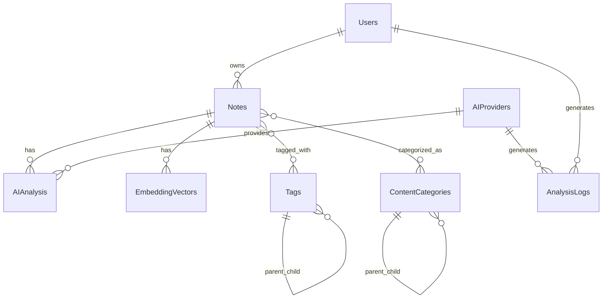

# Data Model: AI内容分析集成

**Branch**: 004-ai | **Date**: 2025-10-25 | **Spec**: [link](./spec.md)

## 核心实体设计

### 1. AIAnalysis (AI分析结果)

```typescript
interface AIAnalysis {
  id: string
  noteId: string
  userId: string

  // 分析结果
  summary: string              // AI生成摘要 (≤100字)
  sentiment: SentimentType     // 情感分析结果
  keyConcepts: string[]        // 关键概念列表
  categories: string[]         // 内容分类
  tags: TagSuggestion[]        // AI推荐的标签

  // 技术信息
  aiProvider: AIProvider       // 使用的AI模型
  modelVersion: string         // 模型版本
  confidence: number           // 分析置信度 (0-1)
  processingTime: number       // 处理时间(ms)
  tokenCount: number          // 消耗的token数

  // 元数据
  status: AnalysisStatus       // 分析状态
  error?: string              // 错误信息
  createdAt: Date
  updatedAt: Date
}

enum SentimentType {
  POSITIVE = 'positive',
  NEGATIVE = 'negative',
  NEUTRAL = 'neutral'
}

enum AnalysisStatus {
  PENDING = 'pending',
  PROCESSING = 'processing',
  COMPLETED = 'completed',
  FAILED = 'failed'
}
```

### 2. EmbeddingVector (向量嵌入)

```typescript
interface EmbeddingVector {
  id: string
  noteId: string
  userId: string

  // 向量数据
  embedding: number[]          // 向量嵌入 (1536维 for OpenAI)
  model: string               // 使用的嵌入模型
  dimensions: number          // 向量维度

  // 技术信息
  checksum: string            // 内容校验和，用于检测变化
  version: number             // 向量版本号

  // 元数据
  createdAt: Date
  updatedAt: Date
}
```

### 3. ContentCategory (内容分类)

```typescript
interface ContentCategory {
  id: string
  name: string                // 分类名称
  description: string         // 分类描述
  color: string               // 颜色标识 (#RRGGBB)
  icon: string                // 图标名称

  // 分类层级
  parentId?: string           // 父分类ID
  level: number               // 层级深度
  sortOrder: number           // 排序权重

  // 统计信息
  noteCount: number           // 关联笔记数量

  // 元数据
  isActive: boolean           // 是否启用
  createdAt: Date
  updatedAt: Date
}
```

### 4. Tag (标签系统)

```typescript
interface Tag {
  id: string
  name: string                // 标签名称
  color: string               // 标签颜色
  category?: string           // 标签分类

  // 层级关系
  parentId?: string           // 父标签ID
  children?: Tag[]           // 子标签列表

  // 统计信息
  usageCount: number          // 使用次数
  aiGenerated: boolean        // 是否AI生成
  confidence: number          // AI推荐置信度

  // 元数据
  createdAt: Date
  updatedAt: Date
}

interface TagSuggestion {
  tagId: string
  tagName: string
  confidence: number
  reason: string              // 推荐理由
}
```

### 5. AnalysisLog (分析日志)

```typescript
interface AnalysisLog {
  id: string
  noteId: string
  userId: string
  aiProvider: string
  modelVersion: string

  // 请求信息
  requestType: AnalysisType   // 分析类型
  inputTokens: number        // 输入token数
  outputTokens: number       // 输出token数
  totalTokens: number        // 总token数

  // 成本信息
  cost: number               // 成本(美元)
  currency: string            // 货币单位

  // 性能信息
  responseTime: number       // 响应时间(ms)
  processingTime: number     // 处理时间(ms)

  // 质量信息
  success: boolean           // 是否成功
  errorCode?: string         // 错误代码
  errorMessage?: string      // 错误信息
  quality?: QualityMetrics   // 质量指标

  // 元数据
  createdAt: Date
}

enum AnalysisType {
  SUMMARY = 'summary',
  CLASSIFICATION = 'classification',
  TAG_EXTRACTION = 'tag_extraction',
  SENTIMENT = 'sentiment',
  FULL_ANALYSIS = 'full_analysis'
}

interface QualityMetrics {
  accuracy: number          // 准确率
  relevance: number         // 相关性
  completeness: number      // 完整性
  userRating?: number       // 用户评分(1-5)
}
```

### 6. AIProvider (AI服务提供商配置)

```typescript
interface AIProvider {
  id: string
  name: string               // 提供商名称 (OpenAI, Claude等)
  apiKey: string            // API密钥 (加密存储)
  endpoint?: string         // 自定义端点

  // 模型配置
  models: AIModel[]         // 支持的模型列表
  defaultModel: string      // 默认模型

  // 限制配置
  rateLimit: number         // 速率限制 (req/min)
  costLimit: number         // 成本限制 ($/hour)
  maxTokens: number         // 最大token数

  // 配置选项
  priority: number          // 优先级权重
  isActive: boolean         // 是否启用
  fallbackEnabled: boolean  // 是否启用fallback

  // 统计信息
  totalRequests: number     // 总请求数
  totalCost: number         // 总成本
  successRate: number       // 成功率

  // 元数据
  createdAt: Date
  updatedAt: Date
}

interface AIModel {
  id: string
  name: string               // 模型名称
  version: string           // 模型版本

  // 能力配置
  supportedTasks: AnalysisType[]  // 支持的分析类型
  maxTokens: number         // 最大token数
  costPerToken: number      // 每token成本

  // 性能配置
  avgResponseTime: number   // 平均响应时间
  accuracy: number          // 准确率

  // 限制配置
  rateLimit: number         // 速率限制
  isEnabled: boolean        // 是否启用
}
```

## 数据库Schema

### 主要表结构

```sql
-- AI分析结果表
CREATE TABLE ai_analysis (
    id UUID PRIMARY KEY DEFAULT gen_random_uuid(),
    note_id UUID NOT NULL REFERENCES notes(id) ON DELETE CASCADE,
    user_id UUID NOT NULL REFERENCES users(id) ON DELETE CASCADE,

    -- 分析结果
    summary TEXT,
    sentiment VARCHAR(20) CHECK (sentiment IN ('positive', 'negative', 'neutral')),
    key_concepts TEXT[], -- JSON数组
    categories TEXT[],    -- JSON数组
    tags JSONB,           -- AI推荐标签

    -- 技术信息
    ai_provider_id UUID NOT NULL REFERENCES ai_providers(id),
    model_version VARCHAR(100),
    confidence DECIMAL(3,2) CHECK (confidence >= 0 AND confidence <= 1),
    processing_time INTEGER, -- ms
    token_count INTEGER,

    -- 状态
    status VARCHAR(20) DEFAULT 'pending' CHECK (status IN ('pending', 'processing', 'completed', 'failed')),
    error TEXT,

    -- 时间戳
    created_at TIMESTAMP DEFAULT NOW(),
    updated_at TIMESTAMP DEFAULT NOW()
);

-- 向量嵌入表
CREATE TABLE embedding_vectors (
    id UUID PRIMARY KEY DEFAULT gen_random_uuid(),
    note_id UUID NOT NULL REFERENCES notes(id) ON DELETE CASCADE,
    user_id UUID NOT NULL REFERENCES users(id) ON DELETE CASCADE,

    -- 向量数据
    embedding vector(1536), -- pgvector向量类型
    model VARCHAR(100),
    dimensions INTEGER DEFAULT 1536,

    -- 技术信息
    checksum VARCHAR(64),    -- 内容SHA256
    version INTEGER DEFAULT 1,

    -- 时间戳
    created_at TIMESTAMP DEFAULT NOW(),
    updated_at TIMESTAMP DEFAULT NOW()
);

-- 创建向量索引用于相似度搜索
CREATE INDEX idx_embedding_vectors_embedding ON embedding_vectors
USING ivfflat (embedding vector_cosine_ops);

-- 内容分类表
CREATE TABLE content_categories (
    id UUID PRIMARY KEY DEFAULT gen_random_uuid(),
    name VARCHAR(100) NOT NULL UNIQUE,
    description TEXT,
    color VARCHAR(7) DEFAULT '#6B7280', -- hex color
    icon VARCHAR(50),

    -- 层级关系
    parent_id UUID REFERENCES content_categories(id),
    level INTEGER DEFAULT 1,
    sort_order INTEGER DEFAULT 0,

    -- 统计
    note_count INTEGER DEFAULT 0,

    -- 状态
    is_active BOOLEAN DEFAULT TRUE,

    -- 时间戳
    created_at TIMESTAMP DEFAULT NOW(),
    updated_at TIMESTAMP DEFAULT NOW()
);

-- 标签表
CREATE TABLE tags (
    id UUID PRIMARY KEY DEFAULT gen_random_uuid(),
    name VARCHAR(100) NOT NULL UNIQUE,
    color VARCHAR(7) DEFAULT '#6B7280',
    category VARCHAR(50),

    -- 层级关系
    parent_id UUID REFERENCES tags(id),

    -- 统计
    usage_count INTEGER DEFAULT 0,
    ai_generated BOOLEAN DEFAULT FALSE,
    confidence DECIMAL(3,2),

    -- 时间戳
    created_at TIMESTAMP DEFAULT NOW(),
    updated_at TIMESTAMP DEFAULT NOW()
);

-- 分析日志表
CREATE TABLE analysis_logs (
    id UUID PRIMARY KEY DEFAULT gen_random_uuid(),
    note_id UUID NOT NULL REFERENCES notes(id) ON DELETE CASCADE,
    user_id UUID NOT NULL REFERENCES users(id) ON DELETE CASCADE,

    -- 请求信息
    ai_provider_id UUID NOT NULL REFERENCES ai_providers(id),
    request_type VARCHAR(50) NOT NULL,
    input_tokens INTEGER DEFAULT 0,
    output_tokens INTEGER DEFAULT 0,
    total_tokens INTEGER DEFAULT 0,

    -- 成本信息
    cost DECIMAL(10,6) DEFAULT 0,
    currency VARCHAR(3) DEFAULT 'USD',

    -- 性能信息
    response_time INTEGER, -- ms
    processing_time INTEGER, -- ms

    -- 质量信息
    success BOOLEAN DEFAULT FALSE,
    error_code VARCHAR(50),
    error_message TEXT,
    quality JSONB,

    -- 时间戳
    created_at TIMESTAMP DEFAULT NOW()
);

-- AI服务提供商表
CREATE TABLE ai_providers (
    id UUID PRIMARY KEY DEFAULT gen_random_uuid(),
    name VARCHAR(100) NOT NULL UNIQUE,
    api_key_encrypted TEXT NOT NULL, -- 加密存储
    endpoint VARCHAR(255),

    -- 配置
    default_model VARCHAR(100),
    rate_limit INTEGER DEFAULT 60, -- per minute
    cost_limit DECIMAL(10,4) DEFAULT 1.0, -- per hour
    max_tokens INTEGER DEFAULT 4096,

    -- 设置
    priority INTEGER DEFAULT 1,
    is_active BOOLEAN DEFAULT TRUE,
    fallback_enabled BOOLEAN DEFAULT TRUE,

    -- 统计
    total_requests BIGINT DEFAULT 0,
    total_cost DECIMAL(12,6) DEFAULT 0,
    success_rate DECIMAL(5,4) DEFAULT 0,

    -- 时间戳
    created_at TIMESTAMP DEFAULT NOW(),
    updated_at TIMESTAMP DEFAULT NOW()
);
```

## 关系设计

### 主要关系图



## 数据迁移策略

### 迁移步骤

1. **创建新表结构**
   - 执行DDL创建AI相关表
   - 创建向量索引和约束

2. **数据迁移**
   - 迁移现有笔记数据
   - 初始化基础分类和标签数据
   - 配置AI服务提供商

3. **初始化数据**
   - 创建20+种预定义内容分类
   - 设置默认AI模型配置
   - 初始化系统配置参数

4. **验证测试**
   - 验证数据完整性
   - 测试向量搜索性能
   - 验证AI分析流程

## 性能优化

### 索引策略

```sql
-- AI分析查询优化
CREATE INDEX idx_ai_analysis_note_id ON ai_analysis(note_id);
CREATE INDEX idx_ai_analysis_user_id ON ai_analysis(user_id);
CREATE INDEX idx_ai_analysis_status ON ai_analysis(status);
CREATE INDEX idx_ai_analysis_created_at ON ai_analysis(created_at);

-- 向量搜索优化
CREATE INDEX idx_embedding_vectors_note_id ON embedding_vectors(note_id);
CREATE INDEX idx_embedding_vectors_user_id ON embedding_vectors(user_id);
CREATE INDEX idx_embedding_vectors_created_at ON embedding_vectors(created_at);

-- 日志查询优化
CREATE INDEX idx_analysis_logs_user_id ON analysis_logs(user_id);
CREATE INDEX idx_analysis_logs_created_at ON analysis_logs(created_at);
CREATE INDEX idx_analysis_logs_success ON analysis_logs(success);
```

### 分区策略

- **analysis_logs**: 按月分区，便于历史数据管理
- **embedding_vectors**: 按用户分区，提高查询性能

## 数据安全

### 敏感数据保护

1. **API密钥加密**: 使用AES-256加密存储
2. **用户数据隔离**: 严格按用户ID隔离数据访问
3. **审计日志**: 记录所有数据访问和修改操作

### 备份策略

- **实时备份**: 向量数据实时同步备份
- **定期备份**: 每日全量备份
- **异地备份**: 跨地域备份确保数据安全