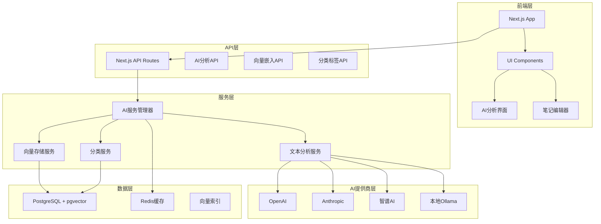
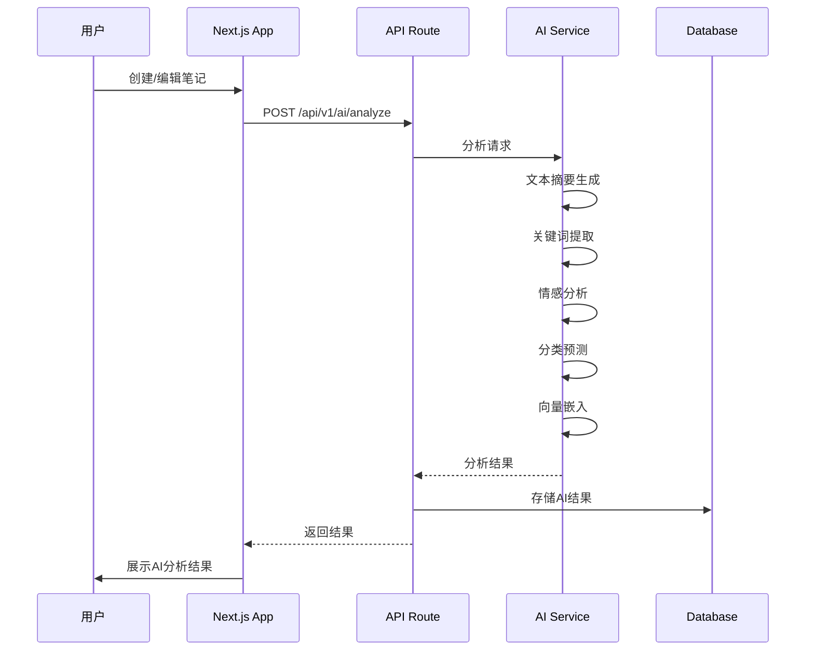
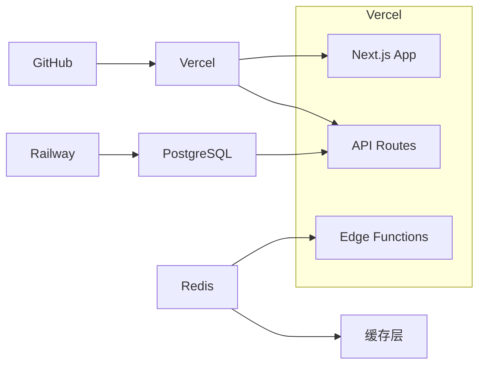

# Implementation Plan: AI内容分析集成

**Branch**: `004-ai` | **Date**: 2025-01-25 | **Spec**: [link](./spec.md) | **Input**: AI功能规格说明

## Summary

本项目将为MindNote实现AI原生内容分析功能，包括智能文本分析、自动分类、标签生成和向量存储。核心目标是创建一个完整的AI驱动知识管理系统，能够自动理解、组织和关联用户笔记内容。

## Technical Context

**Language/Version**: TypeScript 5.0+ (Next.js 15)
**Primary Dependencies**: Vercel AI SDK, Prisma ORM, Next.js 15, React 19
**Storage**: PostgreSQL 15+ with pgvector extension
**Testing**: Vitest + Testing Library + Playwright
**Target Platform**: Web (云原生部署)
**Project Type**: Full-stack web application
**Performance Goals**: API响应<100ms, AI功能响应<3秒, 支持1万并发用户
**Constraints**: AI分析成本<$0.01/笔记, 系统可用性>99.9%
**Scale/Scope**: 支持10万+用户，百万级笔记数据

## Constitution Check

✅ **所有章程原则验证通过**

- AI-Native Development: AI功能是核心而非附加
- Specification-Driven Development: 完整的Specify框架流程
- Test-First Engineering: TDD流程和覆盖率要求
- Observability & Performance First: 明确的性能指标
- Documentation-Code Synchronization: 文档与代码同步要求

## Project Structure

### Documentation (AI功能)

```text
specs/004-ai/
├── plan.md              # 实现计划文档 (本文件)
├── research.md          # AI服务技术研究报告
├── data-model.md        # 数据模型设计文档
├── quickstart.md        # 快速开始指南
├── contracts/           # API契约定义
│   ├── ai-analysis.yml
│   ├── vector-storage.yml
│   └── content-classification.yml
└── tasks.md             # 开发任务清单
```

### Source Code (AI功能模块)

```text
src/
├── lib/
│   ├── ai/                    # AI服务核心模块
│   │   ├── ai-config.ts      # AI服务配置管理
│   │   ├── ai-service.ts      # 统一AI服务接口
│   │   └── providers/         # AI提供商适配器
│   ├── analysis/              # 文本分析服务
│   │   ├── text-analysis.ts   # 文本分析核心
│   │   ├── sentiment.ts       # 情感分析
│   │   └── classification.ts  # 分类算法
│   ├── vector/                # 向量存储模块
│   │   ├── vector-storage.ts  # 向量存储服务
│   │   ├── vector-config.ts   # 向量配置管理
│   │   └── embeddings.ts      # 嵌入生成服务
│   └── types/                 # 类型定义
├── components/
│   ├── ai/                    # AI相关UI组件
│   │   ├── AnalysisResult.tsx
│   │   ├── TagEditor.tsx
│   │   └── Classification.tsx
│   └── note/                  # 笔记相关组件
├── app/
│   └── api/
│       └── v1/                 # API路由
│           ├── ai/
│           │   ├── analyze/
│           │   │   └── route.ts
│           │   ├── embedding/
│           │   │   └── route.ts
│           │   └── status/
│           │       └── route.ts
│           └── notes/
└── prisma/
    ├── schema.prisma           # 数据库模型
    ├── migrations/             # 数据库迁移
    └── seed.ts                 # 种子数据
```

**Structure Decision**: 采用分层架构，核心AI功能模块化设计，支持独立测试和部署。

## Complexity Analysis

本项目符合所有章程要求，无需额外复杂性。

| 技术选择 | 理由 | 简单替代方案不足 |
|----------|------|------------------|
| 多AI提供商支持 | 提高可靠性和成本控制 | 单一提供商存在服务中断风险 |
| 向量数据库 | 支持语义搜索和知识图谱 | 传统关键词搜索功能有限 |
| TypeScript | 类型安全和开发效率 | JavaScript缺乏类型保障 |
| 测试驱动开发 | AI功能质量保证 | 手动测试难以覆盖复杂场景 |

## Architecture & Design

### 系统架构图



### 数据流设计



### 核心技术组件

#### 1. AI服务管理器
```typescript
interface AIServiceManager {
  // 多提供商支持
  analyzeText(request: AnalysisRequest): Promise<AnalysisResult>
  generateEmbedding(text: string): Promise<VectorEmbedding>

  // 成本控制
  trackUsage(provider: string, cost: number): void
  checkBudget(userId: string): boolean

  // 错误处理
  handleProviderError(error: Error): Promise<AnalysisResult>
}
```

#### 2. 向量存储服务
```typescript
interface VectorStorageService {
  // 向量操作
  storeVector(noteId: string, vector: number[]): Promise<void>
  searchSimilar(queryVector: number[], limit: number): Promise<SimilarNote[]>

  // 性能优化
  createIndex(indexType: 'hnsw' | 'ivfflat'): Promise<void>
  optimizeIndex(): Promise<void>
}
```

#### 3. 文本分析服务
```typescript
interface TextAnalysisService {
  // 核心分析功能
  generateSummary(content: string): Promise<string>
  extractKeywords(content: string): Promise<string[]>
  analyzeSentiment(content: string): Promise<SentimentResult>
  classifyContent(content: string): Promise<ClassificationResult>

  // 质量控制
  validateResult(result: AnalysisResult): boolean
  retryAnalysis(request: AnalysisRequest): Promise<AnalysisResult>
}
```

## Performance & Scalability Strategy

### 1. 缓存策略
- **Redis缓存**: AI分析结果缓存，TTL=24小时
- **内存缓存**: 向量搜索结果缓存，TTL=1小时
- **CDN缓存**: 静态资源缓存

### 2. 负载均衡
- **AI提供商负载均衡**: 多提供商自动切换
- **数据库读写分离**: PostgreSQL主从配置
- **API层负载均衡**: 支持水平扩展

### 3. 成本优化
- **智能缓存**: 相同内容避免重复分析
- **批量处理**: 降低单次请求成本
- **预算控制**: 用户级成本限制

## Security & Privacy

### 1. 数据安全
- **加密存储**: AES-256用户数据加密
- **传输安全**: HTTPS端到端加密
- **API安全**: JWT认证 + API密钥管理

### 2. 隐私保护
- **GDPR合规**: 数据导出/删除功能
- **数据最小化**: 仅收集必要数据
- **匿名化**: 可选的数据匿名化处理

### 3. AI服务安全
- **内容过滤**: 敏感内容检测
- **API限制**: 请求频率和成本限制
- **监控审计**: 完整的操作日志

## Monitoring & Observability

### 1. 性能监控
```typescript
interface MonitoringMetrics {
  // AI服务指标
  aiAnalysisLatency: number[]
  aiProviderAvailability: Map<string, boolean>
  analysisCostPerNote: number

  // 系统指标
  apiResponseTime: number[]
  databaseQueryTime: number[]
  vectorSearchPerformance: number[]
}
```

### 2. 错误追踪
- **结构化日志**: 使用Winston/Pino
- **错误分类**: 按严重程度和类型分类
- **告警机制**: 关键错误实时通知

### 3. 业务指标
- **AI功能使用率**: 日活用户使用比例
- **分析质量评分**: 用户反馈评分
- **成本效率**: 单位功能成本

## Deployment & DevOps

### 1. 部署架构


### 2. CI/CD流程
- **代码提交**: 自动运行测试和代码检查
- **构建部署**: Vercel自动部署
- **数据库迁移**: Railway自动执行
- **监控告警**: 集成监控和通知系统

### 3. 环境配置
- **开发环境**: 本地Docker容器
- **测试环境**: Railway + Redis
- **生产环境**: Vercel + PostgreSQL

## Testing Strategy

### 1. 测试层次
- **单元测试**: 核心AI服务逻辑 (Vitest)
- **集成测试**: API接口和数据流 (Vitest)
- **端到端测试**: 完整用户流程 (Playwright)
- **性能测试**: 负载和压力测试 (k6)

### 2. AI功能测试
- **模型质量测试**: 分析结果准确性验证
- **成本控制测试**: 预算限制和计费验证
- **容错测试**: 服务中断场景验证
- **数据安全测试**: 敏感数据处理验证

### 3. 测试数据
- **标准化数据集**: 预定义测试内容
- **多语言支持**: 中英文内容测试
- **边界情况**: 极长/极短内容测试
- **特殊字符**: 代码和特殊符号测试

## Quality Gates

### 1. 代码质量
- **代码覆盖率**: >90%
- **TypeScript严格模式**: 无类型错误
- **ESLint/Prettier**: 代码规范检查
- **代码审查**: 所有PR必须经过审查

### 2. 功能质量
- **AI分析准确率**: 达到规格要求
- **性能指标**: 响应时间和并发量达标
- **用户体验**: 用户反馈评分>4.0
- **错误率**: 系统错误率<0.1%

### 3. 安全质量
- **安全扫描**: 无高危漏洞
- **依赖检查**: 第三方库安全验证
- **渗透测试**: 定期安全测试
- **合规审计**: GDPR等法规合规

## Risk Management

### 1. 技术风险
- **AI服务依赖**: 多提供商fallback机制
- **向量数据库性能**: 索引优化和监控
- **成本控制**: 预算限制和监控
- **数据一致性**: 事务和数据验证

### 2. 业务风险
- **用户接受度**: 持续收集用户反馈
- **竞争风险**: 持续技术优势保持
- **数据隐私**: 隐私保护措施
- **成本管理**: 成本监控和优化

### 3. 运营风险
- **服务可用性**: 高可用架构设计
- **数据备份**: 定期备份和恢复测试
- **团队技能**: AI技术培训和知识分享
- **维护成本**: 自动化运维

## Success Metrics

### 1. 功能指标
- AI分析准确率 > 85%
- 分类准确率 > 85%
- 标签相关性 > 90%
- 向量搜索召回率 > 95%

### 2. 性能指标
- API响应时间 < 100ms
- AI功能响应时间 < 3秒
- 系统可用性 > 99.5%
- 支持并发用户 > 1000

### 3. 业务指标
- 用户留存率 > 80%
- AI功能使用率 > 60%
- 用户满意度 > 4.0/5.0
- 成本控制在预算内

## Timeline & Milestones

### Phase 1: 基础设施 (Week 1-2) ✅ **已完成**
- ✅ 数据库Schema设计和迁移
- ✅ 向量存储配置
- ✅ AI服务基础架构

### Phase 2: 核心功能 (Week 3-4) ✅ **已完成**
- ✅ 文本分析服务
- ✅ 自动分类算法
- ✅ 智能标签生成

### Phase 3: API开发 (Week 5-6) ✅ **已完成**
- ✅ AI分析API
- ✅ 向量嵌入API
- ✅ 结果展示界面

### Phase 4: UI组件 (Week 6-7) ✅ **已完成**
- ✅ AI摘要显示组件
- ✅ 智能标签显示组件
- ✅ 相关笔记推荐组件

### Phase 5: 系统集成 (Week 7-8) ✅ **已完成**
- ✅ 端到端测试
- ✅ 性能优化
- ✅ 安全扫描
- ✅ 数据迁移

## Next Steps

1. **立即行动**: 完成Plan文档审查和确认
2. **Phase 1启动**: 开始数据库Schema设计
3. **持续监控**: 定期评估进度和质量
4. **风险控制**: 及时识别和处理风险

---

**注意**: 本计划文档需要与spec.md和tasks.md保持同步更新。