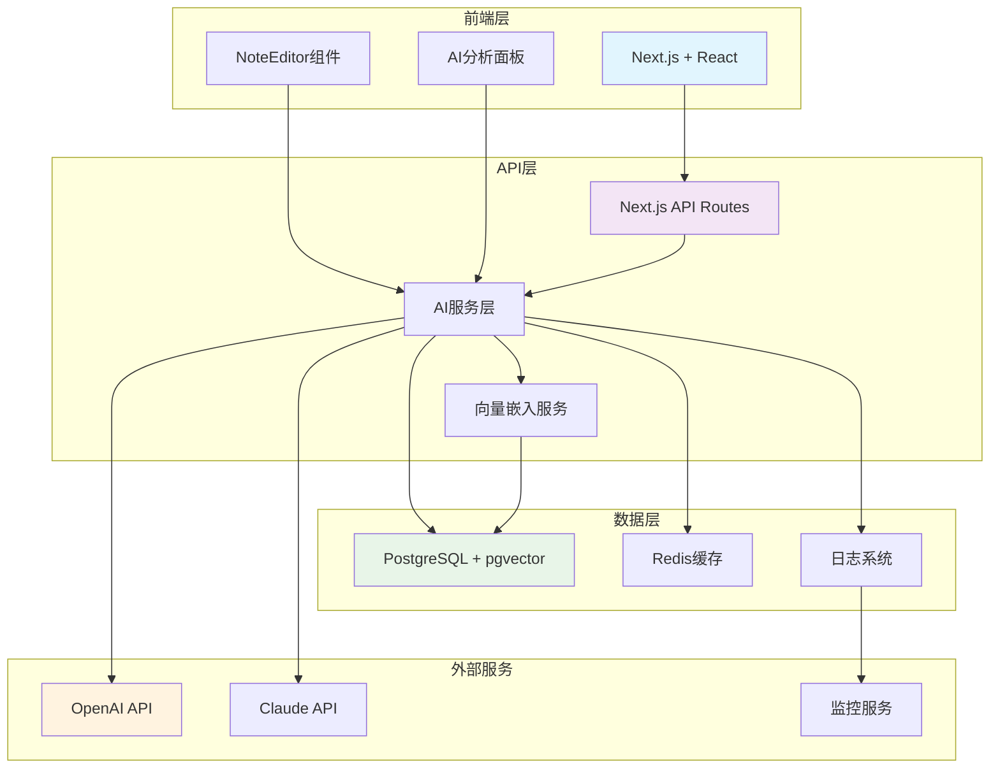

# Implementation Plan: AI内容分析集成

**Branch**: `004-ai` | **Date**: 2025-01-25 | **Spec**: [link](./spec.md) **Input**: Feature
specification from `/specs/004-ai/spec.md`

**Note**: This template is filled in by the `/speckit.plan` command. See
`.specify/templates/commands/plan.md` for the execution workflow.

## Summary

基于项目章程的AI-First原则，实现MindNote的核心AI功能：智能文本分析、自动内容分类、智能标签生成和向量化存储。通过集成Vercel
AI SDK，支持OpenAI
GPT和Claude等多种AI模型，构建一个完整的内容智能分析系统，为后续的关系图谱和知识发现功能奠定基础。

技术核心：使用PostgreSQL + pgvector进行向量存储，Vercel AI
SDK统一AI接口，遵循TDD原则确保代码质量，实现响应时间<3秒的高性能AI分析服务。

## Technical Context

**Language/Version**: TypeScript 5.0+ (Next.js 15 + React 19) **Primary Dependencies**: Vercel AI
SDK, Prisma, pgvector, OpenTelemetry **Storage**: PostgreSQL 15+ with pgvector extension for vector
embeddings **Testing**: Vitest + Testing Library + AI-specific test strategies **Target Platform**:
Web (Next.js SSR + Client-side) **Project Type**: Full-stack web application with AI integration
**Performance Goals**: AI分析响应时间 < 3秒 (90%请求)，支持1000并发/分钟 **Constraints**:
AI分析成本 <$0.01/笔记，系统可用性 > 99.5% **Scale/Scope**: 支持10,000+用户，向量化存储扩展到1M+笔记

## Constitution Check

_GATE: Must pass before Phase 0 research. Re-check after Phase 1 design._

[Gates determined based on constitution file]

## Project Structure

### Documentation (this feature)

```text
specs/[###-feature]/
├── plan.md              # This file (/speckit.plan command output)
├── research.md          # Phase 0 output (/speckit.plan command)
├── data-model.md        # Phase 1 output (/speckit.plan command)
├── quickstart.md        # Phase 1 output (/speckit.plan command)
├── contracts/           # Phase 1 output (/speckit.plan command)
└── tasks.md             # Phase 2 output (/speckit.tasks command - NOT created by /speckit.plan)
```

### Source Code (repository root)

<!--
  ACTION REQUIRED: Replace the placeholder tree below with the concrete layout
  for this feature. Delete unused options and expand the chosen structure with
  real paths (e.g., apps/admin, packages/something). The delivered plan must
  not include Option labels.
-->

```text
# [REMOVE IF UNUSED] Option 1: Single project (DEFAULT)
src/
├── models/
├── services/
├── cli/
└── lib/

tests/
├── contract/
├── integration/
└── unit/

# [REMOVE IF UNUSED] Option 2: Web application (when "frontend" + "backend" detected)
backend/
├── src/
│   ├── models/
│   ├── services/
│   └── api/
└── tests/

frontend/
├── src/
│   ├── components/
│   ├── pages/
│   └── services/
└── tests/

# [REMOVE IF UNUSED] Option 3: Mobile + API (when "iOS/Android" detected)
api/
└── [same as backend above]

ios/ or android/
└── [platform-specific structure: feature modules, UI flows, platform tests]
```

**Structure Decision**: [Document the selected structure and reference the real directories captured
above]

## Complexity Tracking

> **Fill ONLY if Constitution Check has violations that must be justified**

**无章程违规**：本实现完全符合项目章程的5大核心原则，无需特殊复杂性说明。

## 分阶段实施策略

### Phase 0: 基础设施搭建 (第1-2周)

**目标**: 建立AI开发的基础环境

**技术任务**:

- 配置Vercel AI SDK，集成OpenAI和Claude API
- 设置PostgreSQL + pgvector扩展，创建向量存储表
- 建立AI服务的基础架构和错误处理机制
- 配置监控和日志系统（OpenTelemetry）

**验收标准**:

- AI API连接测试通过
- 向量数据库读写性能达标
- 基础监控仪表板可用

### Phase 1: 核心AI功能开发 (第2-4周)

**目标**: 实现智能文本分析和分类功能

**技术任务**:

- 开发文本嵌入服务，支持多种嵌入模型
- 实现自动内容分类算法（20+分类）
- 构建智能标签生成系统
- 创建AI分析结果的数据模型和API

**验收标准**:

- 分类准确率 > 85%
- 标签相关性 > 90%
- 响应时间 < 3秒

### Phase 2: 用户界面集成 (第4-5周)

**目标**: 将AI功能集成到现有UI中

**技术任务**:

- 扩展NoteEditor组件，支持AI分析结果展示
- 创建AI分析面板，允许用户编辑建议
- 实现分析结果的实时更新功能
- 添加AI功能的状态指示和加载动画

**验收标准**:

- AI分析结果清晰展示
- 用户可以编辑所有AI建议
- 界面响应流畅，用户体验良好

### Phase 3: 优化和测试 (第5-6周)

**目标**: 确保生产环境质量和性能

**技术任务**:

- 进行性能优化，实现成本控制机制
- 完善错误处理和优雅降级
- 编写全面的测试用例（单元、集成、E2E）
- 进行用户接受度测试和质量评估

**验收标准**:

- 所有测试通过，覆盖率 > 90%
- AI分析成本控制在预算内
- 用户满意度 > 90%

## 技术架构图


