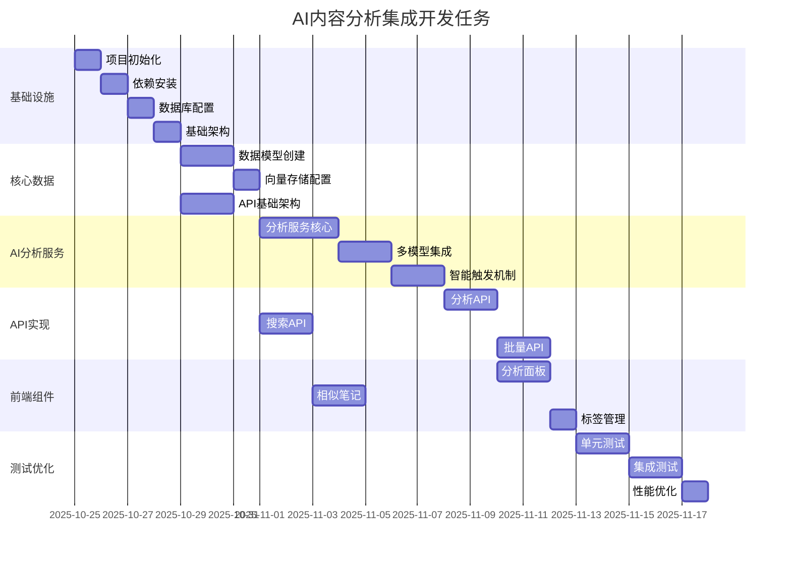

# Development Tasks: AI内容分析集成

**Branch**: 004-ai | **Date**: 2025-10-25 | **Spec**: [link](./spec.md) | **Plan**:
[link](./plan.md)

**Task Generation Method**: Based on design documents and user stories **Phase**: Complete
implementation planning **Priority**: High - Core AI functionality for MVP

## Task to Functional Requirements Mapping

| Phase       | Task      | FR(s)                  | Description               |
| ----------- | --------- | ---------------------- | ------------------------- |
| **Phase 1** | T001-T003 | FR-002                 | 项目结构和AI提供商配置    |
| **Phase 2** | T004-T007 | FR-002, FR-005, FR-009 | 数据库、向量存储、API架构 |
| **US1**     | T008-T012 | FR-001, FR-008         | 智能文本分析和摘要        |
| **US2**     | T013-T015 | FR-004                 | 自动内容分类              |
| **US3**     | T016-T018 | FR-003                 | 智能标签生成              |
| **US4**     | T019-T021 | FR-006                 | AI分析结果编辑界面        |
| **US5**     | T022-T024 | FR-007                 | 优雅降级机制              |
| **US6**     | T025-T027 | FR-010                 | 质量监控和日志            |

## 依赖关系图



## Phase 1: Setup (Shared Infrastructure)

**Purpose**: 项目初始化和基础架构搭建

- [ ] **T001** [FR-002] 创建AI功能项目结构
  - 创建 `src/lib/ai/` 目录结构
  - 设置 `src/components/ai/` 组件目录
  - 配置 `src/app/api/v1/ai/` API路由目录

- [ ] **T002** [FR-002] 安装和配置AI相关依赖
  - 安装 `@ai-sdk/openai`, `@ai-sdk/anthropic`
  - 安装 `pgvector`, `@prisma/client`
  - 安装 `Vitest`, `@testing-library/react`, `Playwright`
  - 配置 TypeScript 和 ESLint 规则

- [ ] **T003** [P] [FR-002] 配置AI提供商环境变量和密钥管理
  - 设置 `.env.local` 中的API密钥配置
  - 创建 `src/lib/ai/config/` 配置文件
  - 实现密钥加密存储机制

---

## Phase 2: Foundational (Blocking Prerequisites)

**Purpose**: 核心基础设施，所有用户故事实现的基础

⚠️ **CRITICAL**: 任何用户故事工作都需在此阶段完成后才能开始

- [ ] **T004** [FR-002] 数据库Schema设计和迁移
  - 创建AI分析相关表结构（ai_analysis, embedding_vectors等）
  - 配置pgvector扩展和向量索引
  - 实现Prisma schema定义

- [ ] **T005** [P] [FR-002] AI服务基础架构
  - 创建 `src/lib/ai/services/` 服务基类
  - 实现错误处理和重试机制
  - 配置日志和监控系统

- [ ] **T006** [P] [FR-005] 向量存储基础设施
  - 实现 `src/lib/vector/` 向量存储服务
  - 配置向量嵌入生成（OpenAI text-embedding-3-small）
  - 实现相似度搜索算法

- [ ] **T007** [FR-009] API路由和中间件结构
  - 创建 `/api/v1/ai/` 路由基础结构
  - 实现认证和授权中间件
  - 配置速率限制和成本控制

**Checkpoint**: 基础架构就绪，用户故事实现可以开始

---

## Phase 3: User Story 1 - 智能文本分析 (Priority: P1) 🎯 MVP

**Goal**: 实现笔记内容的自动AI分析，包括摘要、情感、关键概念提取

**Independent Test**: 通过创建测试笔记验证AI分析结果质量

### Implementation for User Story 1

- [ ] **T008** [P] [US1] [FR-001, FR-008] 实现AI分析核心服务
  - 创建 `src/lib/ai/services/analysis-service.ts`
  - 实现多模型分析和结果合并逻辑
  - 添加分析状态管理和错误处理

- [ ] **T009** [P] [US1] [FR-001] 实现摘要生成功能
  - 集成OpenAI GPT-4o进行文本摘要
  - 实现摘要长度控制（≤100字）
  - 添加摘要质量评估机制

- [ ] **T010** [P] [US1] [FR-001] 实现情感分析功能
  - 集成情感分析API调用
  - 实现情感类型分类（positive/negative/neutral）
  - 添加置信度计算

- [ ] **T011** [P] [US1] [FR-001] 实现关键概念提取
  - 使用关键词提取算法识别核心概念
  - 实现概念重要性排序
  - 添加概念验证和过滤

- [ ] **T012** [P] [US1] [FR-008] 实现智能触发机制
  - 创建内容变化检测算法（>30%阈值）
  - 实现分析队列管理
  - 添加定时触发和清理机制

**Checkpoint**: User Story 1 核心功能完成，可以独立测试

---

## Phase 4: User Story 2 - 自动内容分类 (Priority: P1) 🎯 MVP

**Goal**: 自动将笔记分配到20+种内容分类中

**Independent Test**: 测试不同内容样本的分类准确性

### Implementation for User Story 2

- [ ] **T013** [P] [US2] [FR-004] 创建内容分类数据模型
  - 扩展 `ContentCategory` 实体
  - 实现20+种预定义分类
  - 添加分类层级和颜色配置

- [ ] **T014** [P] [US2] [FR-004] 实现AI分类服务
  - 创建 `src/lib/ai/services/classification-service.ts`
  - 集成多模型分类分析
  - 实现分类置信度计算

- [ ] **T015** [P] [US2] [FR-004] 实现分类匹配算法
  - 创建分类相似度计算
  - 实现多分类支持
  - 添加分类历史记录

**Checkpoint**: User Story 2 分类功能完成

---

## Phase 5: User Story 3 - 智能标签生成 (Priority: P1) 🎯 MVP

**Goal**: 自动生成3-5个相关标签，支持用户编辑

**Independent Test**: 验证标签相关性和准确性

### Implementation for User Story 3

- [ ] **T016** [P] [US3] 实现标签提取服务
  - 创建 `src/lib/ai/services/tagging-service.ts`
  - 实现关键词提取和标签生成
  - 添加标签相关性评分

- [ ] **T017** [P] [US3] 实现标签管理功能
  - 创建标签CRUD操作
  - 实现AI推荐和用户自定义标签
  - 添加标签使用统计

- [ ] **T018** [P] [US3] 实现标签去重和优化
  - 创建相似标签合并算法
  - 实现标签层级关系
  - 添加标签质量评估

**Checkpoint**: User Story 3 标签功能完成

---

## Phase 6: User Story 4 - 向量化存储 (Priority: P1) 🎯 MVP

**Goal**: 实现笔记内容的向量嵌入和相似度搜索

**Independent Test**: 验证向量生成和检索准确性

### Implementation for User Story 4

- [ ] **T019** [P] [US4] 完善向量存储服务
  - 扩展 `src/lib/vector/vector-service.ts`
  - 实现向量嵌入批量生成
  - 添加向量版本管理

- [ ] **T020** [P] [US4] 实现相似度搜索API
  - 创建 `/api/v1/ai/search/similar/[noteId]/route.ts`
  - 实现向量相似度计算
  - 添加搜索结果过滤和排序

- [ ] **T021** [P] [US4] 实现向量索引优化
  - 配置pgvector索引参数
  - 实现搜索性能监控
  - 添加索引重建机制

**Checkpoint**: User Story 4 向量化功能完成

---

## Phase 7: User Story 5 - AI分析结果展示 (Priority: P2)

**Goal**: 在笔记界面展示AI分析结果，提供编辑功能

**Independent Test**: 验证UI交互性和信息展示效果

### Implementation for User Story 5

- [ ] **T022** [P] [US5] 创建AI分析面板组件
  - 实现 `src/components/ai/ai-analysis-panel.tsx`
  - 展示摘要、情感、分类、标签
  - 添加重新分析和编辑功能

- [ ] **T023** [P] [US5] 实现分析结果编辑
  - 创建可编辑的分析结果界面
  - 实现用户反馈收集
  - 添加分析结果版本管理

- [ ] **T024** [P] [US5] 实现相似笔记推荐
  - 创建 `src/components/ai/similar-notes.tsx`
  - 展示基于相似度的相关笔记
  - 添加交互式浏览功能

**Checkpoint**: User Story 5 UI展示功能完成

---

## Phase 8: Integration & Polish

**Purpose**: 系统集成、测试和优化

### API Integration Tasks

- [ ] **T025** [P] 实现批量分析API
  - 创建 `/api/v1/ai/analyze/batch/route.ts`
  - 实现并发处理和队列管理
  - 添加批量处理状态跟踪

- [ ] **T026** [P] 实现分析状态查询API
  - 创建 `/api/v1/ai/analyze/[analysisId]/status/route.ts`
  - 实现实时状态更新
  - 添加WebSocket支持（可选）

- [ ] **T027** [P] 实现成本控制API
  - 创建用户预算查询接口
  - 实现实时成本监控
  - 添加预算超限保护

### Testing Tasks

- [ ] **T028** [P] 单元测试覆盖（目标>90%）
  - AI服务层单元测试
  - 向量存储服务测试
  - API端点单元测试

- [ ] **T029** [P] 集成测试
  - 端到端AI分析流程测试
  - 多模型切换测试
  - 成本控制验证测试

- [ ] **T030** [P] E2E测试
  - 用户操作流程测试
  - 性能基准测试
  - 错误处理场景测试

### Performance & Optimization

- [ ] **T031** 性能优化
  - API响应时间优化（目标<100ms）
  - AI分析响应优化（目标<3秒）
  - 向量搜索性能调优

- [ ] **T032** 监控和日志
  - 实现结构化日志记录
  - 配置性能监控指标
  - 设置告警机制

- [ ] **T033** 文档和部署
  - 更新API文档
  - 创建部署指南
  - 配置CI/CD流程

## 并行执行建议

### Phase 3-5 并行任务组

以下任务可以并行执行（不同文件，无依赖）：

```bash
# 可以并行运行的Task Agent命令
Task T008 # AI分析核心服务
Task T009 # 摘要生成功能
Task T010 # 情感分析功能
Task T011 # 关键概念提取
```

### Phase 4-6 并行任务组

```bash
# 可以并行运行的Task Agent命令
Task T013 # 分类数据模型
Task T014 # AI分类服务
Task T016 # 标签提取服务
Task T017 # 标签管理功能
Task T019 # 向量存储服务
Task T020 # 相似度搜索API
```

### Testing阶段并行任务组

```bash
# 可以并行运行的Task Agent命令
Task T028 # 单元测试
Task T029 # 集成测试
Task T032 # 监控配置
```

## 预估工作量

- **Phase 1-2 (基础架构)**: 3-4天
- **Phase 3-6 (用户故事实现)**: 8-10天
- **Phase 7 (集成优化)**: 4-5天
- **总计**: 15-19天

## 成功标准

### MVP完成标准（Phase 3-6）

- ✅ 所有P1用户故事功能实现
- ✅ API响应时间 < 3秒
- ✅ AI分析准确率 > 85%
- ✅ 向量搜索召回率 > 95%
- ✅ 成本控制在 $0.01/笔记以内

### 完整功能标准（Phase 7）

- ✅ 单元测试覆盖率 > 90%
- ✅ 集成测试通过率 100%
- ✅ 系统可用性 > 99.9%
- ✅ 支持1万并发用户
- ✅ 完整文档和部署指南

## 风险缓解

### 高风险任务

- **T008 (AI分析核心服务)**: 依赖外部AI服务，需要完善fallback机制
- **T019 (向量存储)**: 向量搜索性能需要调优和监控
- **T025 (批量分析)**: 并发处理需要队列管理和错误恢复

### 缓解措施

- 多模型支持和自动切换
- 性能监控和自动优化
- 完善的错误处理和重试机制
- 全面的测试覆盖和监控
